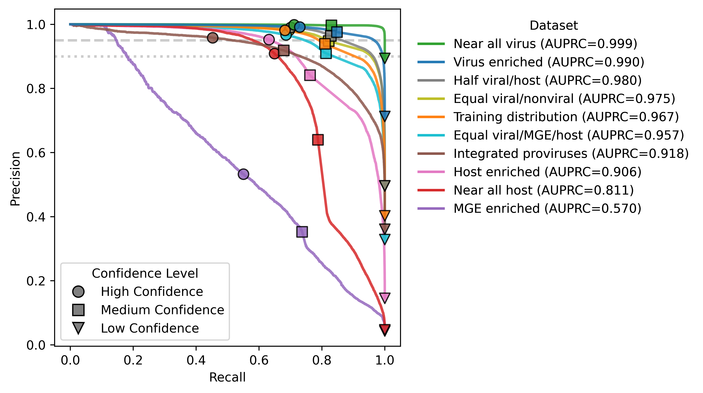

# CheckAMG
[](https://pypi.org/project/checkamg/)
[](https://zenodo.org/records/18407279)

**Automated discovery and curation of Auxiliary Metabolic Genes (AMGs), Auxiliary Regulatory Genes (AReGs), and Auxiliary Physiology Genes (APGs) encoded by viral genomes**

> ⚠️ **This tool is in active development and has not yet been peer-reviewed.**

## Overview

CheckAMG is a pipeline for high-confidence identification and curation of auxiliary genes (AMGs, AReGs, APGs) in viral genomes. It leverages functional annotations, genomic context, and manually curated lists of AVG annotations. Its prediction approach reflects years of community-defined standards for identifying auxiliary genes, validating that they are virus-encoded, and filtering common misannotations.

CheckAMG supports:

* Nucleotide or protein input
* Single-contig viral genomes or vMAGs (multi-contig)
* Running on viral genomes or viromes/metagenomes directly

## Dependencies

See [`pyproject.toml`](https://github.com/AnantharamanLab/CheckAMG/blob/main/pyproject.toml) for all dependencies. Major packages:

* `python >=3.11, <3.13`
* [`lightgbm>=4.5.0`](https://lightgbm.readthedocs.io/en/stable/Installation-Guide.html)
* [`metapyrodigal>=1.4.1`](https://github.com/cody-mar10/metapyrodigal)
* [`polars-u64-idx>=1.30.0`](https://pypi.org/project/polars-u64-idx/)
* [`pyfastatools==2.5.0`](https://github.com/cody-mar10/pyfastatools)
* [`pyhmmer==0.11.1`](https://github.com/althonos/pyhmmer)
* [`snakemake==8.23.2`](https://pypi.org/project/snakemake/8.23.2/)

## Installation
**Step 1: Create a conda environment and install CheckAMG using `pip`**

```bash
conda create -n CheckAMG python=3.11 pip
conda activate CheckAMG
pip install checkamg
```

**Step 2: Download the databases required by CheckAMG**

The current CheckAMG database is v1 (compatible with CheckAMG versions 0.7.0 and higher). It can be downloaded from [Zenodo](https://zenodo.org/records/18407279) and set up automatically  with `checkamg download`.

About 40 GB of free disk space will be required to download the databases. This can be reduced to about 21 GB after downloading finishes if the human-readable HMM files are removed by providing the `--rm-hmm` argument.

```
checkamg download -d /path/to/db/destination --rm-hmm
```

## Quick start

Example data to test your installation of CheckAMG are provided in the [`examples/example_data`](https://github.com/AnantharamanLab/CheckAMG/tree/main/examples/example_data) folder of this repository.

```
checkamg download -d /path/to/db/destination

checkamg annotate \
  -d /path/to/db/destination \
  -i examples/example_data/single_contig_viruses.fasta \
  -I examples/example_data/multi_contig_vMAGs \
  -o CheckAMG_example_out
```

## Usage

CheckAMG has multiple modules. The main modules that will be used for AVG prediction are `annotate`, `de-novo`, and `end-to-end`. Currently, only the `annotate` module has been implemented, and the associated `download` module to download the required databases.

Run `checkamg -h` for full options and module descriptions:

```
usage: checkamg [-h] [-v] {download,annotate,de-novo,aggregate,end-to-end} ...

CheckAMG: Automated discovery and curation of Auxiliary Metabolic Genes (AMGs),
          Auxiliary Regulatory Genes (AReGs), and Auxiliary Physiology Genes
          (APGs) encoded in viral genomes.

options:
  -h, --help            show this help message and exit
  -v, --version         show program's version number and exit

modules:
  {download,annotate,de-novo,aggregate,end-to-end}
    download            Download the databases required by CheckAMG.
    annotate            Predict and curate auxiliary genes using functional
                        annotations and genomic context.
    de-novo             (Not yet implemented) Predict auxiliary genes with an
                        annotation-independent method.
    aggregate           (Not yet implemented) Aggregate results into a final
                        report.
    end-to-end          (Not yet implemented) Run annotate, de-novo, and
                        aggregate in tandem.
```

### CheckAMG annotate

The `annotate` module is for the automated prediction and curation of auxiliary genes in viral genomes based on functional annotations and genomic context.

**Basic usage:**

```
checkamg annotate -i <genomes.fna> -d <db_dir> -o <output_dir>
```

Basic arguments:

* `-i`, `--input-contigs`: Path to viral genomes/nucleotide sequences in a single FASTA file
* `-I`, `--input-bins`: Path to a folder containing multi-contig vMAGs/bins
* `-p`, `--input-proteins`: Path to amino acid sequences from translated contigs in a single FASTA file
* `-P`, `--input-bin-proteins`: Path to a folder containing amino acid sequences from translated vMAGs/bins
* `-d`, `--db-dir`: Path to the CheckAMG database download with `checkamg download`
* `-o`, `--output`: Path to the CheckAMG output folder to be written

Notes:

* At least one of `--input-contigs` or `--input-bins`, or one of `--input-proteins` or `--input-bin-proteins`, must be provided
* Both nucleotide and protein input types cannot be mixed
* Providing single-contigs versus bins only affects the labeling and organization of results, and does not affect AVG predictions
* Protein headers must be in [prodigal format](https://github.com/hyattpd/prodigal/wiki/understanding-the-prodigal-output#protein-translations) (e.g. `>Contig1_1 # 144 # 635 # 1` or `>Contig1_2 # 1535 # 635 # -1`)

**Full usage:**

```
usage: checkamg annotate [-h] -d DB_DIR -o OUTPUT [-i INPUT_CONTIGS]
                         [-I INPUT_BINS] [-p INPUT_PROTEINS]
                         [-P INPUT_BIN_PROTEINS] [--input-type {nucl,prot}]
                         [-l MIN_LEN] [-f MIN_ORF] [-a MIN_ANNOT]
                         [-c COV_FRACTION] [-e EVALUE] [-b BIT_SCORE]
                         [-bf BITSCORE_FRACTION_HEURISTIC] [-w WINDOW_SIZE]
                         [-v MIN_FLANK_VSCORE] [-vl MIN_WINDOW_AVG_VL_SCORE]
                         [-ha | --use-hallmark | --no-use-hallmark]
                         [--filter-ambig-regions | --no-filter-ambig-regions]
                         [--filter-avg-arrays | --no-filter-avg-arrays]
                         [--avg-array-limit AVG_ARRAY_LIMIT]
                         [--filter-presets FILTER_PRESETS] [-kf] [-pq]
                         [-t THREADS] [-m MEM] [--debug | --no-debug]

Predict and curate auxiliary genes in viral genomes based on functional
annotations and genomic context.

options:
  -h, --help            show this help message and exit

required arguments:
  -d DB_DIR, --db-dir DB_DIR
                        Path to CheckAMG database files. (default: None)
  -o OUTPUT, --output OUTPUT
                        Output directory for all generated files and folders.
                        (default: None)

input arguments:
  -i INPUT_CONTIGS, --input-contigs INPUT_CONTIGS
                        Input nucleotide contigs FASTA (.fna/.fasta; gzipped
                        allowed). (default: None)
  -I INPUT_BINS, --input-bins INPUT_BINS
                        Folder of binned contig FASTAs (e.g. vMAGs with
                        multiple contigs). Expects one .fna/.fasta (gzipped
                        allowed) per bin. (default: None)
  -p INPUT_PROTEINS, --input-proteins INPUT_PROTEINS
                        Input amino-acid FASTA from translated contigs
                        (.faa/.fasta; gzipped allowed). Expected Prodigal
                        headers: >[CONTIG]_[CDS] # START # END # FRAME # ...
                        (default: None)
  -P INPUT_BIN_PROTEINS, --input-bin-proteins INPUT_BIN_PROTEINS
                        Folder of amino-acid FASTAs from translated binned
                        contigs (.faa/.fasta; gzipped allowed). Expects one
                        file per bin, each containing proteins from multiple
                        contigs. (default: None)
  --input-type {nucl,prot}
                        Input type: 'nucl' for nucleotide sequences or 'prot'
                        for translated amino-acid sequences. Providing
                        proteins instead of nucleotide sequences skips
                        pyrodigal-gv, and annotations/contextual analyses are
                        performed using the provided proteins. So ensure all
                        proteins from contigs/bins are included and that
                        headers are formatted as expected (see
                        --input-proteins). (default: nucl)

thresholds and HMMsearch settings:
  -l MIN_LEN, --min-len MIN_LEN
                        Minimum length (bp) of input contigs for them to be
                        considered for analysis. (default: 5000)
  -f MIN_ORF, --min-orf MIN_ORF
                        Minimum number of ORFs/proteins per contig for it to
                        be considered for analysis. (default: 4)
  -a MIN_ANNOT, --min-annot MIN_ANNOT
                        Minimum fraction (0.0-1.0) of genes per contig that
                        must receive an annotation to be considered for
                        contextual analysis. (default: 0.2)
  -c COV_FRACTION, --cov-fraction COV_FRACTION
                        Minimum covered fraction (0.0-1.0) of HMM profiles
                        required to report hits. (default: 0.3)
  -e EVALUE, --evalue EVALUE
                        Maximum fallback E-value for HMM hits when database-
                        provided cutoffs are unavailable. (default: 1e-05)
  -b BIT_SCORE, --bitscore BIT_SCORE
                        Minimum fallback bit score for HMM hits when database-
                        provided cutoffs are unavailable. (default: 30)
  -bf BITSCORE_FRACTION_HEURISTIC, --bitscore-fraction-heuristic
                        BITSCORE_FRACTION_HEURISTIC
                        Retain HMM hits scoring at least this fraction
                        (0.0-1.0) of its database-provided threshold during
                        heuristic filtering. (default: 0.5)

genomic context settings:
  -w WINDOW_SIZE, --window-size WINDOW_SIZE
                        Window size (bp) for local average VL-score
                        calculation. (default: 5000)
  -v MIN_FLANK_VSCORE, --min-flank-vscore MIN_FLANK_VSCORE
                        Minimum V-score (0.0-10.0) required in flanking
                        regions to verify viral origin and reduce host-
                        contamination artifacts (higher = more viral-like).
                        (default: 10.0)
  -vl MIN_WINDOW_AVG_VL_SCORE, --min-window-avg-vlscore
                        MIN_WINDOW_AVG_VL_SCORE
                        Minimum average VL-score within the specified window
                        size around a gene to be considered a viral region
                        (higher = more viral-like). (default: 3.0)
  -ha, --use-hallmark, --no-use-hallmark
                        Use viral hallmark genes instead of V-scores when
                        evaluating flanks. Enable to be extra conservative.
                        (default: False)

filtering settings:
  --filter-ambig-regions, --no-filter-ambig-regions
                        Exclude predictions that fall outside strict viral
                        regions (inside ambiguous regions). Strict viral
                        regions are identified from window-average VL-scores
                        and then refined using per-gene V-scores (see
                        --min-window-avg-vlscore and --min-flank-vscore) or
                        viral hallmark genes if --use-hallmark is enabled
                        (stricter, lower recall). When enabled, any
                        prediction not overlapping a strict viral region is
                        filtered out. Disabled by default because it can be
                        too strict when annotation rate is low but other
                        viral origin signals are strong. Enable to be extra
                        conservative. (default: False)
  --filter-avg-arrays, --no-filter-avg-arrays
                        Exclude AVG predictions that occur in contiguous runs
                        (arrays), which suggests non-auxiliary function.
                        (default: True)
  --avg-array-limit AVG_ARRAY_LIMIT
                        If --filter-avg-arrays is enabled, exclude runs of
                        AVGs of this length or more. (default: 3)
  --filter-presets FILTER_PRESETS
                        Comma-separated preset(s) controlling functional
                        annotation filtering. Valid presets:
                        * default (recommended)
                        * allow_glycosyl (keep glycosyltransferase, glycoside-
                          hydrolase, and related annotations)
                        * allow_nucleotide (keep nucleotide metabolism
                          annotations)
                        * allow_methyl (keep methylase/methyltransferase
                          annotations)
                        * allow_lipid (keep lipopolysaccharide and phospho-
                          lipid-related annotations)
                        * no_filter (disable all filtering, not recommended).
                        Example: --filter-presets allow_glycosyl,allow_
                        nucleotide. (default: default)

output files:
  -kf, --keep-full-hmm-results
                        Write all HMM search results for every hit in each
                        database. By default, only the top hit per protein
                        per database is written to reduce file size. Not
                        recommended for large inputs unless --save-as-parquet
                        is used. (default: False)
  -pq, --save-to-parquet
                        Write intermediate and final tables as parquet files
                        instead of TSV. Tables will be smaller files but not
                        human readable without external tools. Recommended
                        for large datasets. (default: False)

resources:
  -t THREADS, --threads THREADS
                        Maximum number of threads allowed. Default is 25% of
                        available. (default: 64)
  -m MEM, --mem MEM     Max memory allowed (GB). Default is 80% of available.
                        (default: 1431)
  --debug, --no-debug   Enable debug-level logging. (default: False)
```

**Outputs:**

The CheckAMG annotate output folder will have the following structure:

```
CheckAMG_annotate_output
├── CheckAMG_annotate.log
├── config_annotate.yaml
├── results/
│   ├── faa_metabolic/
│   │   ├── AMGs_all.faa
│   │   ├── AMGs_high_confidence.faa
│   │   ├── AMGs_low_confidence.faa
│   │   └── AMGs_medium_confidence.faa
│   ├── faa_physiology/
│   │   ├── APGs_all.faa
│   │   ├── APGs_high_confidence.faa
│   │   ├── APGs_low_confidence.faa
│   │   └── APGs_medium_confidence.faa
│   ├── faa_regulatory/
│   │   ├── AReGs_all.faa
│   │   ├── AReGs_high_confidence.faa
│   │   ├── AReGs_low_confidence.faa
│   │   └── AReGs_medium_confidence.faa
│   ├── final_results.tsv
│   ├── gene_annotations.tsv
│   ├── genes_genomic_context.tsv
│   ├── metabolic_genes_curated.tsv
│   ├── physiology_genes_curated.tsv
│   └── regulation_genes_curated.tsv
├── snakemake/
└── wdir/
```

* `CheckAMG_annotate.log`: Log file for the CheckAMG annotate run
* `config_annotate.yaml`: Snakemake pipeline configuration
* `results/`: Main results directory
    * `faa_metabolic/`, `faa_physiology/`, `faa_regulatory/`: Predicted AVGs by type and confidence
    * `final_results.tsv`: Summary table of AVG predictions
      * Note that this table contains information on all genes that made it past the length/CDS filtering steps, including metabolic, physiological, regulatory, and unclassified (not AVG) genes. The "Protein Classification" column can be used to filter by classification.
    * `gene_annotations.tsv`: All gene annotations
    * `genes_genomic_context.tsv`: Gene-level genomic context for confidence assignment
    * `*_genes_curated.tsv`: Curated lists of metabolic, physiological, and regulatory genes after filtering false positives
* `snakemake/`: Snakemake `.done` files
* `wdir/`: Intermediate files

Examples of these output files are provided in the [`examples/example_outputs`](https://github.com/AnantharamanLab/CheckAMG/tree/main/examples/example_outputs) folder of this repository.

### CheckAMG de-novo
*Coming soon.*

### CheckAMG end-to-end
*Coming soon.*

## Important Notes / FAQs
### 1. What is an AVG?
An AVG is an **A**uxiliary **V**iral **G**ene, a virus-encoded gene that is non-essential for viral replication but augments host metabolism (AMGs), physiology (APGs), or regulation (AReGs). Historically, many auxiliary genes were referred to broadly as AMGs, but recently the term AVG has been adopted to include broader host-modulating functions, not just metabolism (see [Martin et al. (2025) *Nat Microbiol*](https://doi.org/10.1038/s41564-025-02095-4)).

Examples:
* A virus-encoded *psbA* or *soxY* would be an AMG because they encode proteins with functions in host photosynthesis and sulfide oxidation
* A virus-encoded VasG type VI secretion system protein or HicA toxin would be an APG because they are involved in host physiology
* A LuxR transcriptional regulator or an AsiA anti-sigma factor protein would be an AReG because they are likely involved in the regulation of host gene expression

Despite the name "CheckAMG", this tool also predicts APGs and AReGs using the same pipeline, differing only by functional annotation criteria.

### 2. How does CheckAMG classify and curate its predictions?

CheckAMG applies a two-stage filtering process:

1. Use a list of curated profile HMMs that represent [metabolic](https://github.com/AnantharamanLab/CheckAMG/blob/main/CheckAMG/files/AMGs.tsv), [physiological](https://github.com/AnantharamanLab/CheckAMG/blob/main/CheckAMG/files/APGs.tsv), and [regulatory](https://github.com/AnantharamanLab/CheckAMG/blob/main/CheckAMG/files/AReGs.tsv) genes to come up with initial AVG candidates
2. Use a second list of curated keywords/substrings that will be used to filter unlikely [AMGs](https://github.com/AnantharamanLab/CheckAMG/blob/main/CheckAMG/files/AMG_filters.tsv), [APGs](https://github.com/AnantharamanLab/CheckAMG/blob/main/CheckAMG/files/APG_filters.tsv), and [AReGs](https://github.com/AnantharamanLab/CheckAMG/blob/main/CheckAMG/files/AReG_filters.tsv)

*Unclassified* genes are those with annotations that don't meet thresholds for confident AVG classification, not necessarily unannotated.

#### Curated Keyword Presets

Users can control how CheckAMG applies keyword-based filters using the `--filter-presets` argument. The currently available options are:

* `default`: Standard annotation filtering behavior (**recommended**)
* `allow_glycosyl`: Disables filtering for glycosyltransferase, glycoside-hydrolase, and related annotations
* `allow_nucleotide`: Disables filtering for nucleotide metabolism annotations
* `allow_methyl`: Disables filtering for methyltransferase and related annotations
* `allow_lipid`: Disables filtering for lipopolysaccharide and phospholipid-related annotations
* `no_filter`: Disables all keyword-based filtering (**not recommended**)

We generally do not recommend changing `--filter-presets` from `default` for most use cases. However, there are scenarios where it may be appropriate to add exceptions to CheckAMG's filtering logic. For example:

* If virus-encoded glycosyltransferases/glycoside-hydrolases, methyltransferases, nucleotide metabolism genes, or lipopolysaccharide/phospholipid metabolism genes are specifically of interest, consider applying the relevant filter presets to include those exceptions
* If you have **environment-specific** knowledge that makes certain gene functions highly relevant to your study system, you can use the appropriate `--filter-presets` to retain those annotations if they were originally included among the CheckAMG filters
  * For example, setting `--filter-presets allow_glycosyl` may include additional potential AMGs involved in carbohydrate degradation when these functions are likely to be enriched in the environmental context of your viral genomes
* If you have other evidence to suggest that annotations flagged by certain keywords are more likely involved in auxiliary metabolic, physiological, or regulatory pathways in the host, rather than essential/core viral functions like genome replication, capsid assembly, cell entry, or lysis

**Note:** If any non-default values for `--filter-presets` are used, additional manual curation of functional annotations is still necessary to avoid misclassification of a gene as an AMG, APG, or AReG.

### 3. What do the *viral origin confidence* assignments to predicted AVGs mean?

> **TL;DR** It reflects the likelihood that a gene is virus-encoded (vs host/MGE)

AVGs often resemble host genes and can result from contamination. CheckAMG uses local genome context to assign **high**, **medium**, or **low** viral origin confidence based on:

1. Proximity to virus-like or viral hallmark genes
2. Proximity to transposases or other [non-viral mobilization genes](https://github.com/AnantharamanLab/CheckAMG/blob/main/CheckAMG/files/mobile_genes.csv)
3. Local viral gene content, determined using [V- and VL-scores](https://github.com/AnantharamanLab/V-Score-Search) ([Zhou et al., 2025](https://www.biorxiv.org/content/10.1101/2024.10.24.619987v1))

A LightGBM model, trained on real and simulated viral/non-viral data, makes these assignments. Confidence levels refer to the viral origin, not the functional annotation.

### 4. Which confidence levels should I use?

> **TL;DR** When in doubt, use high, but medium can be included if your input is virus enriched.

The precision and recall of each confidence level for predicting true viral proteins depends on the input dataset. Whether you should use high, medium, and/or low-confidence AVGs will depend on your knowledge of your input data.

* **High-confidence**
    * CheckAMG assigns confidence levels such that high-confidence predictions can be almost always be trusted (false-discovery rate < 0.05 in most cases)
    * To maintain the integrity of high-confidence predictions even in cases where viral proteins are relatively rare in the input, high-confidence predictions are conservative
    * **We recommend using just high-confidence AVGs when viral proteins are relatively rare in the input data (such as mixed-community metagenomes) or when the composition of the input data is unknown**
* **Medium-confidence**
    * Using medium-confidence predictions can significantly increase the recovery of truly viral proteins, but they may not always be best to use
    * Medium-confidence predictions maintain false-discovery rates < 0.1 in datasets with at least 33% viral proteins, but as input sequences become increasingly non-viral in their protein composition, FDRs begin to surpass 0.1 (see the figure and table, below)
    * **We recommend using both high- and medium-confidence AVGs if you know that roughly one-third or more of your input sequences are viral, such as outputs from most virus prediction tools or viromes**
* **Low-confidence**
    * Low-confidence predictions are not filtered at all, so we only recommend using them when you are certain that all of your input sequences are free of non-viral sequence contamination (complete or high-quality viral genomes), or for testing

Below are preliminary results for benchmarking our viral origin confidence predictions against test datasets with varying sequence composition (% of proteins, see the table below for composition):



|        Dataset        | % Viral Proteins | % MGE Proteins | % Host Proteins |
| :-------------------: | :--------------: | :------------: | :-------------: |
|     Near all virus    |       90.0%      |      4.1%      |       5.9%      |
|     Virus enriched    |       72.0%      |      12.5%     |      15.5%      |
|    Half viral/host    |       50.0%      |      4.8%      |      45.2%      |
|  Equal viral/nonviral |       50.0%      |      20.4%     |      29.6%      |
| Training distribution |       40.6%      |      13.5%     |      45.9%      |
|  Equal viral/MGE/host |       33.3%      |      30.0%     |      36.7%      |
| Integrated proviruses |       38.3%      |      7.7%      |      53.9%      |
|     Host enriched     |       14.7%      |      12.5%     |      72.8%      |
|     Near all host     |       5.0%       |      5.0%      |      90.0%      |
|      MGE enriched     |       8.1%       |      75.0%     |      16.9%      |

### 5. How does CheckAMG assign functions to proteins?

> **TL;DR** Profile HMM searches with adaptive adjustment of database-provided thresholds

If you're curious about the internal mechanics of how CheckAMG annotates proteins for function, this section explains the behavior. These settings are designed to balance sensitivity (not missing true hits) and specificity (excluding weak/ambiguous matches), with additional database-specific optimizations for functional reliability.

1. **Homology Searching Method**

   * CheckAMG uses `pyhmmer` for fast and reproducible HMM searches of user proteins against profile HMMs

2. **Profile HMM Databases**

   * CheckAMG relies on the following databases:

     * [KEGG Orthology (KO)](https://www.genome.jp/kegg/ko.html) ([Kanehisa et al., 2016](https://doi.org/10.1093/nar/gkv1070))
     * [Functional Ontology Assignments for Metagenomes (FOAM) database](https://osf.io/5ba2v/?view_only=) ([Prestat et al., 2014](https://doi.org/10.1093/nar/gku702))
     * [Pfam-A](http://pfam.xfam.org/) ([Mistry et al., 2021](https://doi.org/10.1093/nar/gkaa913))
     * [Prokaryotic Virus Remote Homologous Groups database (PHROGs)](https://phrogs.lmge.uca.fr/) ([Terzian et al., 2021](https://doi.org/10.1093/nargab/lqab067))
     * [dbCAN CAZyme domain HMM database](https://bcb.unl.edu/dbCAN2/) ([Zheng et al., 2023](https://doi.org/10.1093/nar/gkad328))
     * [The METABOLIC HMM database](https://github.com/AnantharamanLab/METABOLIC/tree/master) ([Zhou et al., 2022](https://doi.org/10.1186/s40168-021-01213-8))
     * [Curated Annotations for Microbial (Poly)phenol Enzymes and Reactions (CAMPER)](https://github.com/WrightonLabCSU/CAMPER/tree/main) ([McGivern et al., 2024](https://doi.org/10.1101/2023.09.24.559193))
   * These databases can be downloaded and processed using the `checkamg download` module

3. **E-value Threshold**

   * An *initial*, permissive E-value cutoff of `0.01` is applied during `hmmsearch` to minimize missed hits due to chunking or memory differences when parallelizing, which can affect search reproducibility

4. **Coverage Filter**

   * After hits are collected, CheckAMG enforces a minimum HMM alignment coverage filter (default `0.30`, configurable via `--cov-fraction`)
   * This is applied during downstream hit filtering so that functional inferences are not drawn from tiny partial alignments

5. **Database-Specific Thresholds**

   * CheckAMG applies specialized rules depending on the HMM source:

     * **Pfam:** Applies sequence-level gathering threshold (GA); hits below GA are excluded
     * **FOAM, KEGG, & CAMPER:** Use database-defined bit score thresholds, but apply a relaxed fallback heuristic (see below)
     * **METABOLIC:** Uses GA cutoffs derived from its underlying Pfam/TIGRFAM sources, where available

6. **Fallback Heuristic (FOAM, KEGG, & CAMPER)**

   * KEGG (and consequently, FOAM and CAMPER, since these databases were largely derived from KEGG KOfams) thresholds can sometimes be overly strict, especially for environmental viruses, filtering out hits that are biologically valid
   * To recover these valid hits, CheckAMG applies a relaxed fallback heuristic inspired by the Anvi'o [`anvi-run-kegg-kofams`](https://anvio.org/help/7.1/programs/anvi-run-kegg-kofams/#how-does-it-work) strategy:

     * If a hit falls below the database-provided trusted threshold (e.g., KEGG TC), **it is still retained if all three conditions below are met:**

       1. The bit score is at least 50% of the threshold value
       2. The E-value is below `1e-5`
       3. The coverage of the HMM profile aligned to the sequence hit is at least `0.30`
     * These values are configurable by the user using the `--bitscore-fraction-heuristic`, `--evalue`, and `--cov-fraction` arguments if desired, but we do not recommend changing them
   * A similar heuristic improves annotation recovery without compromising too much on precision ([Kananen et al., 2025](https://doi.org/10.1093/bioadv/vbaf039))

7. **Fallback Filtering for Other Databases**

   * If the HMM source doesn't have defined cutoffs, such as dbCAN, PHROGs, and some profiles in the METABOLIC database, CheckAMG enforces:

     * A minimum coverage of the HMM profile `0.30` to the aligned sequence
     * A minimum bit score of `30`
     * A maximum E-value of `1e-5`
     * These cutoffs are configurable by the user if desired with `--cov-fraction`, `--bitscore`, and `--evalue`

8. **Result Consolidation and Best-Hit Reporting**

   * Each input protein is searched against **each HMM database** (KEGG, FOAM, Pfam, PHROG, dbCAN, METABOLIC, and CAMPER)
   * All hits are filtered using the criteria above (including the minimum coverage filter)
   * Then, CheckAMG reports (1) per-database best hits and (2) a single cross-database top-hit summary:

     * **Per database:** only the **single best hit per protein** is retained and reported for that database

       * Preference is given to the hit with the **lowest E-value**
       * If E-values are equal, the hit with the **higher bit score** is selected
     * **Across databases:** CheckAMG also reports a single best-supported annotation per protein (`top_hit_hmm_id`, `top_hit_description`, `top_hit_db`) by selecting the database whose retained per-database best hit has the **largest bit score** among databases with a non-null hit
   * Full, unfiltered `hmmsearch` output can optionally be written for inspection with `--keep-full-hmm-results`. This output includes **all hits per protein per database**, including hits that **fail** the configured thresholds (e.g., bitscore, E-value, and coverage), rather than only the retained best hit. Because these files can be very large, we strongly recommend enabling `--save-to-parquet` alongside `--keep-full-hmm-results` to reduce disk usage.

These defaults provide a balance between accuracy and recall, and are based on benchmarking and community best practices. Users may modify thresholds using the `--bitscore`, `--bitscore-fraction-heuristic`, `--evalue`, and `--cov-fraction` arguments.

### 6. Snakemake

CheckAMG modules are executed as [Snakemake](https://snakemake.readthedocs.io/en/stable/) pipelines. If a run is interrupted, it can resume from the last complete step as long as intermediate files exist.

## Reproducibility and reference database construction

CheckAMG is packaged with several curated reference tables under [`CheckAMG/files/`](https://github.com/AnantharamanLab/CheckAMG/tree/main/CheckAMG/files) that define (i) the functional label mappings used for reporting, (ii) the curated AMG/APG/AReG HMMs, and (iii) the AVG filtering tables (including exception categories). These tables are what the pipeline reads and parses when curating annotations.

To make these resources transparent and reproducible, this repository includes a notebook (see [`make_checkamg_required_tables.ipynb`](https://github.com/AnantharamanLab/CheckAMG/tree/main/notebooks/make_checkamg_required_tables.ipynb)) that was used to build the required tables from upstream sources, including:

- `hmm_id_to_name.tsv` (cross-database HMM id to name/description mapping)
- `FOAM.tsv` and `vscores.tsv`
- `AMGs.tsv`, `APGs.tsv`, `AReGs.tsv`
- `AMG_filters.tsv`, `APG_filters.tsv`, `AReG_filters.tsv`
- `viral_hallmark_genes.tsv` and `mobile_genes.tsv`

CheckAMG’s required HMM database (downloaded via `checkamg download`) is formatted and packaged to ensure consistency and standardization across versions. The notebook used to download, format, and build this database, including documentation of the associated source versions, is available at [`build_checkamg_db.ipynb`](https://github.com/AnantharamanLab/CheckAMG/tree/main/notebooks/build_checkamg_db.ipynb).

These notebooks are not required to run CheckAMG, but they are provided so others can inspect, regenerate, and update the curated assets when upstream databases change.

## Error reporting

To report bugs or request features, please use the [GitHub Issues page](https://github.com/AnantharamanLab/CheckAMG/issues).

## Citation

*Coming soon.*

Authors:

* James C. Kosmopoulos (**kosmopoulos [at] wisc [dot] edu**)
* Cody Martin
* Karthik Anantharaman (**karthik [at] bact [dot] wisc [dot] edu**)
