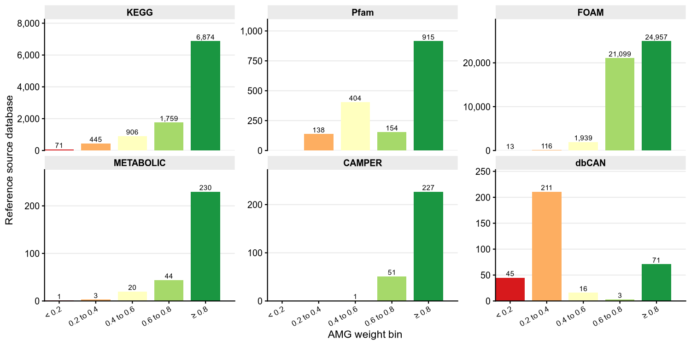
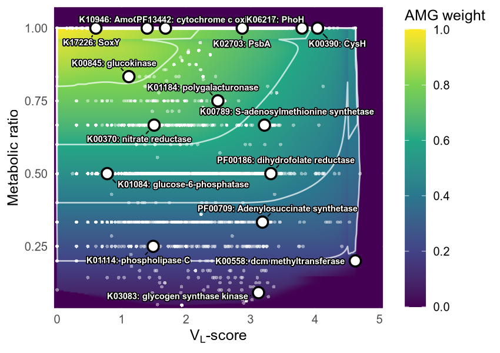
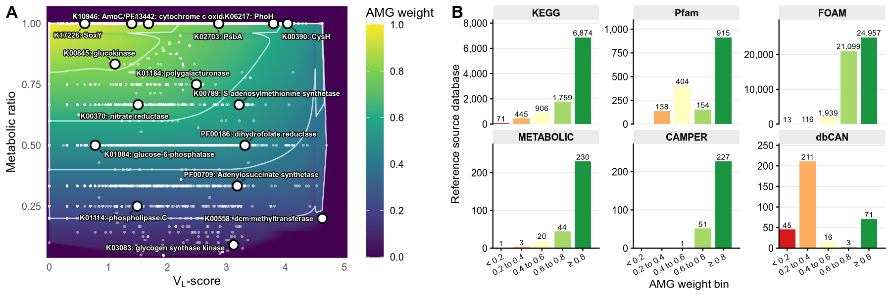

CheckAMG AMG reference weights (Figure 2)
================
James C. Kosmopoulos
2026-09-24

``` r
knitr::opts_chunk$set(echo = TRUE, warning = FALSE, message = FALSE,
                      fig.width = 10, fig.height = 6, dpi = 150)

# the "≥" literals in the bin labels are corrupted under a C/POSIX locale
Sys.setlocale("LC_ALL", "en_US.UTF-8")
```

    ## [1] "LC_CTYPE=en_US.UTF-8;LC_NUMERIC=C;LC_TIME=en_US.UTF-8;LC_COLLATE=en_US.UTF-8;LC_MONETARY=en_US.UTF-8;LC_MESSAGES=en_US.UTF-8;LC_PAPER=en_US.UTF-8;LC_NAME=C;LC_ADDRESS=C;LC_TELEPHONE=C;LC_MEASUREMENT=en_US.UTF-8;LC_IDENTIFICATION=C"

``` r
Sys.setenv(LANG = "en_US.UTF-8", LC_ALL = "en_US.UTF-8")
options(encoding = "UTF-8")

library(tidyverse)
```

    ## ── Attaching core tidyverse packages ──────────────────────────────────────────────────────────────────────────────────────────────────────── tidyverse 2.0.0 ──
    ## ✔ dplyr     1.1.4     ✔ readr     2.1.5
    ## ✔ forcats   1.0.0     ✔ stringr   1.5.1
    ## ✔ ggplot2   3.5.2     ✔ tibble    3.2.1
    ## ✔ lubridate 1.9.4     ✔ tidyr     1.3.1
    ## ✔ purrr     1.0.4     
    ## ── Conflicts ────────────────────────────────────────────────────────────────────────────────────────────────────────────────────────── tidyverse_conflicts() ──
    ## ✖ dplyr::filter() masks stats::filter()
    ## ✖ dplyr::lag()    masks stats::lag()
    ## ℹ Use the conflicted package (<http://conflicted.r-lib.org/>) to force all conflicts to become errors

``` r
library(cowplot)
```

    ## 
    ## Attaching package: 'cowplot'
    ## 
    ## The following object is masked from 'package:lubridate':
    ## 
    ##     stamp

``` r
library(ggrepel)
library(akima)
library(scales)
```

    ## 
    ## Attaching package: 'scales'
    ## 
    ## The following object is masked from 'package:purrr':
    ## 
    ##     discard
    ## 
    ## The following object is masked from 'package:readr':
    ## 
    ##     col_factor

``` r
library(RColorBrewer)
library(svglite)

AMG_REFERENCE_TSV <- file.path("../CheckAMG/files/AMGs.tsv")
PLOT_DIR <- file.path("./plots/amg_benchmark")
dir.create(PLOT_DIR, showWarnings = FALSE, recursive = TRUE)

save_plot_both <- function(p, stem, w, h, dpi = 600) {
  ggsave(file.path(PLOT_DIR, paste0(stem, ".png")), p,
         width = w, height = h, units = "in", dpi = dpi, bg = "white")
  invisible(p)
}

base_theme <- theme_cowplot(font_size = 11) +
  theme(plot.title    = element_text(face = "bold", size = 12),
        strip.background = element_rect(fill = "grey92", color = NA),
        strip.text    = element_text(face = "bold"),
        legend.position = "right",
        legend.title    = element_text(face = "bold"),
        panel.grid.major.y = element_line(color = "grey92")
        )
theme_set(base_theme)
```

# Data

The scored AMG reference table is the only input. Every summary below is
computed from it in this file.

``` r
amgs_raw <- read_tsv(AMG_REFERENCE_TSV, show_col_types = FALSE)
glimpse(amgs_raw)
```

    ## Rows: 60,770
    ## Columns: 10
    ## $ id              <chr> "K25996", "K14580", "K14580", "K27095", "K27802", "K20…
    ## $ db              <chr> "KEGG", "KEGG", "CAMPER", "KEGG", "KEGG", "KEGG", "KEG…
    ## $ name            <chr> "frdC, fdrC; succinate dehydrogenase subunit C", "nahA…
    ## $ metabolic_paths <dbl> 5, 5, 5, 4, 4, 4, 4, 4, 4, 4, 4, 4, 4, 4, 4, 4, 4, 4, …
    ## $ total_paths     <dbl> 5, 5, 5, 4, 4, 4, 4, 4, 4, 4, 4, 4, 4, 4, 4, 4, 4, 4, …
    ## $ path_source     <chr> "KEGG", "KEGG", "KEGG", "KEGG", "KEGG", "KEGG", "KEGG"…
    ## $ metabolic_ratio <dbl> 1, 1, 1, 1, 1, 1, 1, 1, 1, 1, 1, 1, 1, 1, 1, 1, 1, 1, …
    ## $ `VL-score`      <dbl> NA, NA, NA, NA, NA, NA, NA, NA, NA, 0, 0, 0, 0, 0, 0, …
    ## $ AMG_weight      <dbl> 1, 1, 1, 1, 1, 1, 1, 1, 1, 1, 1, 1, 1, 1, 1, 1, 1, 1, …
    ## $ amg_level       <chr> "very high", "very high", "very high", "very high", "v…

# AMG weight distribution per source database (Figure 2B)

``` r
weight_order_ref <- c("very_low", "low", "medium", "high", "very_high")
bin_label_ref <- c(very_low = "< 0.2", low = "0.2 to 0.4", medium = "0.4 to 0.6",
                   high = "0.6 to 0.8", very_high = "≥ 0.8")

ref_weight_plot <- amgs_raw %>%
  mutate(bin = case_when(
    AMG_weight >= 0.8 ~ "very_high",
    AMG_weight >= 0.6 ~ "high",
    AMG_weight >= 0.4 ~ "medium",
    AMG_weight >= 0.2 ~ "low",
    TRUE              ~ "very_low"
  )) %>%
  count(db, bin) %>%
  filter(!is.na(db)) %>%
  mutate(bin = factor(bin_label_ref[bin], levels = unname(bin_label_ref[weight_order_ref])),
         db  = factor(db, levels = c("KEGG", "Pfam", "FOAM", "METABOLIC", "CAMPER", "dbCAN")))

p_reference_weight_distribution <- ggplot(ref_weight_plot,
                                          aes(x = bin, y = n, fill = bin)) +
  geom_col(width = 0.8) +
  geom_text(aes(label = comma(n)), vjust = -0.3, size = 2.6) +
  facet_wrap(~ db, scales = "free_y", ncol = 3) +
  scale_fill_brewer(palette = "RdYlGn") +
  scale_y_continuous(labels = comma, expand = expansion(mult = c(0, 0.2))) +
  scale_x_discrete(expand = expansion(mult = c(0, 0.2))) +
  labs(x = "AMG weight bin", y = "Reference source database", fill = NULL) +
  theme(legend.position = "none",
        axis.text.x = element_text(angle = 30, hjust = 1, size = 8))
save_plot_both(p_reference_weight_distribution, "reference_weight_distribution", 10, 5)
p_reference_weight_distribution
```

<!-- -->

``` r
ref_weight_plot %>%
  pivot_wider(names_from = bin, values_from = n, values_fill = 0) %>%
  arrange(db)
```

    ## # A tibble: 6 × 6
    ##   db        `0.6 to 0.8` `0.4 to 0.6` `≥ 0.8` `0.2 to 0.4` `< 0.2`
    ##   <fct>            <int>        <int>   <int>        <int>   <int>
    ## 1 KEGG              1759          906    6874          445      71
    ## 2 Pfam               154          404     915          138       0
    ## 3 FOAM             21099         1939   24957          116      13
    ## 4 METABOLIC           44           20     230            3       1
    ## 5 CAMPER              51            1     227            0       0
    ## 6 dbCAN                3           16      71          211      45

# AMG weight against VL-score and metabolic ratio (Figure 2A)

``` r
VIRIDIS_DARK <- "#440154"

highlight_ids <- c(
  "K00390"     = "K00390: CysH",
  "K02703"     = "K02703: PsbA",
  "K17226"     = "K17226: SoxY",
  "K06217"     = "K06217: PhoH",
  "K10946"     = "K10946: AmoC/PmoC",
  "K00558"     = "K00558: dcm methyltransferase",
  "K00956"     = "K00956: CysN",
  "K01184"     = "K01184: polygalacturonase",
  "K00789"     = "K00789: S-adenosylmethionine synthetase",
  "K00370"     = "K00370: nitrate reductase",
  "K00845"     = "K00845: glucokinase",
  "PF13442.12" = "PF13442: cytochrome c oxidase III",
  "K01084"     = "K01084: glucose-6-phosphatase",
  "PF00186.25" = "PF00186: dihydrofolate reductase",
  "TIGR02188"  = "TIGR02188: acetyl-CoA synthetase",
  "PF04724.19" = "PF04724: Glycosyl transferase",
  "K01114"     = "K01114: phospholipase C",
  "PF00709.28" = "PF00709: Adenylosuccinate synthetase",
  "K03083"     = "K03083: glycogen synthase kinase"
)

gauss_blur_2d <- function(mat, sigma) {
  r <- ceiling(4 * sigma)
  ks <- seq(-r, r)
  kernel <- exp(-ks^2 / (2 * sigma^2))
  kernel <- kernel / sum(kernel)
  tmp <- matrix(NA_real_, nrow(mat), ncol(mat))
  for (i in seq_len(nrow(mat)))
    tmp[i, ] <- as.numeric(stats::filter(mat[i, ], kernel, sides = 2))
  tmp[is.na(tmp)] <- mat[is.na(tmp)] # filter() returns NA at the edges, keep the input there
  out <- matrix(NA_real_, nrow(mat), ncol(mat))
  for (j in seq_len(ncol(mat)))
    out[, j] <- as.numeric(stats::filter(tmp[, j], kernel, sides = 2))
  out[is.na(out)] <- tmp[is.na(out)]
  out
}

plot_amg_vs_vl <- function(df, highlight_ids = NULL, grid_res = 300L, smooth_sigma = 8) {
  plot_df <- df %>%
    filter(!is.na(`VL-score`), !is.na(AMG_weight), !is.na(metabolic_ratio))

  x <- plot_df$`VL-score`
  y <- plot_df$metabolic_ratio
  z <- plot_df$AMG_weight

  x_rng <- range(x)
  y_rng <- range(y)
  xmin_pad <- diff(x_rng) * 0.010
  xmax_pad <- diff(x_rng) * 0.075
  ymin_pad <- diff(y_rng) * 0.010
  ymax_pad <- diff(y_rng) * 0.075
  xi <- seq(x_rng[1] - xmin_pad, x_rng[2] + xmax_pad, length.out = grid_res)
  yi <- seq(y_rng[1] - ymin_pad, y_rng[2] + ymax_pad, length.out = grid_res)

  # linear + extrap mirror scipy griddata "linear" with a nearest-neighbor fallback
  interp_res <- akima::interp(x, y, z, xo = xi, yo = yi,
                              linear = TRUE, extrap = TRUE, duplicate = "mean")
  Zi <- interp_res$z
  Zi[is.na(Zi)] <- 0.0 # 0 renders as the darkest viridis color, so there are no grey patches

  Xi_mat <- matrix(rep(xi, times = grid_res), nrow = grid_res)
  Yi_mat <- matrix(rep(yi, each = grid_res), nrow = grid_res)
  Zi[Xi_mat > 3.8 & Yi_mat < 0.15] <- 0.0 # no reference profiles sit here, so do not extrapolate into it

  Zi <- gauss_blur_2d(Zi, sigma = smooth_sigma)
  Zi <- pmin(pmax(Zi, 0.0), 1.0)

  grid_df <- expand.grid(x = xi, y = yi)
  grid_df$z <- as.vector(Zi)

  if (!is.null(highlight_ids)) {
    hi_df <- plot_df %>%
      filter(id %in% names(highlight_ids)) %>%
      distinct(id, .keep_all = TRUE) %>%
      mutate(label = highlight_ids[id])
    bg_df <- plot_df %>%
      filter(!id %in% names(highlight_ids))
  } else {
    bg_df <- plot_df
    hi_df <- NULL
  }

  p <- ggplot() +
    geom_raster(data = grid_df, aes(x = x, y = y, fill = z), interpolate = TRUE) +
    scale_fill_viridis_c(name = "AMG weight", limits = c(0, 1),
                         breaks = seq(0, 1, 0.2), labels = sprintf("%.1f", seq(0, 1, 0.2)),
                         option = "D", na.value = VIRIDIS_DARK) +
    geom_contour(data = grid_df, aes(x = x, y = y, z = z),
                 breaks = seq(0.2, 1.0, 0.2), colour = "white",
                 linewidth = 0.6, alpha = 0.7) +
    geom_point(data = bg_df, aes(x = `VL-score`, y = metabolic_ratio),
               colour = "white", alpha = 0.45, size = 1.0, shape = 16) +
    labs(x = expression(V[L] * "-score"), y = "Metabolic ratio") +
    coord_cartesian(xlim = range(xi), ylim = range(yi), expand = FALSE) +
    theme_minimal(base_size = 12) +
    theme(
      panel.grid.major  = element_line(colour = "white", linewidth = 0.4, linetype = "solid"),
      panel.grid.minor  = element_blank(),
      panel.background  = element_rect(fill = VIRIDIS_DARK, colour = NA),
      plot.background   = element_rect(fill = "white", colour = NA),
      panel.border      = element_blank(),
      legend.position   = "right",
      legend.key.height = unit(1.6, "cm")
    )

  if (!is.null(hi_df) && nrow(hi_df) > 0) {
    p <- p +
      geom_point(data = hi_df, aes(x = `VL-score`, y = metabolic_ratio),
                 shape = 21, size = 3.5, colour = "black", fill = "white", stroke = 1.2) +
      ggrepel::geom_text_repel(
        data = hi_df,
        aes(x = `VL-score`, y = metabolic_ratio, label = label),
        colour = "white", fontface = "bold", size = 2.5,
        bg.color = "black", bg.r = 0.15,
        segment.color = "black", segment.size = 0.5, segment.alpha = 0.9,
        box.padding = 0.5, point.padding = 0.4,
        force = 3, force_pull = 0.4,
        max.overlaps = Inf, min.segment.length = 0,
        seed = 20260401,
        xlim = range(xi), ylim = range(yi)
      )
  }
  p
}

p_reference_weight_ratio_vl <- plot_amg_vs_vl(amgs_raw, highlight_ids = highlight_ids)
save_plot_both(p_reference_weight_ratio_vl, "reference_weight_ratio_vl", 5.67, 4)
p_reference_weight_ratio_vl
```

<!-- -->

# Composite (Figure 2)

``` r
p_reference_weight_composite <- cowplot::plot_grid(
  p_reference_weight_ratio_vl,
  p_reference_weight_distribution + theme(legend.position = "none"),
  ncol = 2, rel_widths = c(1, 1),
  labels = c("A", "B"), label_size = 16, label_fontface = "bold"
)
save_plot_both(p_reference_weight_composite, "reference_weight_ratio_vl_composite", 12, 4)
p_reference_weight_composite
```

<!-- -->

# Session info

``` r
sessionInfo()
```

    ## R version 4.3.3 (2024-02-29)
    ## Platform: x86_64-conda-linux-gnu (64-bit)
    ## Running under: Ubuntu 20.04.6 LTS
    ## 
    ## Matrix products: default
    ## BLAS/LAPACK: /storage2/scratch/kosmopoulos/miniconda3/envs/peatlands_env/lib/libopenblasp-r0.3.21.so;  LAPACK version 3.9.0
    ## 
    ## locale:
    ##  [1] LC_CTYPE=en_US.UTF-8       LC_NUMERIC=C              
    ##  [3] LC_TIME=en_US.UTF-8        LC_COLLATE=en_US.UTF-8    
    ##  [5] LC_MONETARY=en_US.UTF-8    LC_MESSAGES=en_US.UTF-8   
    ##  [7] LC_PAPER=en_US.UTF-8       LC_NAME=C                 
    ##  [9] LC_ADDRESS=C               LC_TELEPHONE=C            
    ## [11] LC_MEASUREMENT=en_US.UTF-8 LC_IDENTIFICATION=C       
    ## 
    ## time zone: America/Chicago
    ## tzcode source: system (glibc)
    ## 
    ## attached base packages:
    ## [1] stats     graphics  grDevices utils     datasets  methods   base     
    ## 
    ## other attached packages:
    ##  [1] svglite_2.1.2      RColorBrewer_1.1-3 scales_1.4.0       akima_0.6-3.6     
    ##  [5] ggrepel_0.9.8      cowplot_1.1.3      lubridate_1.9.4    forcats_1.0.0     
    ##  [9] stringr_1.5.1      dplyr_1.1.4        purrr_1.0.4        readr_2.1.5       
    ## [13] tidyr_1.3.1        tibble_3.2.1       ggplot2_3.5.2      tidyverse_2.0.0   
    ## 
    ## loaded via a namespace (and not attached):
    ##  [1] utf8_1.2.4        generics_0.1.3    stringi_1.8.7     lattice_0.22-7   
    ##  [5] hms_1.1.3         digest_0.6.37     magrittr_2.0.3    evaluate_1.0.3   
    ##  [9] grid_4.3.3        timechange_0.3.0  fastmap_1.2.0     viridisLite_0.4.2
    ## [13] isoband_0.2.7     textshaping_0.3.7 cli_3.6.4         rlang_1.2.0      
    ## [17] crayon_1.5.3      bit64_4.6.0-1     withr_3.0.2       yaml_2.3.10      
    ## [21] tools_4.3.3       parallel_4.3.3    tzdb_0.5.0        vctrs_0.6.5      
    ## [25] R6_2.6.1          lifecycle_1.0.4   bit_4.6.0         vroom_1.6.5      
    ## [29] ragg_1.3.3        pkgconfig_2.0.3   pillar_1.10.2     gtable_0.3.6     
    ## [33] glue_1.8.0        Rcpp_1.0.14       systemfonts_1.2.1 xfun_0.52        
    ## [37] tidyselect_1.2.1  knitr_1.50        farver_2.1.2      htmltools_0.5.8.1
    ## [41] labeling_0.4.3    rmarkdown_2.29    compiler_4.3.3    S7_0.2.2         
    ## [45] sp_2.2-0
