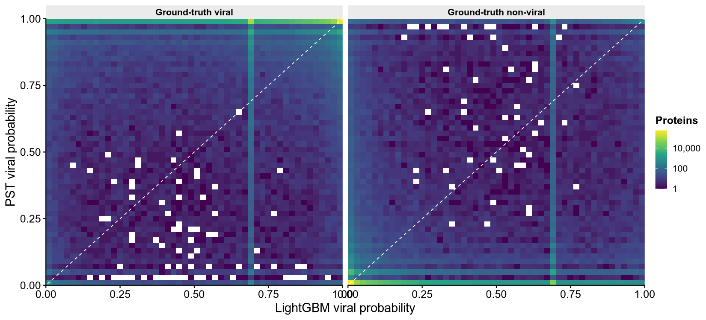
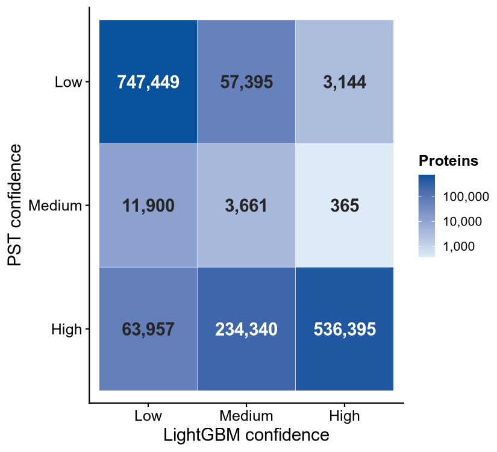
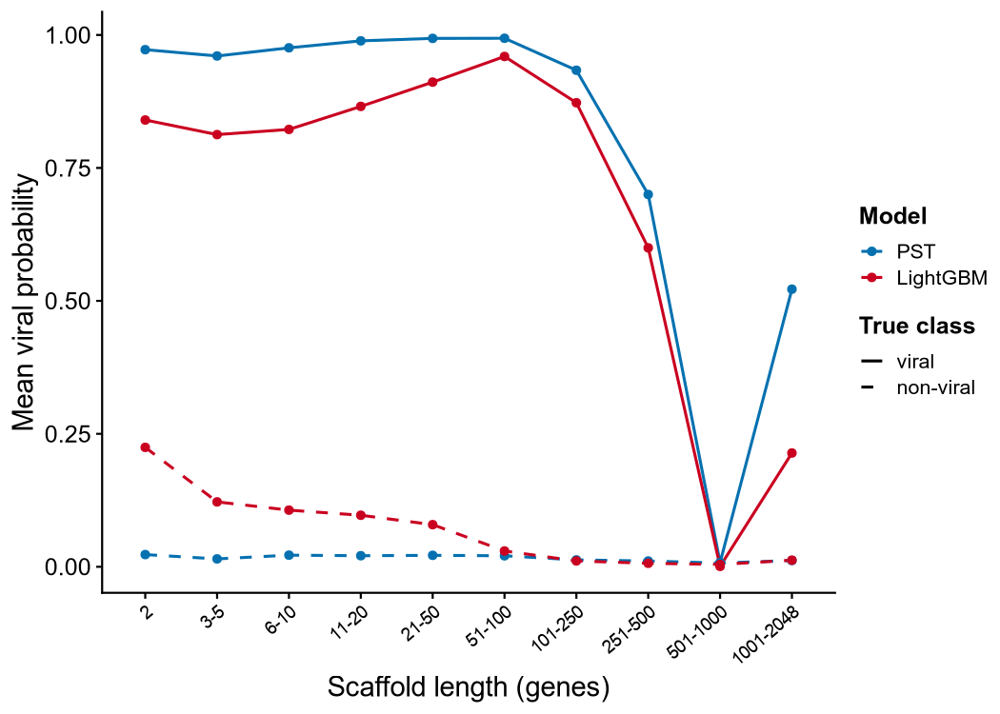
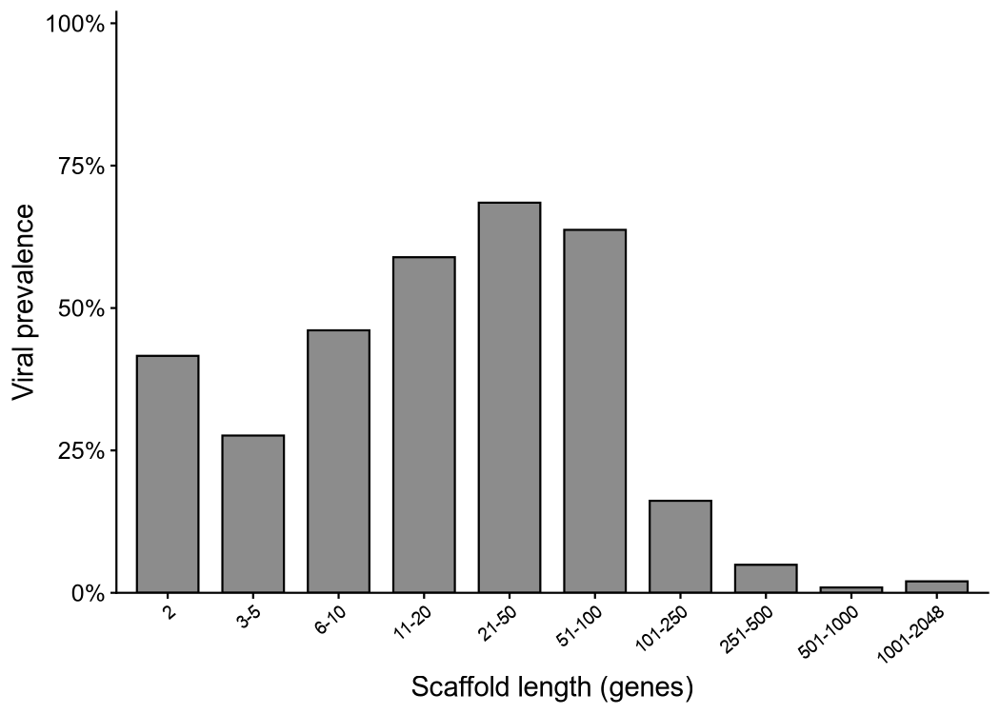
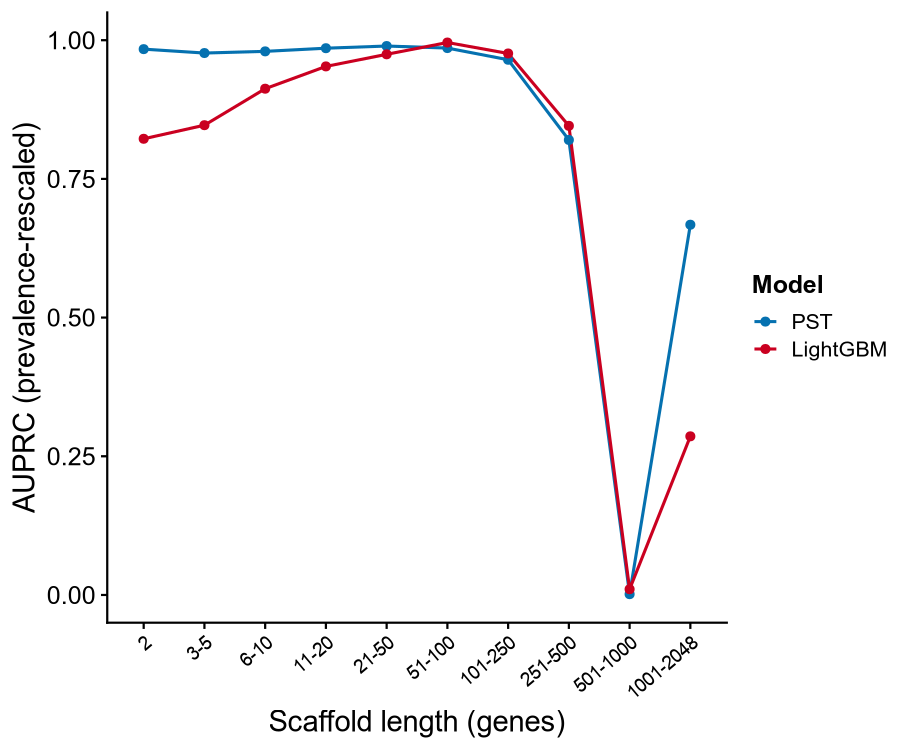
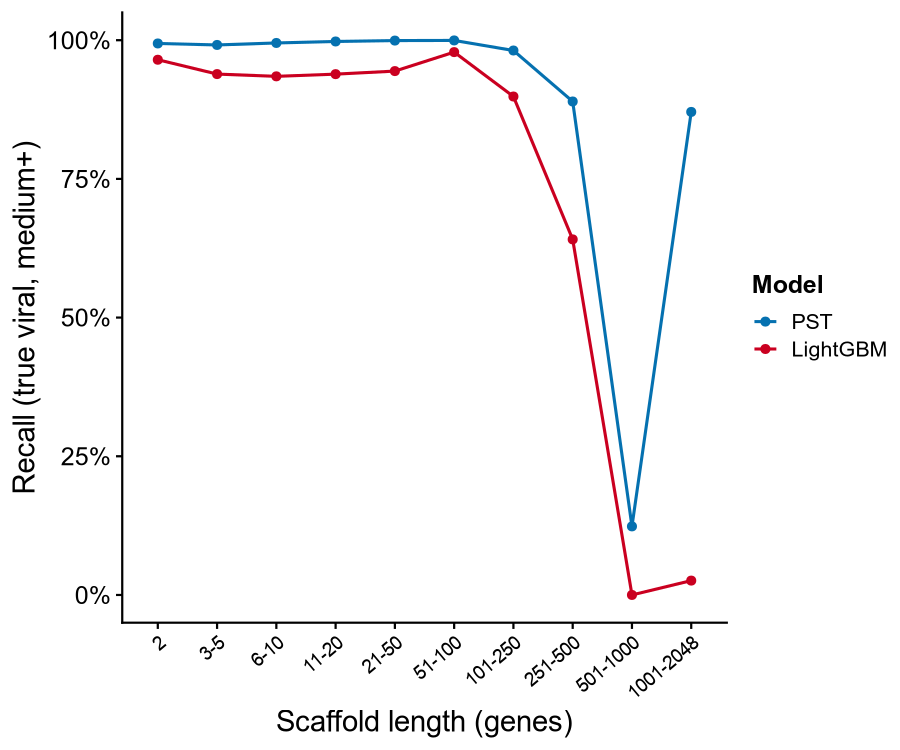
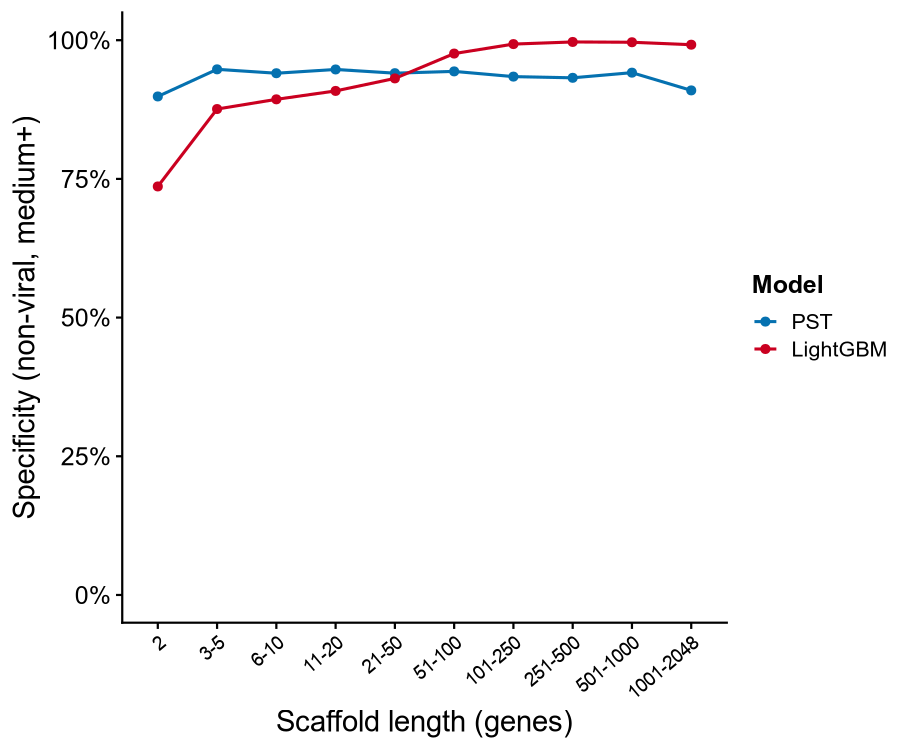
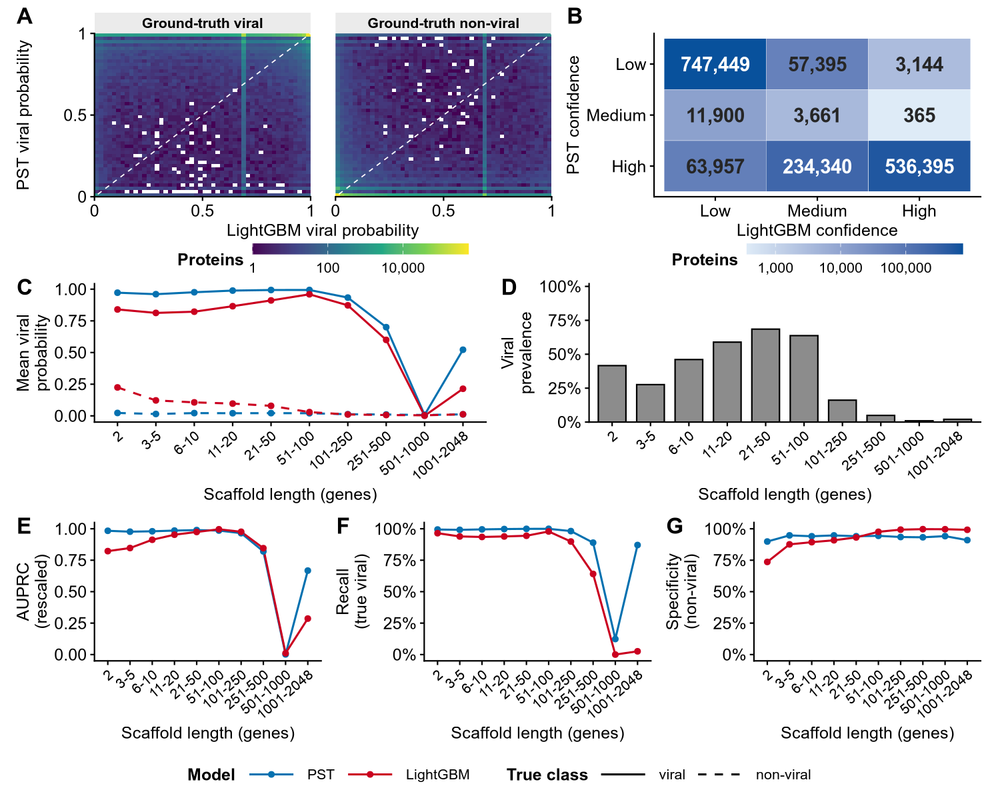

PST vs LightGBM viral-model comparison figures
================
James C. Kosmopoulos
2026-09-24

``` r
knitr::opts_chunk$set(echo = TRUE, warning = FALSE, message = FALSE, fig.width = 10, fig.height = 6, dpi = 150)

library("arrow");packageVersion("arrow")
```

    ## 
    ## Attaching package: 'arrow'

    ## The following object is masked from 'package:utils':
    ## 
    ##     timestamp

    ## [1] '13.0.0'

``` r
library("tidyverse");packageVersion("tidyverse")
```

    ## -- Attaching core tidyverse packages ------------------------ tidyverse 2.0.0 --
    ## v dplyr     1.1.4     v readr     2.1.5
    ## v forcats   1.0.0     v stringr   1.5.1
    ## v ggplot2   3.5.2     v tibble    3.2.1
    ## v lubridate 1.9.4     v tidyr     1.3.1
    ## v purrr     1.0.4

    ## -- Conflicts ------------------------------------------ tidyverse_conflicts() --
    ## x lubridate::duration() masks arrow::duration()
    ## x dplyr::filter()       masks stats::filter()
    ## x dplyr::lag()          masks stats::lag()
    ## i Use the conflicted package (<http://conflicted.r-lib.org/>) to force all conflicts to become errors

    ## [1] '2.0.0'

``` r
library("cowplot");packageVersion("cowplot")
```

    ## 
    ## Attaching package: 'cowplot'
    ## 
    ## The following object is masked from 'package:lubridate':
    ## 
    ##     stamp

    ## [1] '1.1.3'

``` r
library("patchwork");packageVersion("patchwork")
```

    ## 
    ## Attaching package: 'patchwork'
    ## 
    ## The following object is masked from 'package:cowplot':
    ## 
    ##     align_plots

    ## [1] '1.3.2'

``` r
library("scales");packageVersion("scales")
```

    ## 
    ## Attaching package: 'scales'
    ## 
    ## The following object is masked from 'package:purrr':
    ## 
    ##     discard
    ## 
    ## The following object is masked from 'package:readr':
    ## 
    ##     col_factor

    ## [1] '1.4.0'

``` r
library("RColorBrewer");packageVersion("RColorBrewer")
```

    ## [1] '1.1.3'

``` r
library("svglite");packageVersion("svglite")
```

    ## [1] '2.1.2'

``` r
TABLES_DIR <- file.path("./tables/compare_pst_lgbm")
PLOT_DIR   <- file.path("./plots/compare_pst_lgbm")
dir.create(PLOT_DIR, showWarnings = FALSE, recursive = TRUE)

save_plot_both <- function(p, stem, w, h, dpi = 600) {
  ggsave(file.path(PLOT_DIR, paste0(stem, ".png")), p,
         width = w, height = h, units = "in", dpi = dpi, bg = "white")
  # ggsave(file.path(PLOT_DIR, paste0(stem, ".svg")), p,
  #        width = w, height = h, units = "in", bg = "white", device = svglite::svglite)
  invisible(p)
}

read_t <- function(f) suppressMessages(readr::read_tsv(file.path(TABLES_DIR, f), show_col_types = FALSE, progress = FALSE))
```

# Palettes and theme

``` r
model_pal <- c("PST" = "#0571b0", "LightGBM" = "#ca0020")

# scaffold-length bins in ascending order
bin_levels <- c("2", "3-5", "6-10", "11-20", "21-50", "51-100", "101-250", "251-500", "501-1000", "1001-2048", ">2048")

base_theme <- theme_cowplot(font_size = 12) +
  theme(plot.title    = element_text(face = "bold", size = 14),
        axis.text     = element_text(size = 12),
        axis.title    = element_text(size = 14),
        strip.background = element_rect(fill = "grey92", color = NA),
        strip.text    = element_text(face = "bold"),
        legend.position = "right",
        legend.title    = element_text(face = "bold"),
        panel.grid.major.x = element_blank(),
        panel.grid.major.y = element_blank())
theme_set(base_theme)

# long-format helper for the two model columns of the length table
to_models <- function(df, pst_col, lgbm_col, value_name) {
  df %>% select(gene_bin, PST = all_of(pst_col), LightGBM = all_of(lgbm_col)) %>%
    pivot_longer(c(PST, LightGBM), names_to = "model", values_to = value_name) %>%
    mutate(model = factor(model, levels = c("PST", "LightGBM")),
           gene_bin = factor(gene_bin, levels = bin_levels))
}

xlen <- list(scale_x_discrete(), labs(x = "Scaffold length (genes)"),
             theme(axis.text.x = element_text(angle = 40, hjust = 1, size = 9)))
```

# Panel A: viral probability agreement (2D bins)

``` r
b2d <- read_t("task1_prob_2d_bins_fine.tsv") %>%
  mutate(klass = factor(klass, levels = c("Ground-truth viral", "Ground-truth non-viral")))
pA <- ggplot(b2d, aes(x = lgbm_p, y = pst_p, fill = n)) +
  geom_raster() +
  geom_abline(slope = 1, intercept = 0, linetype = 2, color = "white", linewidth = 0.4) +
  facet_wrap(~ klass) +
  scale_fill_viridis_c(trans = "log10", labels = comma, name = "Proteins") +
  scale_x_continuous(limits = c(0, 1), expand = c(0, 0)) +
  scale_y_continuous(limits = c(0, 1), expand = c(0, 0)) +
  labs(x = "LightGBM viral probability", y = "PST viral probability") +
  theme(legend.position = "right")
save_plot_both(pA, "compare_prob_2d_bins", w = 11, h = 5)
print(pA)
```

<!-- -->

# Panel B: confidence-call agreement

``` r
lev <- c("Low", "Medium", "High")
cc <- read_t("task1_confidence_confusion_counts.tsv") %>%
  pivot_longer(c(Low, Medium, High), names_to = "lgbm_conf", values_to = "n") %>%
  mutate(pst_conf3 = factor(pst_conf3, levels = rev(lev)), lgbm_conf = factor(lgbm_conf, levels = lev))
pB <- ggplot(cc, aes(lgbm_conf, pst_conf3, fill = n)) +
  geom_tile(color = "white") +
  geom_text(aes(label = comma(n), color = n > 2e5), size = 5, fontface = "bold", show.legend = FALSE) +
  scale_color_manual(values = c("FALSE" = "grey15", "TRUE" = "white")) +
  scale_fill_gradient(low = "#deebf7", high = "#08519c", trans = "log10", labels = comma, name = "Proteins") +
  labs(x = "LightGBM confidence", y = "PST confidence") +
  theme(legend.position = "right")
save_plot_both(pB, "compare_confidence_agreement", w = 6, h = 5)
print(pB)
```

<!-- -->

# Panel C: mean viral probability versus scaffold length

``` r
lp <- read_t("task2_length_probability_profile.tsv") %>%
  filter(klass %in% c("viral", "non-viral")) %>%
  select(gene_bin, klass, pst_mean, lgbm_mean) %>%
  pivot_longer(c(pst_mean, lgbm_mean), names_to = "model", values_to = "mean_prob") %>%
  mutate(model = factor(ifelse(model == "pst_mean", "PST", "LightGBM"), levels = c("PST", "LightGBM")),
         gene_bin = factor(gene_bin, levels = bin_levels),
         klass = factor(klass, levels = c("viral", "non-viral")))
pC <- ggplot(lp, aes(gene_bin, mean_prob, color = model, linetype = klass, group = interaction(model, klass))) +
  geom_line(linewidth = 0.7) + geom_point(size = 1.6) +
  scale_color_manual(values = model_pal, name = "Model") +
  scale_linetype_manual(values = c("viral" = 1, "non-viral" = 2), name = "True class") +
  labs(x = "Scaffold length (genes)", y = "Mean viral probability") +
  theme(axis.text.x = element_text(angle = 40, hjust = 1, size = 9))
save_plot_both(pC, "compare_length_probability", w = 7, h = 5)
print(pC)
```

<!-- -->

# Panel D: viral prevalence per length bin

``` r
perf <- read_t("task2_performance_by_length.tsv") %>% mutate(gene_bin = factor(gene_bin, levels = bin_levels))
pD <- ggplot(perf, aes(gene_bin, viral_prevalence)) +
  geom_col(fill = "grey55", color = "black", width = 0.72) +
  scale_y_continuous(labels = percent, limits = c(0, 1), expand = expansion(mult = c(0, 0.02))) +
  labs(x = "Scaffold length (genes)", y = "Viral prevalence") +
  theme(axis.text.x = element_text(angle = 40, hjust = 1, size = 9))
save_plot_both(pD, "compare_prevalence_by_length", w = 7, h = 5)
print(pD)
```

<!-- -->

# Panel E: AUPRC rescaled to bin prevalence

``` r
pE <- ggplot(to_models(perf, "pst_norm_auprc", "lgbm_norm_auprc", "v"),
             aes(gene_bin, v, color = model, group = model)) +
  geom_line(linewidth = 0.7) + geom_point(size = 1.6) +
  scale_color_manual(values = model_pal, name = "Model") +
  scale_y_continuous(limits = c(0, 1)) +
  labs(x = "Scaffold length (genes)", y = "AUPRC (prevalence-rescaled)") +
  theme(axis.text.x = element_text(angle = 40, hjust = 1, size = 9))
save_plot_both(pE, "compare_auprc_rescaled", w = 6, h = 5)
print(pE)
```

<!-- -->

# Panel F: recall among true viral proteins (medium+)

``` r
pF <- ggplot(to_models(perf, "pst_recall_viral", "lgbm_recall_viral", "v"),
             aes(gene_bin, v, color = model, group = model)) +
  geom_line(linewidth = 0.7) + geom_point(size = 1.6) +
  scale_color_manual(values = model_pal, name = "Model") +
  scale_y_continuous(labels = percent, limits = c(0, 1)) +
  labs(x = "Scaffold length (genes)", y = "Recall (true viral, medium+)") +
  theme(axis.text.x = element_text(angle = 40, hjust = 1, size = 9))
save_plot_both(pF, "compare_recall_viral", w = 6, h = 5)
print(pF)
```

<!-- -->

# Panel G: specificity among non-viral proteins (medium+)

``` r
pG <- ggplot(to_models(perf, "pst_specificity_nonviral", "lgbm_specificity_nonviral", "v"),
             aes(gene_bin, v, color = model, group = model)) +
  geom_line(linewidth = 0.7) + geom_point(size = 1.6) +
  scale_color_manual(values = model_pal, name = "Model") +
  scale_y_continuous(labels = percent, limits = c(0, 1)) +
  labs(x = "Scaffold length (genes)", y = "Specificity (non-viral, medium+)") +
  theme(axis.text.x = element_text(angle = 40, hjust = 1, size = 9))
save_plot_both(pG, "compare_specificity_nonviral", w = 6, h = 5)
print(pG)
```

<!-- -->

# Composite figure

``` r
cbar_theme <- theme(legend.position = "bottom",
                    legend.direction = "horizontal",
                    legend.title.position = "left",
                    legend.justification = "center",
                    legend.key.width = unit(1.1, "cm"),
                    legend.key.height = unit(0.28, "cm"),
                    legend.box.spacing = unit(3, "pt"),
                    legend.margin = margin(0, 0, 0, 0))

tight <- theme(plot.margin = margin(3, 8, 3, 3))

xlab_theme <- theme(axis.text.x = element_text(size = 10),
                    axis.title.x = element_text(margin = margin(t = 3)),
                    plot.margin = margin(3, 8, 11, 3))

pA_c <- pA + labs(y = "PST viral probability", tag = "A") +
  scale_x_continuous(limits = c(0, 1), expand = c(0, 0), breaks = c(0, 0.5, 1), labels = c("0", "0.5", "1")) +
  scale_y_continuous(limits = c(0, 1), expand = c(0, 0), breaks = c(0, 0.5, 1), labels = c("0", "0.5", "1")) +
  cbar_theme + tight + theme(panel.spacing = unit(18, "pt"))
pB_c <- pB + labs(y = "PST confidence", tag = "B") + cbar_theme + tight

# C, E, F, G share the model (and true-class) scales, so their legends move to one common row at the bottom
pC_c <- pC + labs(y = "Mean viral\nprobability", tag = "C") + tight + xlab_theme + theme(legend.position = "none")
pD_c <- pD + labs(y = "Viral\nprevalence", tag = "D") + tight + xlab_theme
pE_c <- pE + labs(y = "AUPRC\n(rescaled)", tag = "E") + tight + xlab_theme + theme(legend.position = "none")
pF_c <- pF + labs(y = "Recall\n(true viral)", tag = "F") + tight + xlab_theme + theme(legend.position = "none")
pG_c <- pG + labs(y = "Specificity\n(non-viral)", tag = "G") + tight + xlab_theme + theme(legend.position = "none")

shared_leg <- cowplot::get_plot_component(
  pC + theme(legend.position = "bottom", legend.direction = "horizontal",
             legend.box = "horizontal", legend.justification = "center",
             legend.margin = margin(0, 8, 0, 8),
             legend.key.width = unit(1.4, "cm")),
  "guide-box-bottom")

composite <- (pA_c + pB_c + plot_layout(widths = c(7, 5))) /
  (pC_c + pD_c) /
  (pE_c + pF_c + pG_c) /
  wrap_elements(full = shared_leg) +
  plot_layout(heights = c(1.18, 1, 1, 0.13)) &
  theme(plot.tag = element_text(size = 16, face = "bold"),
        axis.title = element_text(size = 12))
save_plot_both(composite, "compare_pst_lgbm_composite", w = 10, h = 8)
print(composite)
```

<!-- -->

# Session info

``` r
sessionInfo()
```

    ## R version 4.3.3 (2024-02-29)
    ## Platform: x86_64-conda-linux-gnu (64-bit)
    ## Running under: Ubuntu 20.04.6 LTS
    ## 
    ## Matrix products: default
    ## BLAS/LAPACK: /storage2/scratch/kosmopoulos/miniconda3/envs/peatlands_env/lib/libopenblasp-r0.3.21.so;  LAPACK version 3.9.0
    ## 
    ## locale:
    ##  [1] LC_CTYPE=en_US       LC_NUMERIC=C         LC_TIME=en_US       
    ##  [4] LC_COLLATE=en_US     LC_MONETARY=en_US    LC_MESSAGES=en_US   
    ##  [7] LC_PAPER=en_US       LC_NAME=C            LC_ADDRESS=C        
    ## [10] LC_TELEPHONE=C       LC_MEASUREMENT=en_US LC_IDENTIFICATION=C 
    ## 
    ## time zone: America/Chicago
    ## tzcode source: system (glibc)
    ## 
    ## attached base packages:
    ## [1] stats     graphics  grDevices utils     datasets  methods   base     
    ## 
    ## other attached packages:
    ##  [1] svglite_2.1.2      RColorBrewer_1.1-3 scales_1.4.0       patchwork_1.3.2   
    ##  [5] cowplot_1.1.3      lubridate_1.9.4    forcats_1.0.0      stringr_1.5.1     
    ##  [9] dplyr_1.1.4        purrr_1.0.4        readr_2.1.5        tidyr_1.3.1       
    ## [13] tibble_3.2.1       ggplot2_3.5.2      tidyverse_2.0.0    arrow_13.0.0      
    ## 
    ## loaded via a namespace (and not attached):
    ##  [1] generics_0.1.3    stringi_1.8.7     hms_1.1.3         digest_0.6.37    
    ##  [5] magrittr_2.0.3    evaluate_1.0.3    grid_4.3.3        timechange_0.3.0 
    ##  [9] fastmap_1.2.0     viridisLite_0.4.2 textshaping_0.3.7 cli_3.6.4        
    ## [13] rlang_1.2.0       crayon_1.5.3      bit64_4.6.0-1     withr_3.0.2      
    ## [17] yaml_2.3.10       tools_4.3.3       parallel_4.3.3    tzdb_0.5.0       
    ## [21] assertthat_0.2.1  vctrs_0.6.5       R6_2.6.1          lifecycle_1.0.4  
    ## [25] bit_4.6.0         vroom_1.6.5       ragg_1.3.3        pkgconfig_2.0.3  
    ## [29] pillar_1.10.2     gtable_0.3.6      glue_1.8.0        systemfonts_1.2.1
    ## [33] xfun_0.52         tidyselect_1.2.1  knitr_1.50        farver_2.1.2     
    ## [37] htmltools_0.5.8.1 labeling_0.4.3    rmarkdown_2.29    compiler_4.3.3
