DRAM-V Pfam over-reporting figures
================
James C. Kosmopoulos
2026-09-17

``` r
knitr::opts_chunk$set(echo = TRUE, warning = FALSE, message = FALSE,
                      fig.width = 10, fig.height = 6, dpi = 150)

library("arrow");packageVersion("arrow")
```

    ## Warning: package 'arrow' was built under R version 4.4.3

    ## 
    ## Attaching package: 'arrow'

    ## The following object is masked from 'package:utils':
    ## 
    ##     timestamp

    ## [1] '22.0.0.1'

``` r
library("tidyverse");packageVersion("tidyverse")
```

    ## Warning: package 'tibble' was built under R version 4.4.3

    ## Warning: package 'tidyr' was built under R version 4.4.3

    ## Warning: package 'purrr' was built under R version 4.4.3

    ## ── Attaching core tidyverse packages ──────────────────────── tidyverse 2.0.0 ──
    ## ✔ dplyr     1.1.4     ✔ readr     2.1.5
    ## ✔ forcats   1.0.0     ✔ stringr   1.5.1
    ## ✔ ggplot2   3.5.2     ✔ tibble    3.3.1
    ## ✔ lubridate 1.9.3     ✔ tidyr     1.3.2
    ## ✔ purrr     1.2.1

    ## ── Conflicts ────────────────────────────────────────── tidyverse_conflicts() ──
    ## ✖ lubridate::duration() masks arrow::duration()
    ## ✖ dplyr::filter()       masks stats::filter()
    ## ✖ dplyr::lag()          masks stats::lag()
    ## ℹ Use the conflicted package (<http://conflicted.r-lib.org/>) to force all conflicts to become errors

    ## [1] '2.0.0'

``` r
library("cowplot");packageVersion("cowplot")
```

    ## 
    ## Attaching package: 'cowplot'
    ## 
    ## The following object is masked from 'package:lubridate':
    ## 
    ##     stamp

    ## [1] '1.1.3'

``` r
library("patchwork");packageVersion("patchwork")
```

    ## Warning: package 'patchwork' was built under R version 4.4.1

    ## 
    ## Attaching package: 'patchwork'
    ## 
    ## The following object is masked from 'package:cowplot':
    ## 
    ##     align_plots

    ## [1] '1.3.2'

``` r
library("scales");packageVersion("scales")
```

    ## Warning: package 'scales' was built under R version 4.4.1

    ## 
    ## Attaching package: 'scales'
    ## 
    ## The following object is masked from 'package:purrr':
    ## 
    ##     discard
    ## 
    ## The following object is masked from 'package:readr':
    ## 
    ##     col_factor

    ## [1] '1.4.0'

``` r
library("RColorBrewer");packageVersion("RColorBrewer")
```

    ## [1] '1.1.3'

``` r
library("svglite");packageVersion("svglite")
```

    ## [1] '2.1.3'

``` r
TABLES_DIR  <- file.path("./tables/DRAMV_pfam")
PLOT_DIR <- file.path("./plots/DRAMV_pfam")
dir.create(PLOT_DIR, showWarnings = FALSE, recursive = TRUE)

save_plot_both <- function(p, stem, w, h, dpi = 600) {
  ggsave(file.path(PLOT_DIR, paste0(stem, ".png")), p,
         width = w, height = h, units = "in", dpi = dpi, bg = "white")
  # ggsave(file.path(PLOT_DIR, paste0(stem, ".svg")), p,
  #        width = w, height = h, units = "in", bg = "white", device = svglite::svglite)
  invisible(p)
}

read_if <- function(f) {
  if (file.exists(f)) suppressMessages(readr::read_tsv(f, show_col_types = FALSE, progress = FALSE)) else NULL
}
```

# Palettes and theme

``` r
tool_pal <- c(
  "CheckAMG"           = "#377EB8",
  "DRAM-V"             = "#984EA3",
  "VIBRANT"            = "#4DAF4A",
  "CheckAMG (all)"     = "#6BAED6",
  "CheckAMG (kept)"    = "#08519C",
  "hmmscan (default)"  = "#F16913",
  "hmmscan (--cut_ga)" = "#8C2D04"
)

support_pal <- c(
  "HMMER supported"  = "#1A9850",
  "HMMER borderline" = "#FEE08B",
  "HMMER rejected"   = "#B85450"
)

seq_type_order  <- c("metagenome", "virome", "viral_genome")
seq_type_label  <- c("metagenome" = "Mixed metagenomes",
                     "virome" = "Viromes",
                     "viral_genome" = "Viral genomes")

base_theme <- theme_cowplot(font_size = 11) +
  theme(plot.title    = element_text(face = "bold", size = 12),
        axis.text     = element_text(size = 12),
        axis.title    = element_text(size = 14),
        strip.background = element_rect(fill = "grey92", color = NA),
        strip.text    = element_text(face = "bold"),
        legend.position = "right",
        legend.title    = element_text(face = "bold"),
        panel.grid.major.y = element_line(color = "grey92"))
theme_set(base_theme)
```

# Benchmark-wide per-gene Pfam count ECDF

``` r
dramv_per_gene_pfam_counts <- read_if(file.path(TABLES_DIR, "dramv_pfam_per_gene_counts.tsv")) %>%
  mutate(
    seq_type = factor(seq_type, levels = unname(seq_type_label)),
    tool = factor(tool, levels = c("DRAM-V", "CheckAMG (all)", "CheckAMG (kept)"))
  )

p_dramv_per_gene_pfam_counts <- ggplot(dramv_per_gene_pfam_counts, aes(x = n + 1, color = tool, weight = count)) +
  stat_ecdf(linewidth = 1.0) +
  scale_x_log10(labels = label_comma()) +
  scale_color_manual(values = tool_pal, name = "Tool") +
  facet_wrap(~ seq_type) +
  labs(x = "Pfam hits per gene (+1, log10)", y = "Empirical CDF",
        title = "Per-gene Pfam hit counts across the benchmark (n = 4.66 M)")
save_plot_both(p_dramv_per_gene_pfam_counts, "dramv_pfam_hit_counts_ecdf", w = 11, h = 4.5)
print(p_dramv_per_gene_pfam_counts)
```

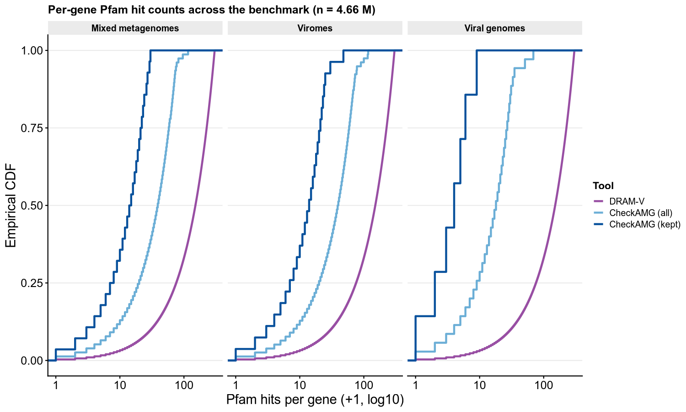<!-- -->

# Targeted hmmscan concordance

``` r
dramv_pfam_concordance <- read_parquet(file.path(TABLES_DIR, "dramv_pfam_concordance.parquet"))
if (!is.null(dramv_pfam_concordance)) {
  category_label <- c("dramv_over" = "DRAM-V over-reports",
                      "concordant" = "Concordant",
                      "checkamg_only" = "CheckAMG only")
  dramv_pfam_concordance_long <- dramv_pfam_concordance %>%
    select(new_gene, category, seq_type,
           dramv_pfam_n, checkamg_pfam_n_all, checkamg_pfam_n_keep,
           hmmscan_default_n, hmmscan_cutga_n) %>%
    pivot_longer(cols = c(dramv_pfam_n, checkamg_pfam_n_all, checkamg_pfam_n_keep,
                          hmmscan_default_n, hmmscan_cutga_n),
                 names_to = "tool", values_to = "n") %>%
    mutate(tool = recode(tool,
                         "dramv_pfam_n"         = "DRAM-V",
                         "checkamg_pfam_n_all"  = "CheckAMG (all)",
                         "checkamg_pfam_n_keep" = "CheckAMG (kept)",
                         "hmmscan_default_n"    = "hmmscan (default)",
                         "hmmscan_cutga_n"      = "hmmscan (--cut_ga)"),
           tool = factor(tool, levels = c("DRAM-V", "CheckAMG (all)", "CheckAMG (kept)",
                                          "hmmscan (default)", "hmmscan (--cut_ga)")),
           category = factor(category_label[category], levels = unname(category_label)))

  p_dramv_pfam_concordance <- ggplot(dramv_pfam_concordance_long, aes(x = tool, y = n + 1, fill = tool)) +
    geom_violin(alpha = 0.6, scale = "width", color = NA) +
    geom_jitter(width = 0.12, alpha = 0.85, size = 1.6, color = "grey20") +
    scale_y_log10(labels = label_comma()) +
    scale_fill_manual(values = tool_pal, name = "Tool") +
    facet_wrap(~ category) +
    labs(x = NULL, y = "Pfam hits per gene (+1, log10)",
         title = "Targeted hmmscan concordance (n = 36 genes)") +
    theme(axis.text.x = element_text(angle = 35, hjust = 1), legend.position = "none")
  save_plot_both(p_dramv_pfam_concordance, "dramv_pfam_concordance", w = 10, h = 5)
  print(p_dramv_pfam_concordance)

  p_dramv_pfam_concordanceb <- ggplot(dramv_pfam_concordance %>% mutate(category = factor(category_label[category], levels = unname(category_label))),
                  aes(x = hmmscan_default_n + 1, y = dramv_pfam_n + 1, color = category)) +
    geom_abline(slope = 1, intercept = 0, linetype = 2, color = "grey70") +
    geom_point(size = 2.8, alpha = 0.9) +
    scale_x_log10(labels = label_comma()) + scale_y_log10(labels = label_comma()) +
    scale_color_brewer(palette = "Set1", name = "Selection category") +
    labs(x = "HMMscan (default) Pfam hits per gene (+1, log10)",
         y = "DRAM-V Pfam hits per gene (+1, log10)",
         title = "Per-gene DRAM-V vs HMMscan",
         subtitle = "Diagonal = agreement; points above = DRAM-V over-reports")
  save_plot_both(p_dramv_pfam_concordanceb, "dramv_pfam_concordance_scatter", w = 8, h = 6)
  print(p_dramv_pfam_concordanceb)
}
```

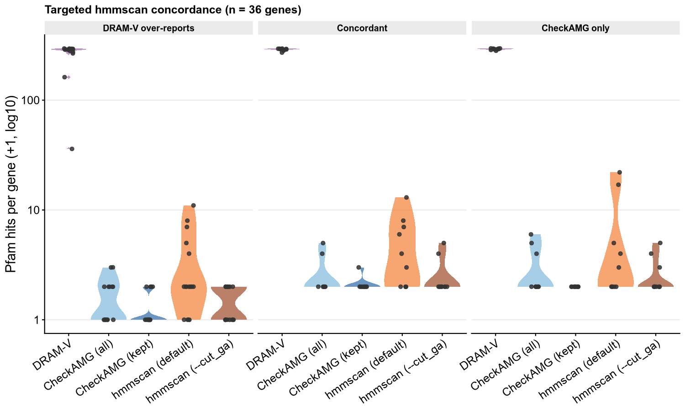<!-- -->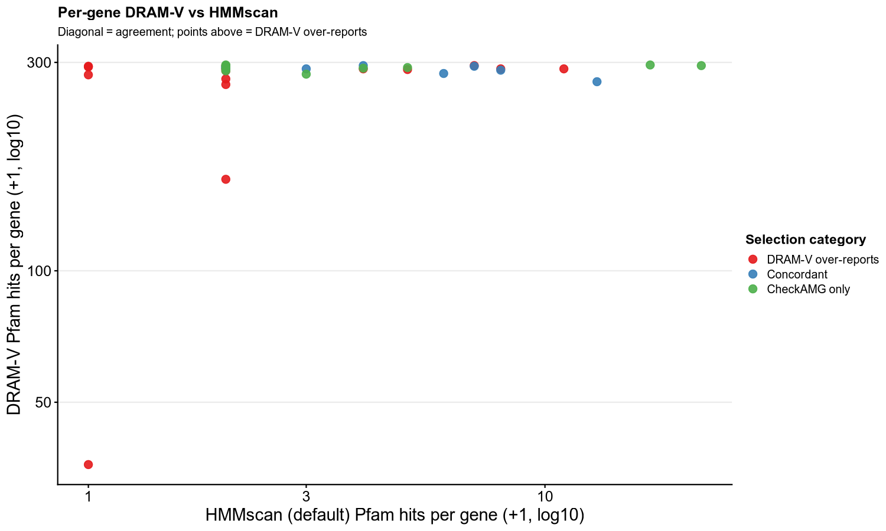<!-- -->

# Benchmark-scale distributions

## ECDFs

``` r
benchmark_wide_ecdf_tools <- c("DRAM-V", "CheckAMG (all)", "CheckAMG (kept)")
ec <- read_if(file.path(TABLES_DIR, "dramv_pfam_ecdf_points.tsv")) %>%
  filter(tool %in% benchmark_wide_ecdf_tools) %>%
  mutate(
    seq_type = factor(seq_type, levels = unname(seq_type_label)),
    tool = factor(tool, levels = benchmark_wide_ecdf_tools)
  )
p_ec <- ggplot(ec, aes(x = value + 1, y = ecdf, color = tool)) +
  geom_step(linewidth = 1.0) +
  scale_x_log10(labels = label_comma()) +
  scale_color_manual(values = tool_pal, name = "Tool") +
  facet_wrap(~ seq_type) +
  labs(x = "Pfam hits per gene (+1, log10)", y = "Empirical CDF",
        title = "Benchmark-wide Pfam hit ECDFs (n = 4.66 M genes)")
save_plot_both(p_ec, "dramv_pfam_ecdf_benchmark_wide", w = 11, h = 4.5)
print(p_ec)
```

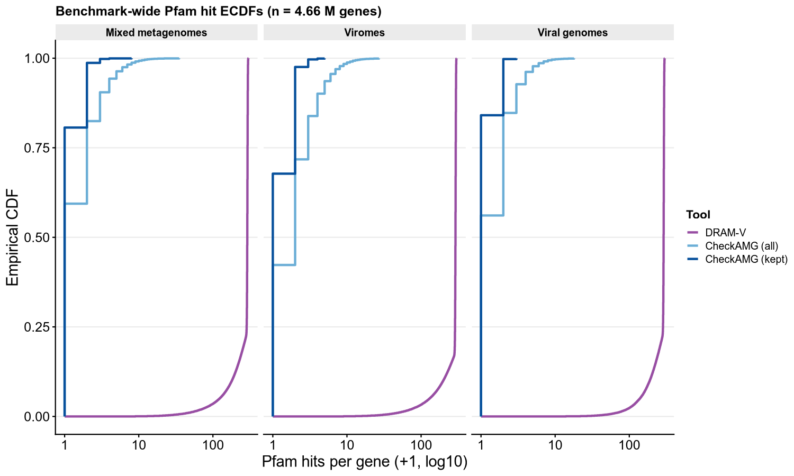<!-- -->

## Per-gene scatter DRAM-V vs hmmscan

``` r
sc <- read_parquet(file.path(TABLES_DIR, "dramv_pfam_scatter.parquet"))
sc <- sc %>%
  filter(!is.na(hmmscan_default_n) & !is.na(dramv_pfam_n)) %>%
  mutate(seq_type = factor(seq_type_label[seq_type], levels = unname(seq_type_label)))
if (nrow(sc) > 120000) sc <- sc %>% slice_sample(n = 120000)

p_per_gene_sc <- ggplot(sc, aes(x = hmmscan_default_n + 1, y = dramv_pfam_n + 1)) +
  geom_abline(aes(slope = 1, intercept = 0,
                  color = "Perfect agreement", linetype = "Perfect agreement")) +
  geom_point(aes(color = "DRAM-V gene"),
              shape = 16, alpha = 0.04, size = 0.8) +
  geom_smooth(aes(color = "GAM fit"),
              method = "gam", formula = y ~ s(x, bs = "cs"),
              fill = "grey80", linewidth = 0.8) +
  scale_x_log10(labels = label_comma()) + scale_y_log10(labels = label_comma()) +
  scale_color_manual(values = c("DRAM-V gene"      = tool_pal[["DRAM-V"]],
                                "GAM fit"          = "#333333",
                                "Perfect agreement" = "grey60"),
                      name = "HMMscan",
                      guide = guide_legend(override.aes = list(
                        alpha    = c(1, 1, 1),
                        size     = c(1.5, 1.5, 0.5),
                        color    = c(tool_pal[["DRAM-V"]], "#333333", "grey60"),
                        linetype = c("blank", "solid", "dashed"),
                        shape    = c(16, NA, NA)
                      ))) +
  scale_linetype_manual(values = c("DRAM-V gene"       = "blank",
                                    "GAM fit"           = "blank",
                                    "Perfect agreement" = "dashed"),
                        name = "HMMscan", guide = "none") +
  facet_wrap(~ seq_type) +
  labs(x = "HMMscan (default) Pfam hits per gene (+1, log10)",
        y = "DRAM-V Pfam hits per gene (+1, log10)",
        title = "Per-gene DRAM-V vs hmmscan (n = 120 K subsample)",
        subtitle = "Cloud far above the diagonal = DRAM-V over-reports")
save_plot_both(p_per_gene_sc, "dramv_pfam_scatter", w = 12, h = 4.5)
print(p_per_gene_sc)
```

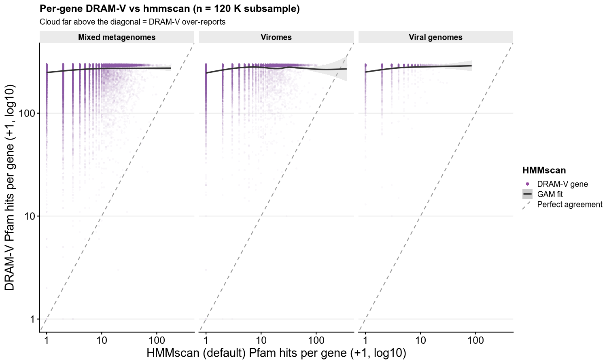<!-- -->

## Per-bucket mean

``` r
sc_bucket <- sc %>%
  mutate(dramv_bucket = case_when(
    dramv_pfam_n == 0 ~ "0",
    dramv_pfam_n <= 5 ~ "1 to 5",
    dramv_pfam_n <= 20 ~ "6 to 20",
    dramv_pfam_n <= 100 ~ "21 to 100",
    TRUE ~ "Above 100")) %>%
  mutate(dramv_bucket = factor(dramv_bucket,
                                levels = c("0", "1 to 5", "6 to 20", "21 to 100", "Above 100")))
bkt <- sc_bucket %>%
  group_by(dramv_bucket) %>%
  summarise(`DRAM-V` = mean(dramv_pfam_n, na.rm = TRUE),
            `hmmscan (default)` = mean(hmmscan_default_n, na.rm = TRUE),
            n = n(), .groups = "drop") %>%
  pivot_longer(c(`DRAM-V`, `hmmscan (default)`), names_to = "Tool", values_to = "mean_hits")

p_b <- ggplot(bkt, aes(x = dramv_bucket, y = mean_hits, fill = Tool)) +
  geom_col(position = position_dodge(width = 0.75), width = 0.68) +
  geom_text(aes(label = round(mean_hits, 1)),
            position = position_dodge(width = 0.75), vjust = -0.3, size = 3) +
  scale_fill_manual(values = tool_pal, name = "Tool") +
  scale_y_continuous(expand = expansion(mult = c(0, 0.15))) +
  labs(x = "DRAM-V reported hit-count bucket",
        y = "Mean Pfam hits per gene",
        title = "Per-bucket mean hit count: DRAM-V vs hmmscan",
        subtitle = "Same sequences, same Pfam release")
save_plot_both(p_b, "dramv_pfam_bucket_bars", w = 9, h = 5)
print(p_b)
```

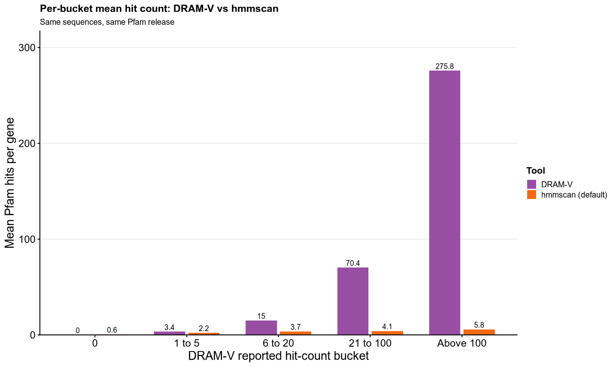<!-- -->

# Pfam clan incompatibility

``` r
cl <- read_if(file.path(TABLES_DIR, "dramv_pfam_clans_per_gene.tsv"))
cl <- cl %>% mutate(seq_type = factor(seq_type_label[seq_type], levels = unname(seq_type_label)))
cl_long <- cl %>%
  select(seq_type, dramv_clan_n, checkamg_all_clan_n, checkamg_keep_clan_n) %>%
  pivot_longer(c(dramv_clan_n, checkamg_all_clan_n, checkamg_keep_clan_n),
                names_to = "tool", values_to = "n_clans") %>%
  mutate(tool = recode(tool,
                        "dramv_clan_n"         = "DRAM-V",
                        "checkamg_all_clan_n"  = "CheckAMG (all)",
                        "checkamg_keep_clan_n" = "CheckAMG (kept)"),
          tool = factor(tool, levels = c("DRAM-V", "CheckAMG (all)", "CheckAMG (kept)")))

p_c1 <- ggplot(cl_long, aes(x = n_clans + 1, color = tool)) +
  stat_ecdf(linewidth = 1.0) +
  scale_x_log10(labels = label_comma()) +
  scale_color_manual(values = tool_pal, name = "Tool") +
  facet_wrap(~ seq_type) +
  labs(x = "Distinct Pfam clans per gene (+1, log10)", y = "Empirical CDF",
        title = "Distinct Pfam clans per gene (n = 300 K stratified sample)",
        subtitle = "A single protein rarely spans multiple unrelated clans")
save_plot_both(p_c1, "dramv_pfam_clan_ecdf", w = 11, h = 4.5)
print(p_c1)
```

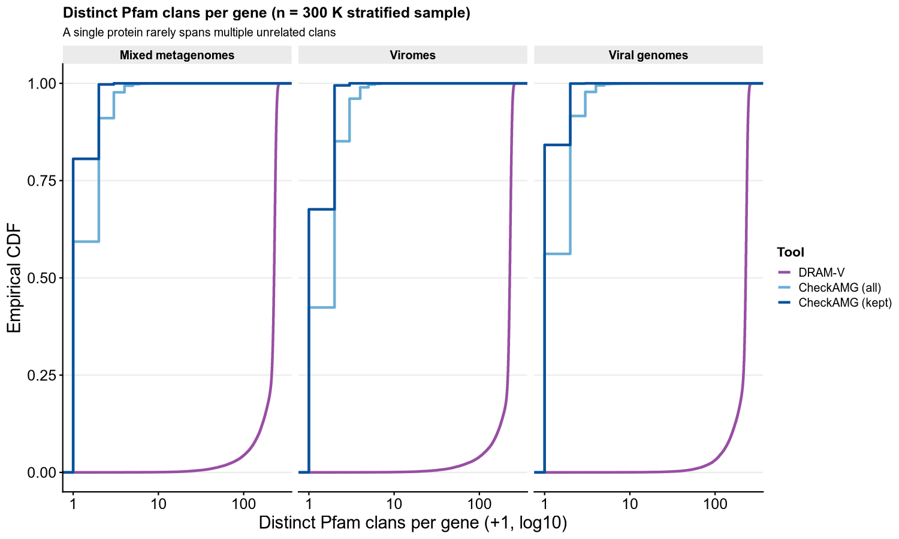<!-- -->

``` r
cl_sub <- cl %>%
  filter(seq_len_aa > 0 & seq_len_aa < 3000) %>%
  slice_sample(n = min(80000, nrow(cl))) %>%
  mutate(seq_type = factor(seq_type_label[seq_type], levels = unname(seq_type_label)))
p_clans <- ggplot(cl_sub, aes(x = seq_len_aa, y = dramv_clan_n + 1)) +
  geom_point(aes(color = "DRAM-V gene"), shape = 16, alpha = 0.07, size = 0.8) +
  geom_smooth(aes(color = "GAM fit"),
              method = "gam", formula = y ~ s(x, bs = "cs"),
              fill = "grey80", linewidth = 0.8) +
  scale_y_log10(labels = label_comma()) +
  scale_x_continuous(labels = label_comma()) +
  scale_color_manual(values = c("DRAM-V gene" = tool_pal[["DRAM-V"]],
                                "GAM fit" = "#333333"),
                      name = NULL,
                      guide = guide_legend(override.aes = list(alpha = 1, size = 1.5))) +
  facet_wrap(~ seq_type) +
  labs(x = "Gene length (amino acids)",
        y = "DRAM-V distinct clans per gene (+1, log10)",
        title = "Gene length vs DRAM-V clan count (80 K subsample)")
save_plot_both(p_clans, "dramv_pfam_length_vs_clans", w = 12, h = 4.5)
print(p_clans)
```

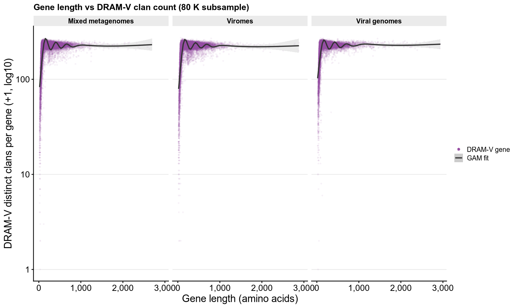<!-- -->

# HMMER support for DRAM-V AMG calls

``` r
amg <- read_parquet(file.path(TABLES_DIR, "dramv_pfam_amg_calls.parquet"))
amg <- amg %>%
  mutate(support_class = recode(support_class,
                                "hmmer_supported"  = "HMMER supported",
                                "hmmer_borderline" = "HMMER borderline",
                                "hmmer_rejected"   = "HMMER rejected"),
          support_class = factor(support_class,
                                levels = c("HMMER supported","HMMER borderline","HMMER rejected")),
          seq_type = factor(seq_type_label[seq_type], levels = unname(seq_type_label)))

amg_seqt <- amg %>% count(seq_type, support_class) %>%
  group_by(seq_type) %>% mutate(frac = n / sum(n)) %>% ungroup()

p_h <- ggplot(amg_seqt, aes(x = seq_type, y = frac, fill = support_class)) +
  geom_col(width = 0.7) +
  geom_text(aes(label = ifelse(frac >= 0.05, percent(frac, accuracy = 0.1), "")),
            position = position_stack(vjust = 0.5), size = 4, color = "black") +
  scale_y_continuous(labels = percent, expand = expansion(mult = c(0, 0.02))) +
  scale_fill_manual(values = support_pal, name = "HMMER support") +
  labs(x = NULL, y = "Fraction of Pfam AMG calls",
        title = "HMMER support for DRAM-V AMG calls",
        subtitle = sprintf("Total Pfam-based DRAM-V AMG calls: N = %s", comma(nrow(amg))))
save_plot_both(p_h, "dramv_pfam_amg_calls_frac", w = 9, h = 5)
print(p_h)
```

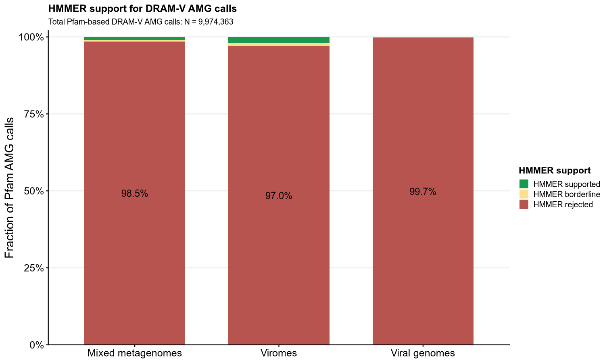<!-- -->

``` r
p_count <- ggplot(amg_seqt, aes(x = seq_type, y = n, fill = support_class)) +
  geom_col(width = 0.7) +
  geom_text(aes(label = ifelse(n >= 100000, formatC(n, format = "e", digits = 1), "")),
            position = position_stack(vjust = 0.5),
            size = 4, color = "black") +
  scale_y_continuous(labels = label_number(scale = 1e-6, suffix = "M"),
                    expand = expansion(mult = c(0, 0.02))) +
  scale_fill_manual(values = support_pal, name = "HMMER support") +
  labs(x = NULL, y = "Pfam AMG call count (millions)",
      title = "AMG call counts by sequence type and HMMER support class")
save_plot_both(p_count, "dramv_pfam_amg_calls_counts", w = 9, h = 5)
print(p_count)
```

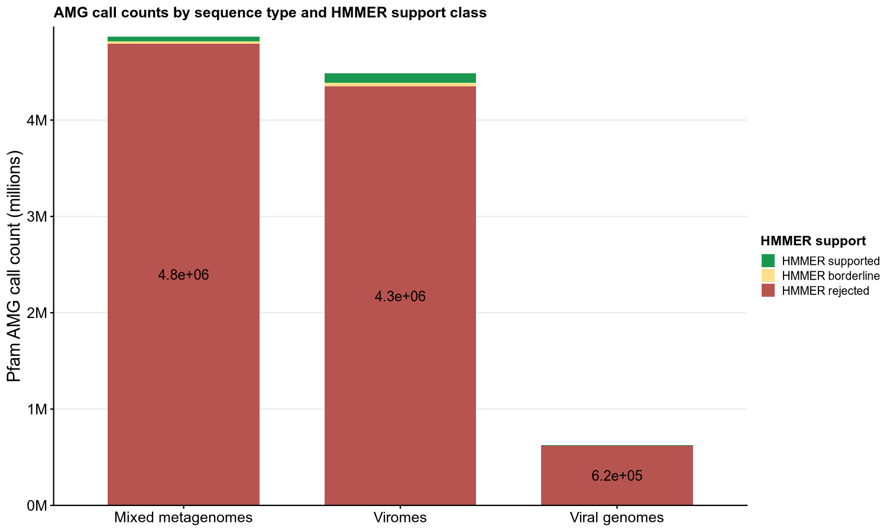<!-- -->

## Top Pfam accessions behind DRAM-V AMG calls

``` r
top20 <- amg %>% count(pfam_acc, sort = TRUE) %>% slice_head(n = 20)
top20_det <- amg %>% filter(pfam_acc %in% top20$pfam_acc) %>%
  count(pfam_acc, support_class) %>%
  group_by(pfam_acc) %>% mutate(total = sum(n), frac = n / total) %>% ungroup() %>%
  mutate(pfam_acc = factor(pfam_acc, levels = top20$pfam_acc[order(top20$n)]))

p_tp <- ggplot(top20_det, aes(x = pfam_acc, y = n, fill = support_class)) +
  geom_col(width = 0.8) +
  scale_y_continuous(labels = label_comma(), expand = expansion(mult = c(0, 0.05))) +
  scale_fill_manual(values = support_pal, name = "HMMER support") +
  coord_flip() +
  labs(x = "Pfam accession", y = "DRAM-V Pfam-based AMG call count",
        title = "Top 20 Pfam accessions underlying DRAM-V AMG calls (absolute)")
save_plot_both(p_tp, "dramv_pfam_top_pfams_counts", w = 10, h = 7)
print(p_tp)
```

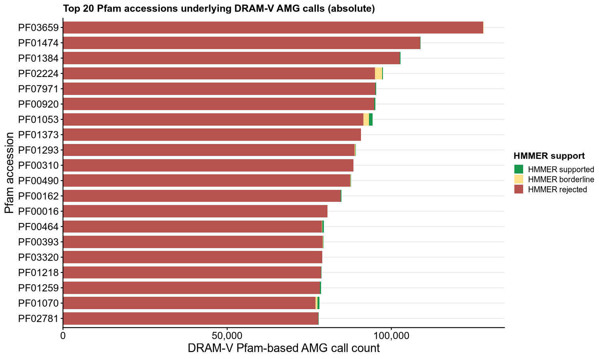<!-- -->

``` r
top20_det_ann <- top20_det %>%
  left_join(top20 %>% rename(total_calls = n), by = "pfam_acc")

p_tpf <- ggplot(top20_det_ann, aes(x = pfam_acc, y = frac, fill = support_class)) +
  geom_col(width = 0.8) +
  geom_text(
    data = top20_det_ann %>% distinct(pfam_acc, total_calls),
    aes(x = pfam_acc, y = 1, label = paste0(comma(total_calls), " total"), fill = NULL),
    hjust = -0.15, size = 3.2, color = "grey20", fontface = "plain"
  ) +
  scale_y_continuous(labels = percent, breaks = seq(0, 1, by = 0.25),
                      expand = expansion(mult = c(0, 0.24))) +
  scale_fill_manual(values = support_pal, name = "HMMER support") +
  coord_flip() +
  labs(x = "Pfam accession", y = "Fraction of calls per Pfam",
        title = "Top 20 Pfam accessions: HMMER support fraction")
save_plot_both(p_tpf, "dramv_pfam_top_pfams_frac", w = 10, h = 7)
print(p_tpf)
```

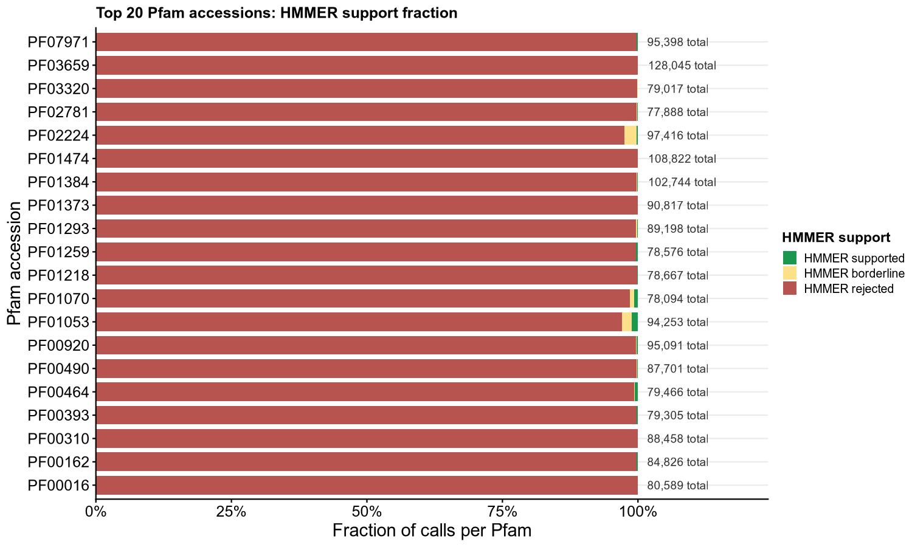<!-- -->

## Per-Pfam rejection rate vs call frequency

``` r
per_pfam <- amg %>% count(pfam_acc, support_class) %>%
  group_by(pfam_acc) %>% mutate(total = sum(n), frac = n / total) %>% ungroup() %>%
  filter(support_class == "HMMER rejected") %>%
  select(pfam_acc, total, frac_rejected = frac) %>%
  filter(total >= 100)

p_pd <- ggplot(per_pfam,
                aes(x = total, y = frac_rejected)) +
  geom_point(aes(color = "Pfam accession"),
              alpha = 0.45, size = 1.6) +
  geom_hline(aes(yintercept = 0.9, linetype = "90% rejected threshold"),
              color = "grey40") +
  scale_x_log10(labels = label_comma()) +
  scale_y_continuous(labels = percent, limits = c(0, 1)) +
  scale_color_manual(values = c("Pfam accession" = tool_pal[["DRAM-V"]]),
                      name = NULL,
                      guide = guide_legend(override.aes = list(alpha = 1, size = 2))) +
  scale_linetype_manual(values = c("90% rejected threshold" = 2), name = NULL) +
  labs(x = "DRAM-V AMG calls for this Pfam (log10)",
        y = "Fraction HMMER rejected",
        title = "Per-Pfam rejection rate vs call frequency",
        subtitle = "One point per Pfam accession with at least 100 DRAM-V AMG calls")
save_plot_both(p_pd, "dramv_pfam_per_pfam_rejection", w = 9, h = 6)
print(p_pd)
```

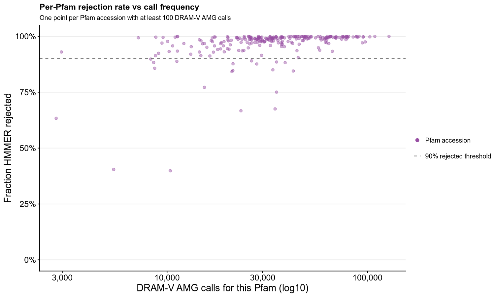<!-- -->

# Sequence-level mechanism

``` r
f <- read_parquet(file.path(TABLES_DIR, "dramv_pfam_per_gene_features.parquet"))
p_l <- ggplot(f %>% filter(!is.na(dramv_pfam_n)),
              aes(x = length, y = dramv_pfam_n)) +
  geom_point(aes(color = "DRAM-V gene"), shape = 16, alpha = 0.35, size = 1.0) +
  geom_smooth(aes(color = "GAM fit"),
              method = "gam", formula = y ~ s(x, bs = "cs"),
              fill = "grey80", linewidth = 0.8) +
  scale_x_continuous(labels = label_comma()) +
  scale_color_manual(values = c("DRAM-V gene" = tool_pal[["DRAM-V"]],
                                "GAM fit" = "#333333"),
                      name = NULL,
                      guide = guide_legend(override.aes = list(alpha = 1, size = 2))) +
  labs(x = "Gene length (amino acids)",
        y = "DRAM-V Pfam hits per gene",
        title = "Gene length vs DRAM-V Pfam count",
        subtitle = sprintf("n = %s genes; Spearman rho = 0.50", comma(nrow(f))))
save_plot_both(p_l, "dramv_pfam_length_vs_dramv", w = 8, h = 6)
print(p_l)
```

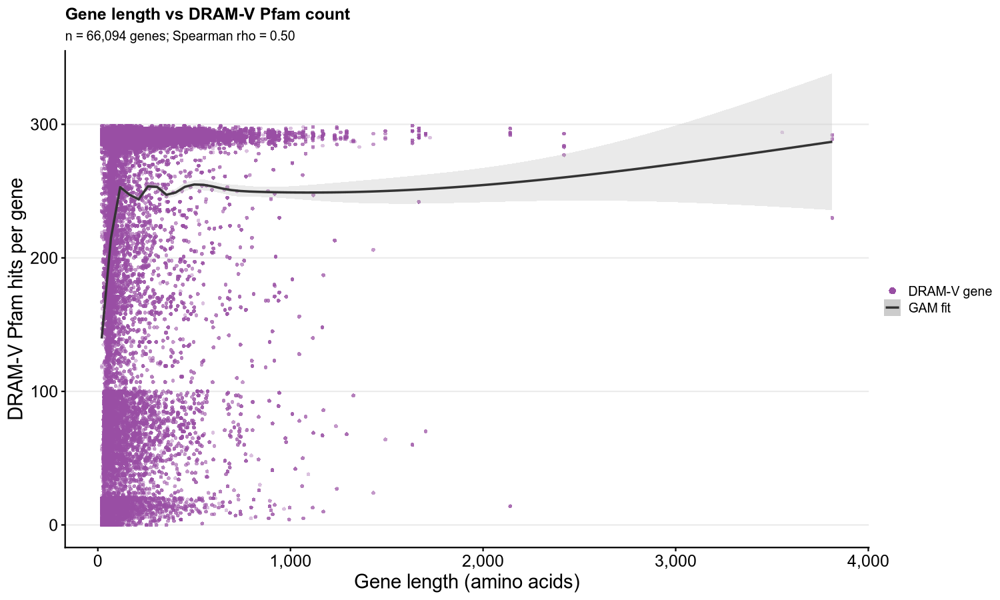<!-- -->

``` r
p_e <- ggplot(f %>% filter(!is.na(dramv_pfam_n) & !is.na(aa_entropy)),
              aes(x = aa_entropy, y = dramv_pfam_n)) +
  geom_point(aes(color = "DRAM-V gene"), shape = 16, alpha = 0.35, size = 1.0) +
  geom_smooth(aes(color = "GAM fit"),
              method = "gam", formula = y ~ s(x, bs = "cs"),
              fill = "grey80", linewidth = 0.8) +
  scale_color_manual(values = c("DRAM-V gene" = tool_pal[["DRAM-V"]],
                                "GAM fit" = "#333333"),
                      name = NULL,
                      guide = guide_legend(override.aes = list(alpha = 1, size = 2))) +
  labs(x = "Amino-acid Shannon entropy (bits)",
        y = "DRAM-V Pfam hits per gene",
        title = "Amino-acid entropy vs DRAM-V Pfam count",
        subtitle = sprintf("n = %s genes; Spearman rho = 0.32", comma(nrow(f))))
save_plot_both(p_e, "dramv_pfam_entropy_vs_dramv", w = 8, h = 6)
print(p_e)
```

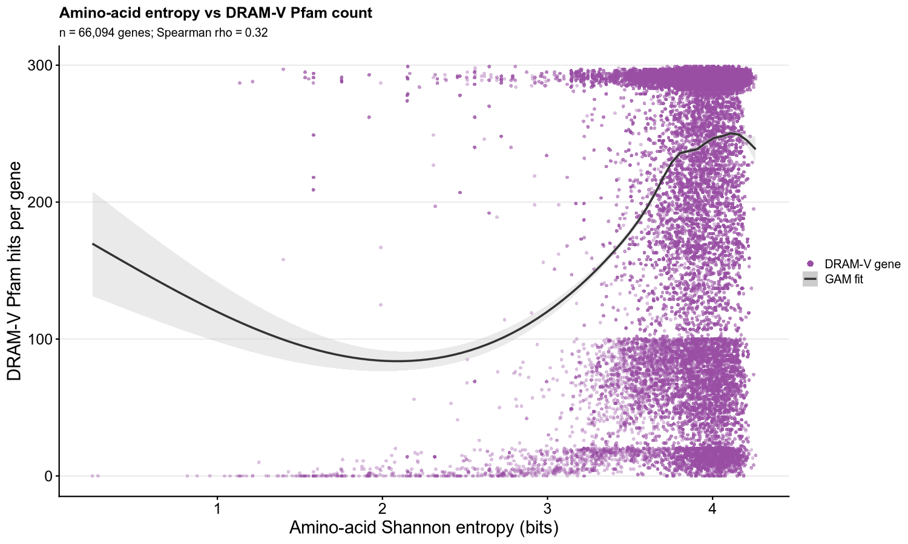<!-- -->

``` r
if ("excess_dramv_vs_hmmer" %in% names(f)) {
  fx <- f %>% filter(!is.na(excess_dramv_vs_hmmer))
  p_x <- ggplot(fx, aes(x = length, y = pmax(excess_dramv_vs_hmmer, 0))) +
    geom_point(aes(color = "DRAM-V gene"), shape = 16, alpha = 0.35, size = 1.0) +
    geom_smooth(aes(color = "GAM fit"),
                method = "gam", formula = y ~ s(x, bs = "cs"),
                fill = "grey80", linewidth = 0.8) +
    scale_x_continuous(labels = label_comma()) +
    scale_color_manual(values = c("DRAM-V gene" = tool_pal[["DRAM-V"]],
                                  "GAM fit" = "#333333"),
                        name = NULL,
                        guide = guide_legend(override.aes = list(alpha = 1, size = 2))) +
    labs(x = "Gene length (amino acids)",
          y = "DRAM-V excess over HMMER (hit-count difference)",
          title = "Gene length vs DRAM-V excess over HMMER",
          subtitle = sprintf("n = %s genes; Spearman rho = 0.33", comma(nrow(fx))))
  save_plot_both(p_x, "dramv_pfam_length_vs_excess", w = 8, h = 6)
  print(p_x)
}
```

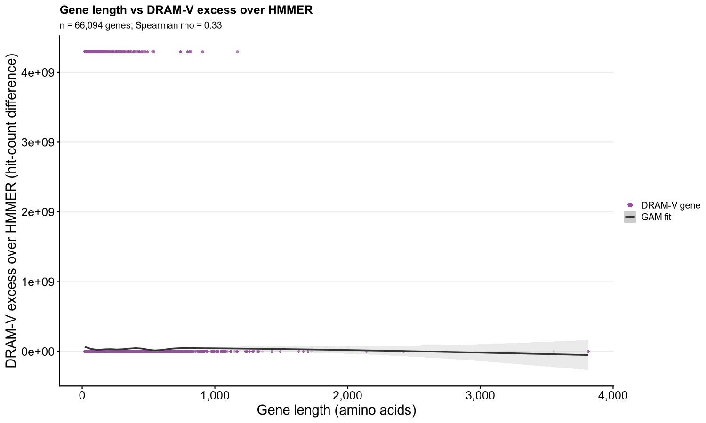<!-- -->

# Score calibration on concordant hits

``` r
s <- read_parquet(file.path(TABLES_DIR, "dramv_pfam_score_comparison.parquet"))
s <- s %>% filter(!is.na(hmmer_score) & !is.na(mmseqs_bits))
if (nrow(s) > 120000) s_plot <- s %>% slice_sample(n = 120000) else s_plot <- s

p_sc <- ggplot(s_plot, aes(x = hmmer_score, y = mmseqs_bits)) +
  geom_point(aes(color = "Concordant hit"),
              shape = 16, alpha = 0.15, size = 0.8) +
  geom_smooth(aes(color = "GAM fit"),
              method = "gam", formula = y ~ s(x, bs = "cs"),
              fill = "grey80", linewidth = 0.8) +
  scale_color_manual(values = c("Concordant hit" = tool_pal[["DRAM-V"]],
                                "GAM fit" = "#333333"),
                      name = NULL,
                      guide = guide_legend(override.aes = list(alpha = 1, size = 2))) +
  labs(x = "HMMER bitscore (log-odds)",
        y = "MMseqs2 profile bitscore",
        title = "Score comparison on concordant hits",
        subtitle = sprintf("n = %s (gene, Pfam) pairs; Spearman rho = 0.11", comma(nrow(s))))
save_plot_both(p_sc, "dramv_pfam_score_scatter", w = 8, h = 6)
print(p_sc)
```

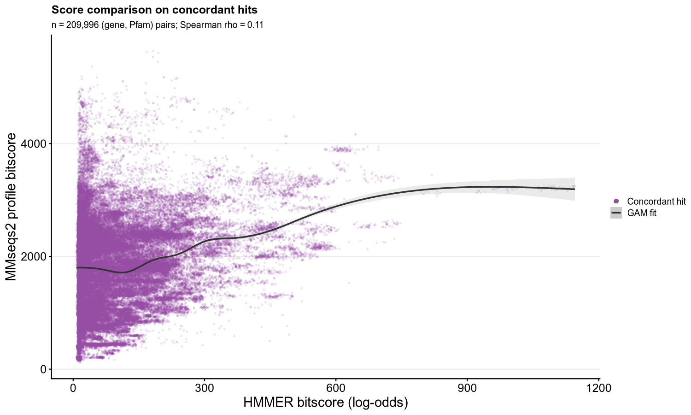<!-- -->

``` r
p_ev <- ggplot(s_plot, aes(x = -log10(pmax(hmmer_evalue, 1e-300)),
                            y = -log10(pmax(mmseqs_evalue, 1e-300)))) +
  geom_point(shape = 16, alpha = 0.15, size = 0.8,
              color = tool_pal[["DRAM-V"]]) +
  labs(x = "-log10(HMMER E-value)",
        y = "-log10(MMseqs2 E-value)",
        title = "E-value comparison on concordant hits",
        subtitle = sprintf("n = %s pairs; %.0f%% of MMseqs2 E-values saturate at 0",
                          comma(nrow(s)),
                          100 * mean(s$mmseqs_evalue == 0, na.rm = TRUE)))
save_plot_both(p_ev, "dramv_pfam_evalue_scatter", w = 8, h = 6)
print(p_ev)
```

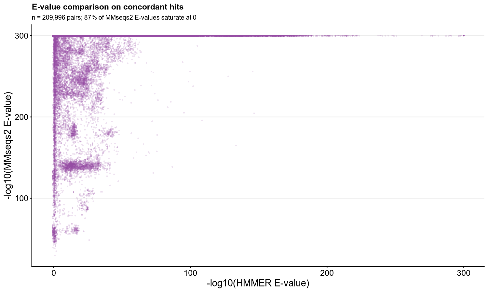<!-- -->

# Composite figure

``` r
need <- c("p_ec", "p_c1", "p_per_gene_sc", "p_h", "p_count", "p_tpf")
have_all <- all(vapply(need, exists, logical(1)))
if (have_all) {

  seq_type_label_wrap <- c(
    "Mixed metagenomes" = "Mixed\nmetagenomes",
    "Viromes"           = "Viromes",
    "Viral genomes"     = "Viral\ngenomes"
  )

  A <- p_ec + labs(title = "A  Benchmark-wide per-gene Pfam hit ECDF", subtitle = NULL) +
    theme(plot.title = element_text(face = "bold", size = 16),
          plot.title.position = "plot")
  B <- p_c1 + labs(title = "B  Distinct Pfam clans per gene", subtitle = NULL) +
    theme(plot.title = element_text(face = "bold", size = 16),
          plot.title.position = "plot")
  C <- p_per_gene_sc + labs(title = "C  Per-gene DRAM-V vs HMMscan", subtitle = NULL) +
    theme(plot.title = element_text(face = "bold", size = 16),
          plot.title.position = "plot")
  D <- p_h +
    scale_x_discrete(labels = seq_type_label_wrap) +
    labs(title = "D  HMMER support for\n     DRAM-V AMGs", subtitle = NULL) +
    theme(plot.title = element_text(face = "bold", size = 16),
          plot.title.position = "plot")
  E <- p_count +
    scale_x_discrete(labels = seq_type_label_wrap) +
    labs(title = "E  HMMER support for\n     DRAM-V AMGs (counts)", subtitle = NULL) +
    theme(plot.title = element_text(face = "bold", size = 16),
          plot.title.position = "plot")
  F_plot <- p_tpf + labs(title = "F  Top 20 Pfams for DRAM-V AMG calls", subtitle = NULL) +
    theme(plot.title = element_text(face = "bold", size = 16),
          plot.title.position = "plot")

  # Bottom row with explicit per-panel widths
  bottom_row <- (D | E | F_plot) +
    plot_layout(widths = c(0.25, 0.25, 0.5))

  composite <- ((A | B) / C / bottom_row) +
    plot_layout(heights = c(1, 1, 1.2), guides = "collect") &
    theme(
      legend.position      = "bottom",
      legend.box           = "vertical",
      legend.box.just      = "left",
      legend.justification = "center",
      legend.text          = element_text(size = 12),
      legend.title         = element_text(size = 14, face = "bold")
    )

  save_plot_both(composite, "dramv_pfam_composite", w = 13, h = 16)
  print(composite)
}
```

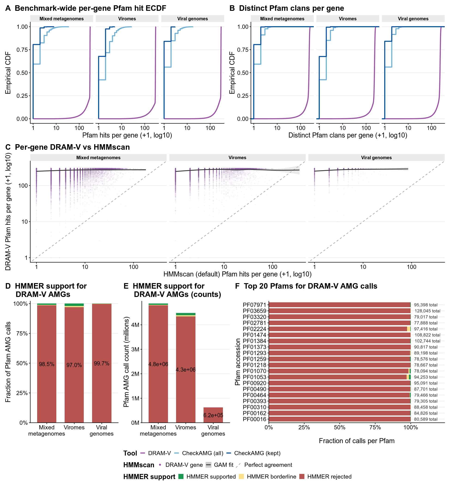<!-- -->

# Session info

``` r
sessionInfo()
```

    ## R version 4.4.0 (2024-04-24)
    ## Platform: aarch64-apple-darwin20
    ## Running under: macOS 26.6.2
    ## 
    ## Matrix products: default
    ## BLAS:   /Library/Frameworks/R.framework/Versions/4.4-arm64/Resources/lib/libRblas.0.dylib 
    ## LAPACK: /Library/Frameworks/R.framework/Versions/4.4-arm64/Resources/lib/libRlapack.dylib;  LAPACK version 3.12.0
    ## 
    ## locale:
    ## [1] en_US.UTF-8/en_US.UTF-8/en_US.UTF-8/C/en_US.UTF-8/en_US.UTF-8
    ## 
    ## time zone: America/Chicago
    ## tzcode source: internal
    ## 
    ## attached base packages:
    ## [1] stats     graphics  grDevices utils     datasets  methods   base     
    ## 
    ## other attached packages:
    ##  [1] svglite_2.1.3      RColorBrewer_1.1-3 scales_1.4.0       patchwork_1.3.2   
    ##  [5] cowplot_1.1.3      lubridate_1.9.3    forcats_1.0.0      stringr_1.5.1     
    ##  [9] dplyr_1.1.4        purrr_1.2.1        readr_2.1.5        tidyr_1.3.2       
    ## [13] tibble_3.3.1       ggplot2_3.5.2      tidyverse_2.0.0    arrow_22.0.0.1    
    ## 
    ## loaded via a namespace (and not attached):
    ##  [1] utf8_1.2.4        generics_0.1.3    lattice_0.22-6    stringi_1.8.4    
    ##  [5] hms_1.1.3         digest_0.6.37     magrittr_2.0.4    evaluate_1.0.5   
    ##  [9] grid_4.4.0        timechange_0.3.0  fastmap_1.2.0     Matrix_1.7-0     
    ## [13] mgcv_1.9-1        fansi_1.0.6       textshaping_0.4.0 cli_3.6.5        
    ## [17] rlang_1.1.7       crayon_1.5.3      splines_4.4.0     bit64_4.5.2      
    ## [21] withr_3.0.2       yaml_2.3.10       parallel_4.4.0    tools_4.4.0      
    ## [25] tzdb_0.4.0        assertthat_0.2.1  vctrs_0.6.5       R6_2.6.1         
    ## [29] lifecycle_1.0.5   bit_4.5.0         vroom_1.6.5       ragg_1.5.1       
    ## [33] pkgconfig_2.0.3   pillar_1.9.0      gtable_0.3.6      glue_1.8.0       
    ## [37] systemfonts_1.3.1 highr_0.11        xfun_0.48         tidyselect_1.2.1 
    ## [41] rstudioapi_0.16.0 knitr_1.48        farver_2.1.2      nlme_3.1-166     
    ## [45] htmltools_0.5.8.1 labeling_0.4.3    rmarkdown_2.28    compiler_4.4.0
