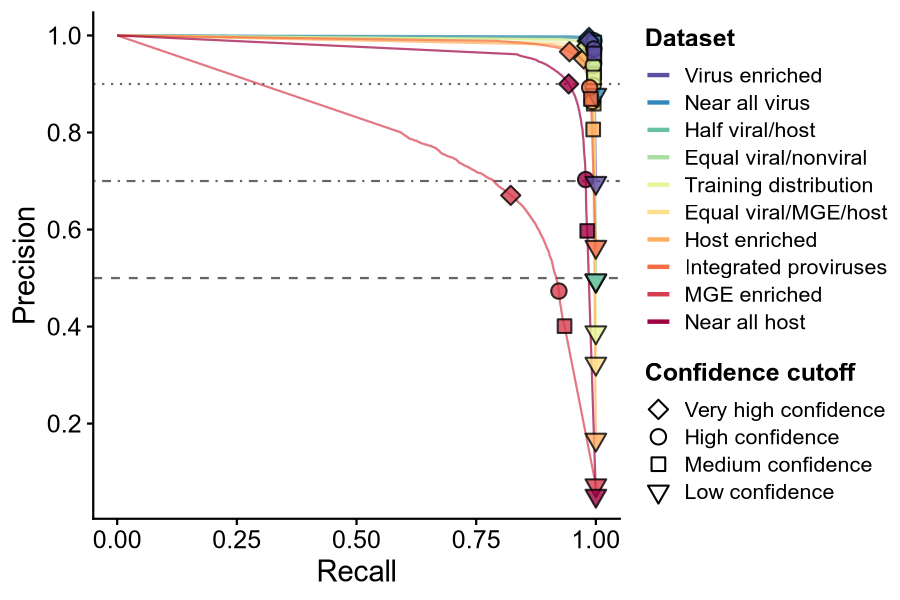
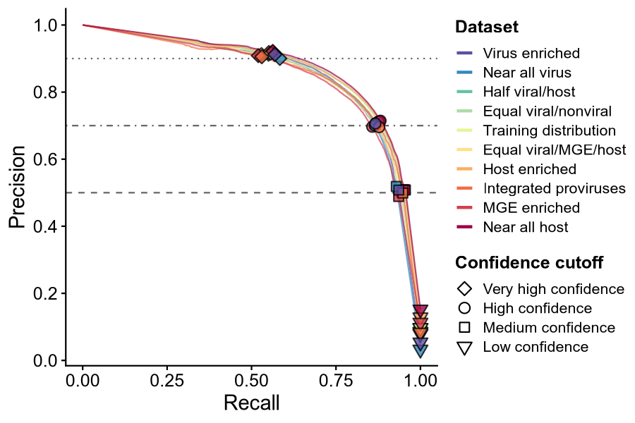
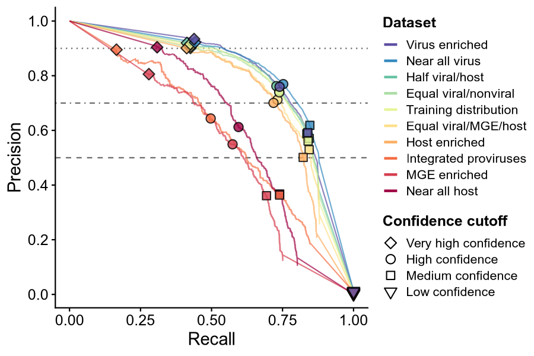
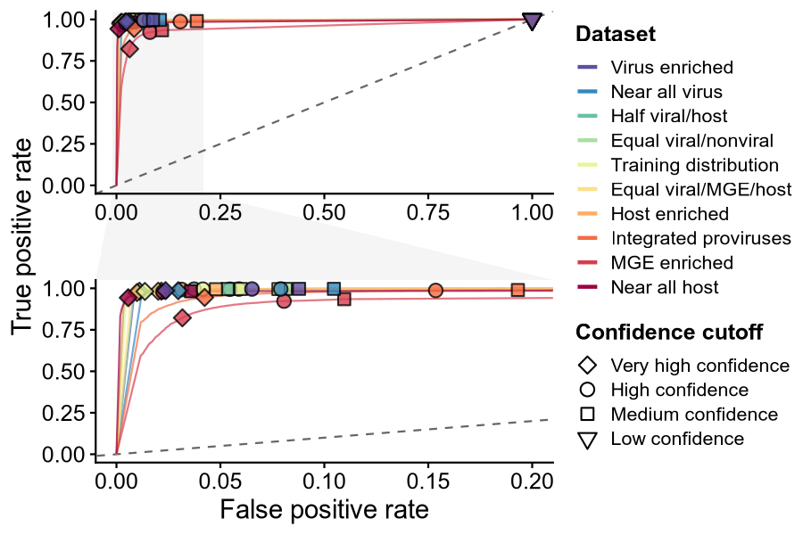
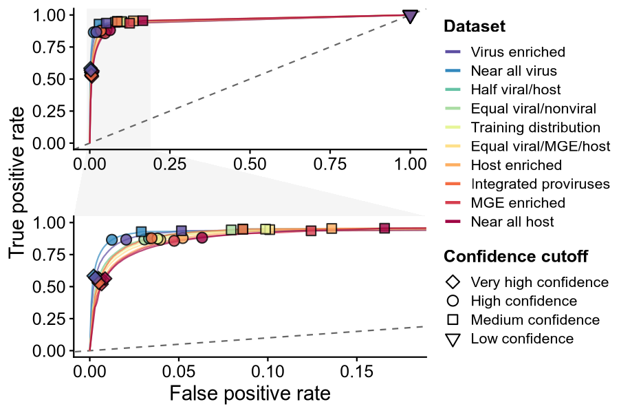
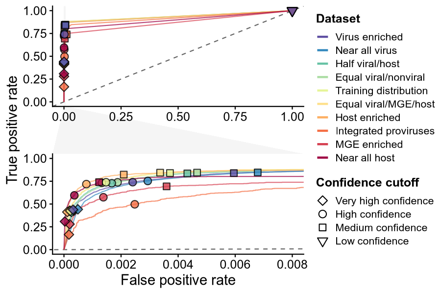
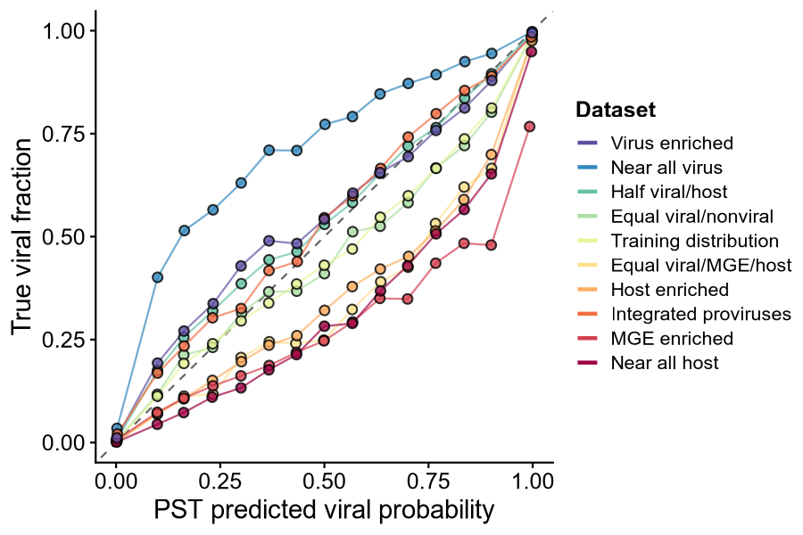
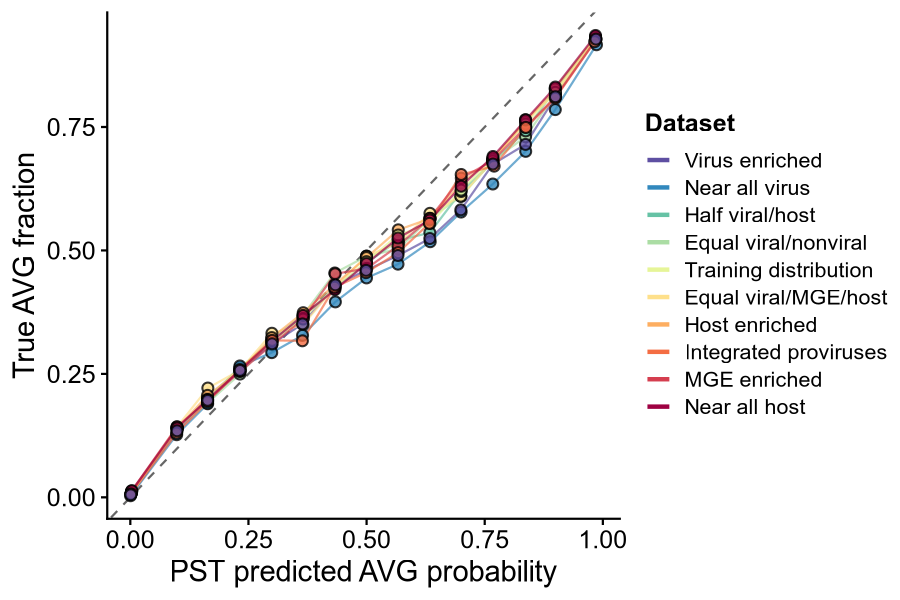
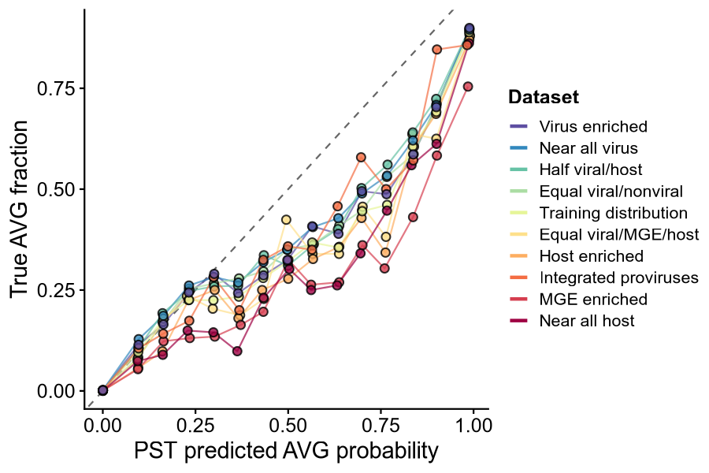
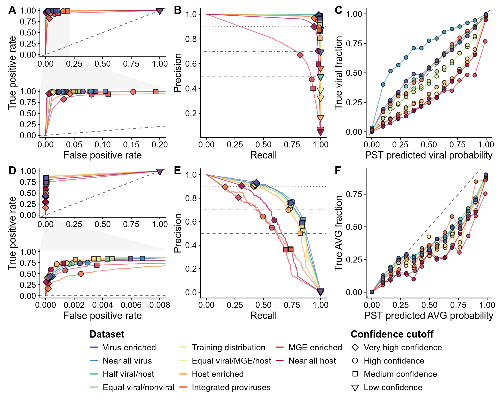

PST figures
================
James C. Kosmopoulos
2026-07-20

``` r
knitr::opts_chunk$set(echo = TRUE, warning = FALSE, message = FALSE, fig.width = 10, fig.height = 6, dpi = 150)

library("arrow");packageVersion("arrow")
```

    ## 
    ## Attaching package: 'arrow'

    ## The following object is masked from 'package:utils':
    ## 
    ##     timestamp

    ## [1] '13.0.0'

``` r
library("tidyverse");packageVersion("tidyverse")
```

    ## ── Attaching core tidyverse packages ────────────────────────────────────────────────────────────────────────────────────── tidyverse 2.0.0 ──
    ## ✔ dplyr     1.1.4     ✔ readr     2.1.5
    ## ✔ forcats   1.0.0     ✔ stringr   1.5.1
    ## ✔ ggplot2   3.5.2     ✔ tibble    3.2.1
    ## ✔ lubridate 1.9.4     ✔ tidyr     1.3.1
    ## ✔ purrr     1.0.4

    ## ── Conflicts ──────────────────────────────────────────────────────────────────────────────────────────────────────── tidyverse_conflicts() ──
    ## ✖ lubridate::duration() masks arrow::duration()
    ## ✖ dplyr::filter()       masks stats::filter()
    ## ✖ dplyr::lag()          masks stats::lag()
    ## ℹ Use the conflicted package (<http://conflicted.r-lib.org/>) to force all conflicts to become errors

    ## [1] '2.0.0'

``` r
library("cowplot");packageVersion("cowplot")
```

    ## 
    ## Attaching package: 'cowplot'
    ## 
    ## The following object is masked from 'package:lubridate':
    ## 
    ##     stamp

    ## [1] '1.1.3'

``` r
library("patchwork");packageVersion("patchwork")
```

    ## 
    ## Attaching package: 'patchwork'
    ## 
    ## The following object is masked from 'package:cowplot':
    ## 
    ##     align_plots

    ## [1] '1.3.2'

``` r
library("scales");packageVersion("scales")
```

    ## 
    ## Attaching package: 'scales'
    ## 
    ## The following object is masked from 'package:purrr':
    ## 
    ##     discard
    ## 
    ## The following object is masked from 'package:readr':
    ## 
    ##     col_factor

    ## [1] '1.4.0'

``` r
library("RColorBrewer");packageVersion("RColorBrewer")
```

    ## [1] '1.1.3'

``` r
library("svglite");packageVersion("svglite")
```

    ## [1] '2.1.2'

``` r
library("ggh4x");packageVersion("ggh4x")
```

    ## [1] '0.3.1'

``` r
library("ggforce");packageVersion("ggforce")
```

    ## [1] '0.5.0'

``` r
TABLES_DIR  <- file.path("./tables/pst")
PLOT_DIR <- file.path("./plots/pst")
dir.create(PLOT_DIR, showWarnings = FALSE, recursive = TRUE)

save_plot_both <- function(p, stem, w, h, dpi = 600) {
  ggsave(file.path(PLOT_DIR, paste0(stem, ".png")), p,
         width = w, height = h, units = "in", dpi = dpi, bg = "white")
  # ggsave(file.path(PLOT_DIR, paste0(stem, ".svg")), p,
  #        width = w, height = h, units = "in", bg = "white", device = svglite::svglite)
  invisible(p)
}

read_if <- function(f) {
  if (file.exists(f)) suppressMessages(readr::read_tsv(f, show_col_types = FALSE, progress = FALSE)) else NULL
}
```

# Palettes and theme

``` r
dataset_pal <- c(
  "Combined"              = "#000000",
  "Virus enriched"        = "#5E4FA2",
  "Near all virus"        = "#3288BD",
  "Half viral/host"       = "#66C2A5",
  "Equal viral/nonviral"  = "#ABDDA4",
  "Training distribution" = "#E6F598",
  "Equal viral/MGE/host"  = "#FEE08B",
  "Host enriched"         = "#FDAE61",
  "Integrated proviruses" = "#F46D43",
  "MGE enriched"          = "#D53E4F",
  "Near all host"         = "#9E0142"
)

confidence_shapes <- c(
  "Very high confidence" = 23,
  "High confidence"      = 21,
  "Medium confidence"    = 22,
  "Low confidence"       = 25
)

confidence_order  <- c("Very high confidence", "High confidence", "Medium confidence", "Low confidence")

base_theme <- theme_cowplot(font_size = 12) +
  theme(plot.title    = element_text(face = "bold", size = 14),
        axis.text     = element_text(size = 12),
        axis.title    = element_text(size = 14),
        strip.background = element_rect(fill = "grey92", color = NA),
        strip.text    = element_text(face = "bold"),
        legend.position = "right",
        legend.title    = element_text(face = "bold"),
        panel.grid.major.x = element_blank(),
        panel.grid.major.y = element_blank(),
        )
theme_set(base_theme)
```

# PST performance

## Precision-recall curves (viral)

``` r
pr_points <- read_parquet(file.path(TABLES_DIR, "pst_pr_points.parquet")) %>%
  mutate(
    dataset = factor(dataset, levels =  names(dataset_pal)),
    confidence = str_replace(confidence, "Confidence", tolower("Confidence")),
    confidence = str_replace(confidence, "Very High", "Very high")
    ) %>%
  mutate(confidence = factor(confidence, levels = confidence_order)) %>%
  filter(dataset != "Combined")

p_pr_viral <- ggplot() +
  geom_hline(yintercept = 0.90, linetype = 3, color = "grey40") +
  geom_hline(yintercept = 0.70, linetype = 4, color = "grey40") +
  geom_hline(yintercept = 0.50, linetype = 2, color = "grey40") +
  geom_line(
    data = pr_points %>% filter(target == "viral", type == "curve"),
    aes(x = recall, y = precision, color = dataset),
    alpha = 0.7
  ) +
  geom_point(
    data = pr_points %>% filter(target == "viral", type == "point"),
    aes(x = recall, y = precision, fill = dataset, shape = confidence),
    color = "black",
    alpha = 0.8,
    size = 3,
    stroke = 0.7
  ) +
  scale_color_manual(values = dataset_pal, name = "Dataset") +
  scale_fill_manual(values = dataset_pal, guide = "none") +
  scale_shape_manual(values = confidence_shapes, name = "Confidence cutoff") +
  scale_y_continuous(breaks = c(0, 0.2, 0.4, 0.6, 0.8, 1.0)) +
  guides(
    color = guide_legend(order = 1, override.aes = list(alpha = 1, linewidth = 1)), # dataset first
    shape = guide_legend(order = 2, override.aes = list(alpha = 1))  # confidence second
  ) +
  labs(x = "Recall", y = "Precision") +
  base_theme
save_plot_both(p_pr_viral, "pst_precision_recall_plot_viral", w = 6, h = 4)
print(p_pr_viral)
```

<!-- -->

## Precision-recall curves (AVG, no AND-gate)

``` r
p_pr_avg <- ggplot() +
  geom_hline(yintercept = 0.90, linetype = 3, color = "grey40") +
  geom_hline(yintercept = 0.70, linetype = 4, color = "grey40") +
  geom_hline(yintercept = 0.50, linetype = 2, color = "grey40") +
  geom_line(
    data = pr_points %>% filter(target == "AVG", type == "curve"),
    aes(x = recall, y = precision, color = dataset),
    alpha = 0.7
  ) +
  geom_point(
    data = pr_points %>%
      filter(target == "AVG", type == "point")  %>%
      mutate(confidence = factor(confidence, levels = confidence_order)),
    aes(x = recall, y = precision, fill = dataset, shape = confidence),
    color = "black",
    alpha = 0.8,
    size = 3,
    stroke = 0.7
  ) +
  scale_color_manual(values = dataset_pal, name = "Dataset") +
  scale_fill_manual(values = dataset_pal, guide = "none") +
  scale_shape_manual(values = confidence_shapes, name = "Confidence cutoff") +
  scale_y_continuous(breaks = c(0, 0.2, 0.4, 0.6, 0.8, 1.0)) +
  guides(
    color = guide_legend(order = 1, override.aes = list(alpha = 1, linewidth = 1)),
    shape = guide_legend(order = 2, override.aes = list(alpha = 1))
  ) +
  labs(x = "Recall", y = "Precision") +
  base_theme
save_plot_both(p_pr_avg, "pst_precision_recall_plot_avg", w = 6, h = 4)
print(p_pr_avg)
```

<!-- -->

## Precision-recall curves (AVG, with AND-gate)

``` r
p_pr_avg_and_gate <- ggplot() +
  geom_hline(yintercept = 0.90, linetype = 3, color = "grey40") +
  geom_hline(yintercept = 0.70, linetype = 4, color = "grey40") +
  geom_hline(yintercept = 0.50, linetype = 2, color = "grey40") +
  geom_line(
    data = pr_points %>% filter(target == "AVG (AND gate)", type == "curve"),
    aes(x = recall, y = precision, color = dataset),
    alpha = 0.7
  ) +
  geom_point(
    data = pr_points %>%
      filter(target == "AVG (AND gate)", type == "point")  %>%
      mutate(confidence = factor(confidence, levels = confidence_order)),
    aes(x = recall, y = precision, fill = dataset, shape = confidence),
    color = "black",
    alpha = 0.8,
    size = 3,
    stroke = 0.7
  ) +
  scale_color_manual(values = dataset_pal, name = "Dataset") +
  scale_fill_manual(values = dataset_pal, guide = "none") +
  scale_shape_manual(values = confidence_shapes, name = "Confidence cutoff") +
  scale_y_continuous(breaks = c(0, 0.2, 0.4, 0.6, 0.8, 1.0)) +
  guides(
    color = guide_legend(order = 1, override.aes = list(alpha = 1, linewidth = 1)),
    shape = guide_legend(order = 2, override.aes = list(alpha = 1))
  ) +
  labs(x = "Recall", y = "Precision") +
  base_theme
save_plot_both(p_pr_avg_and_gate, "pst_precision_recall_plot_avg_and_gate", w = 6, h = 4)
print(p_pr_avg_and_gate)
```

<!-- -->

## ROC curves (viral)

``` r
roc_points <- read_parquet(file.path(TABLES_DIR, "pst_roc_points.parquet")) %>%
  mutate(
    dataset = factor(dataset, levels =  names(dataset_pal)),
    confidence = str_replace(confidence, "Confidence", tolower("Confidence")),
    confidence = str_replace(confidence, "Very High", "Very high")
  )  %>%
  mutate(confidence = factor(confidence, levels = confidence_order)) %>%
  filter(dataset != "Combined")

p_roc_viral <- ggplot() +
  geom_abline(slope = 1, xintercept = 0, yintercept = 0, linetype = 2, color = "grey40") +
  geom_line(
    data = roc_points %>% filter(target == "viral", type == "curve"),
    aes(x = fpr, y = tpr, color = dataset),
    alpha = 0.7
  ) +
  geom_point(
    data = roc_points %>% filter(target == "viral", type == "point"),
    aes(x = fpr, y = tpr, fill = dataset, shape = confidence),
    color = "black",
    alpha = 0.8,
    size = 3,
    stroke = 0.7
  ) +
  scale_color_manual(values = dataset_pal, name = "Dataset") +
  scale_fill_manual(values = dataset_pal, guide = "none") +
  scale_shape_manual(values = confidence_shapes, name = "Confidence cutoff") +
  guides(
    color = guide_legend(order = 1, override.aes = list(alpha = 1, linewidth = 1)),
    shape = guide_legend(order = 2, override.aes = list(alpha = 1))
  ) +
  labs(x = "False positive rate", y = "True positive rate") +
  base_theme +
  facet_zoom(xlim = c(0, 0.2), zoom.size = 1)
save_plot_both(p_roc_viral, "pst_roc_plot_viral", w = 6, h = 4)
print(p_roc_viral)
```

<!-- -->

## ROC curves (AVG, no AND-gate)

``` r
p_roc_avg <- ggplot() +
  geom_abline(slope = 1, xintercept = 0, yintercept = 0, linetype = 2, color = "grey40") +
  geom_line(
    data = roc_points %>%
      filter(target == "AVG", type == "curve")%>%
      mutate(confidence = factor(confidence, levels = confidence_order)),
    aes(x = fpr, y = tpr, color = dataset),
    alpha = 0.7
  ) +
  geom_point(
    data = roc_points %>%
      filter(target == "AVG", type == "point") %>%
      mutate(confidence = factor(confidence, levels = confidence_order)),
    aes(x = fpr, y = tpr, fill = dataset, shape = confidence),
    color = "black",
    alpha = 0.8,
    size = 3,
    stroke = 0.7
  ) +
  scale_color_manual(values = dataset_pal, name = "Dataset") +
  scale_fill_manual(values = dataset_pal, guide = "none") +
  scale_shape_manual(values = confidence_shapes, name = "Confidence cutoff") +
  guides(
    color = guide_legend(order = 1, override.aes = list(alpha = 1, linewidth = 1)),
    shape = guide_legend(order = 2, override.aes = list(alpha = 1))
  ) +
  labs(x = "False positive rate", y = "True positive rate") +
  base_theme +
  facet_zoom(xlim = c(0, 0.18), zoom.size = 1)
save_plot_both(p_roc_avg, "pst_roc_plot_avg", w = 6, h = 4)
print(p_roc_avg)
```

<!-- -->

## ROC curves (AVG, with AND-gate)

``` r
p_roc_avg_and_gate <- ggplot() +
  geom_abline(slope = 1, xintercept = 0, yintercept = 0, linetype = 2, color = "grey40") +
  geom_line(
    data = roc_points %>%
      filter(target == "AVG (AND gate)", type == "curve")%>%
      mutate(confidence = factor(confidence, levels = confidence_order)),
    aes(x = fpr, y = tpr, color = dataset),
    alpha = 0.7
  ) +
  geom_point(
    data = roc_points %>%
      filter(target == "AVG (AND gate)", type == "point") %>%
      mutate(confidence = factor(confidence, levels = confidence_order)),
    aes(x = fpr, y = tpr, fill = dataset, shape = confidence),
    color = "black",
    alpha = 0.8,
    size = 3,
    stroke = 0.7
  ) +
  scale_color_manual(values = dataset_pal, name = "Dataset") +
  scale_fill_manual(values = dataset_pal, guide = "none") +
  scale_shape_manual(values = confidence_shapes, name = "Confidence cutoff") +
  guides(
    color = guide_legend(order = 1, override.aes = list(alpha = 1, linewidth = 1)),
    shape = guide_legend(order = 2, override.aes = list(alpha = 1))
  ) +
  labs(x = "False positive rate", y = "True positive rate") +
  base_theme +
  facet_zoom(xlim = c(0, 0.008), zoom.size = 1)
save_plot_both(p_roc_avg_and_gate, "pst_roc_plot_avg_and_gate", w = 6, h = 4)
print(p_roc_avg_and_gate)
```

<!-- -->

## True viral fraction over model probability (“reliability”)

``` r
reliability_points <- read_parquet(file.path(TABLES_DIR, "pst_reliability_points.parquet")) %>%
  mutate(
    dataset = factor(dataset, levels =  names(dataset_pal))
  ) %>%
  filter(dataset != "Combined")

p_rel_viral <- ggplot() +
  geom_abline(slope = 1, xintercept = 0, yintercept = 0, linetype = 2, color = "grey40") +
  geom_line(
    data = reliability_points %>% filter(target == "viral"),
    aes(x = predicted_prob, y = observed_fraction, color = dataset),
    alpha = 0.7
  ) +
  geom_point(
    data = reliability_points %>% filter(target == "viral"),
    aes(x = predicted_prob, y = observed_fraction, fill = dataset),
    shape = 21,
    color = "black",
    alpha = 0.8,
    size = 2,
    stroke = 0.7
  ) +
  scale_color_manual(values = dataset_pal, name = "Dataset") +
  scale_fill_manual(values = dataset_pal, guide = "none") +
  guides(
    color = guide_legend(override.aes = list(alpha = 1, linewidth = 1)),
  ) +
  labs(x = "PST predicted viral probability", y = "True viral fraction") +
  base_theme
save_plot_both(p_rel_viral, "pst_reliability_plot_viral", w = 6, h = 4)
print(p_rel_viral)
```

<!-- -->

## True AVG (no AND-gate) fraction over model probability (“reliability”)

``` r
p_rel_avg <- ggplot() +
  geom_abline(slope = 1, xintercept = 0, yintercept = 0, linetype = 2, color = "grey40") +
  geom_line(
    data = reliability_points %>% filter(target == "AVG"),
    aes(x = predicted_prob, y = observed_fraction, color = dataset),
    alpha = 0.7
  ) +
  geom_point(
    data = reliability_points %>% filter(target == "AVG"),
    aes(x = predicted_prob, y = observed_fraction, fill = dataset),
    shape = 21,
    color = "black",
    alpha = 0.8,
    size = 2,
    stroke = 0.7
  ) +
  scale_color_manual(values = dataset_pal, name = "Dataset") +
  scale_fill_manual(values = dataset_pal, guide = "none") +
  guides(
    color = guide_legend(override.aes = list(alpha = 1, linewidth = 1)),
  ) +
  labs(x = "PST predicted AVG probability", y = "True AVG fraction") +
  base_theme
save_plot_both(p_rel_avg, "pst_reliability_plot_avg", w = 6, h = 4)
print(p_rel_avg)
```

<!-- -->

## True AVG (with AND-gate) fraction over model probability (“reliability”)

``` r
p_rel_avg_and_gate <- ggplot() +
  geom_abline(slope = 1, xintercept = 0, yintercept = 0, linetype = 2, color = "grey40") +
  geom_line(
    data = reliability_points %>% filter(target == "AVG (AND gate)"),
    aes(x = predicted_prob, y = observed_fraction, color = dataset),
    alpha = 0.7
  ) +
  geom_point(
    data = reliability_points %>% filter(target == "AVG (AND gate)"),
    aes(x = predicted_prob, y = observed_fraction, fill = dataset),
    shape = 21,
    color = "black",
    alpha = 0.8,
    size = 2,
    stroke = 0.7
  ) +
  scale_color_manual(values = dataset_pal, name = "Dataset") +
  scale_fill_manual(values = dataset_pal, guide = "none") +
  guides(
    color = guide_legend(override.aes = list(alpha = 1, linewidth = 1)),
  ) +
  labs(x = "PST predicted AVG probability", y = "True AVG fraction") +
  base_theme
save_plot_both(p_rel_avg_and_gate, "pst_reliability_plot_avg_and_gate", w = 6, h = 4)
print(p_rel_avg_and_gate)
```

<!-- -->

## Composite figure (PST)

``` r
composite <- (
  (p_roc_viral | p_pr_viral | p_rel_viral) /
  (p_roc_avg_and_gate   | p_pr_avg_and_gate   | p_rel_avg_and_gate)
) +
  plot_annotation(tag_levels = 'A') +
  plot_layout(guides = "collect") & # & is for patchwork, not same as ggplot '+'
  theme(plot.tag = element_text(size = 16)) &
  scale_fill_manual(values = dataset_pal, guide = "none") &
  guides(
    color = guide_legend(order = 1, nrow = 4, override.aes = list(alpha = 1, linewidth = 1)),
    shape = guide_legend(order = 2, nrow = 4, override.aes = list(alpha = 1))
  ) &
  theme(
    legend.position       = "bottom",
    legend.box            = "horizontal",
    legend.box.just       = "center",
    legend.justification  = c(0.5, 0),
    legend.title.position = "top",
    legend.title.align    = 0,
    legend.text           = element_text(size = 12),
    legend.title          = element_text(size = 14, face = "bold")
  )

save_plot_both(composite, "pst_composite", w = 10, h = 8)
print(composite)
```

<!-- -->
