Soil and gut AVG figures
================
James C. Kosmopoulos
2026-09-23

``` r
knitr::opts_chunk$set(echo = TRUE, warning = FALSE, message = FALSE, fig.width = 10, fig.height = 6, dpi = 150)

library("arrow");packageVersion("arrow")
```

    ## 
    ## Attaching package: 'arrow'

    ## The following object is masked from 'package:utils':
    ## 
    ##     timestamp

    ## [1] '13.0.0'

``` r
library("tidyverse");packageVersion("tidyverse")
```

    ## -- Attaching core tidyverse packages ------------------------ tidyverse 2.0.0 --
    ## v dplyr     1.1.4     v readr     2.1.5
    ## v forcats   1.0.0     v stringr   1.5.1
    ## v ggplot2   3.5.2     v tibble    3.2.1
    ## v lubridate 1.9.4     v tidyr     1.3.1
    ## v purrr     1.0.4

    ## -- Conflicts ------------------------------------------ tidyverse_conflicts() --
    ## x lubridate::duration() masks arrow::duration()
    ## x dplyr::filter()       masks stats::filter()
    ## x dplyr::lag()          masks stats::lag()
    ## i Use the conflicted package (<http://conflicted.r-lib.org/>) to force all conflicts to become errors

    ## [1] '2.0.0'

``` r
library("cowplot");packageVersion("cowplot")
```

    ## 
    ## Attaching package: 'cowplot'
    ## 
    ## The following object is masked from 'package:lubridate':
    ## 
    ##     stamp

    ## [1] '1.1.3'

``` r
library("patchwork");packageVersion("patchwork")
```

    ## 
    ## Attaching package: 'patchwork'
    ## 
    ## The following object is masked from 'package:cowplot':
    ## 
    ##     align_plots

    ## [1] '1.3.2'

``` r
library("scales");packageVersion("scales")
```

    ## 
    ## Attaching package: 'scales'
    ## 
    ## The following object is masked from 'package:purrr':
    ## 
    ##     discard
    ## 
    ## The following object is masked from 'package:readr':
    ## 
    ##     col_factor

    ## [1] '1.4.0'

``` r
library("RColorBrewer");packageVersion("RColorBrewer")
```

    ## [1] '1.1.3'

``` r
library("svglite");packageVersion("svglite")
```

    ## [1] '2.1.2'

``` r
library("ggrepel");packageVersion("ggrepel")
```

    ## [1] '0.9.8'

``` r
library("jsonlite");packageVersion("jsonlite")
```

    ## 
    ## Attaching package: 'jsonlite'
    ## 
    ## The following object is masked from 'package:purrr':
    ## 
    ##     flatten

    ## [1] '2.0.0'

``` r
TABLES_DIR <- file.path("./tables/soil_gut_avgs")
PLOT_DIR   <- file.path("./plots/soil_gut_avgs")
dir.create(PLOT_DIR, showWarnings = FALSE, recursive = TRUE)

save_plot_both <- function(p, stem, w, h, dpi = 600, bg = "white") {
  ggsave(file.path(PLOT_DIR, paste0(stem, ".png")), p,
         width = w, height = h, units = "in", dpi = dpi, bg = bg)
  invisible(p)
}

fig <- function(name) read_parquet(file.path(TABLES_DIR, paste0(name, ".parquet")))

PROP_DIR <- file.path("./tables/propagation")
prop <- function(name) read_parquet(file.path(PROP_DIR, paste0(name, ".parquet")))
SCHEMA_VERSION <- "propagation-1.2"
MANIFEST <- jsonlite::fromJSON(file.path(PROP_DIR, "manifest.json"))
stopifnot(identical(MANIFEST$schema_version, SCHEMA_VERSION))
EVAL <- jsonlite::fromJSON(file.path(PROP_DIR, "evaluation_summary.json"))
TARGET <- MANIFEST$primary_target

nvm <- read_parquet(file.path("./tables/novel_avgs", "novel_master_per_protein.parquet"))

## Color comes from external evidence only (DefenseFinder and the structural target description), never from CheckAMG propagation
nvm <- nvm %>%
  mutate(theme_ext = coalesce(theme_struct,
                              if_else(struct_tier == "Structure: known function",
                                      "Other", "No functional annotation")),
         ## Nested sets: a specific assignment also implies its L1 and category ancestors
         prop_category = final_level %in% c("specific", "L1", "category"),
         prop_L1       = final_level %in% c("specific", "L1"),
         prop_specific = final_level == "specific")

# The three HMM-derived segments share one purple scale so they read as one set against the propagated-depth colors
depth_pal <- c("hmm_shared" = "#3f007d", "hmm_annotate_only" = "#6a51a3", "hmm_denovo_only" = "#9e9ac8",
               "specific" = "#1a9850", "L1" = "#74add1",
               "category" = "#fdae61", "unassigned" = "grey70")
# A named list rather than a vector so entries can hold plotmath expressions
depth_lab <- list(
  "hmm_shared" = "HMM-derived function (shared AVG)",
  "hmm_annotate_only" = expression(paste("HMM-derived function (", italic("annotate"), "-only AVG)")),
  "hmm_denovo_only" = expression(paste("HMM-derived function (", italic("de-novo"), "-only AVG)")),
  "specific" = "Propagated specific function",
  "L1" = "Propagated L1 category",
  "category" = "Propagated broad category",
  "unassigned" = "No propagated function")

# Category colors and grays match category_pal so auxiliary categories read the same across figures
func_pal <- c("metabolic" = "#2c7fb8", "physiological" = "#7fbc41", "regulatory" = "#d95f0e",
              "Other" = "grey75", "No reliable label" = "grey60")

# structural outcome for a family, renamed so each tier states what it does and does not establish
eviden_lvl <- c("Confident match, specific function", "Confident match, domain-level function",
                "Structure match, unknown function", "No structural match")
eviden_pal <- c("Confident match, specific function"     = "#1a9850",
                "Confident match, domain-level function" = "#a6d96a",
                "Structure match, unknown function"      = "#74add1",
                "No structural match"                    = "grey45")

# Auxiliary category for the UpSet, from external evidence only (theme_ext)
theme_lvl <- c("Metabolic", "Physiological", "Regulatory", "Other", "No functional annotation")
theme_pal <- c("Metabolic"                = "#2c7fb8",
               "Physiological"            = "#7fbc41",
               "Regulatory"               = "#d95f0e",
               "Other"                    = "grey75",
               "No functional annotation" = "#a50026")

unres_pal <- c("metabolic" = "#2c7fb8", "physiological" = "#7fbc41", "regulatory" = "#d95f0e",
              "Other" = "grey75", "No reliable label" = "grey60",
              "Assignable" = "#1a9850", "Not assignable" = "grey80")

ident_pal <- c("Identified by DefenseFinder"         = "#4575b4",
               "Identified by structure"             = "grey75",
               "Identified by CheckAMG de-novo only" = "#a50026")

PT_MIN <- 10 / .pt
PT_BODY <- 12 / .pt
```

# Data and setup

``` r
## Every result below is derived from these four row-level tables
mast  <- read_parquet(file.path(TABLES_DIR, "avg_master_per_protein.parquet"))
pcat  <- read_parquet(file.path(TABLES_DIR, "avg_protein_categories.parquet"))
guniv <- read_parquet(file.path(TABLES_DIR, "avg_genome_universe.parquet"))
upts  <- read_parquet(file.path(TABLES_DIR, "avg_umap_points.parquet"))

CAT3     <- c("metabolic", "physiological", "regulatory")
SKEW_LV  <- c("soil-specific", "soil-leaning", "mixed", "gut-leaning", "gut-specific")

## fisher.test reports the conditional MLE, so the sample odds ratio (ad/bc) is computed directly and only the p value is taken from fisher.test
fisher_p <- function(a, b, c, d) {
  mapply(function(w, x, y, z) fisher.test(matrix(c(w, x, y, z), nrow = 2))$p.value, a, b, c, d)
}

## Haldane-Anscombe correction only where a zero cell makes the ratio undefined.
odds_ratio_2x2 <- function(a, b, c, d, haldane = FALSE) {
  z <- haldane & (a == 0 | b == 0 | c == 0 | d == 0)
  ifelse(z, ((a + .5) / (b + .5)) / ((c + .5) / (d + .5)), (a / b) / (c / d))
}

call_enrichment <- function(or, q, up = "soil-enriched", down = "gut-enriched", ns = "not different") {
  case_when(q < 0.05 & or > 1.5 ~ up, q < 0.05 & or < 0.667 ~ down, TRUE ~ ns)
}

n_gen  <- guniv %>% count(ecosystem, name = "N")
n_soil <- n_gen$N[n_gen$ecosystem == "soil"]
n_gut  <- n_gen$N[n_gen$ecosystem == "gut"]

## Panel A: AVG counts by module, category, biome, and assignment depth.
fig5a <- bind_rows(
  mast %>% filter(annotate_avg, annotate_classification %in% CAT3) %>%
    count(ecosystem, category = annotate_classification, name = "AVGs") %>%
    mutate(source = "annotate", depth = "annotate"),
  mast %>% filter(sequence_similarity_invisible, !is.na(final_level), final_level != "unassigned") %>%
    count(ecosystem, category = raw_category, depth = final_level, name = "AVGs") %>%
    mutate(source = "de-novo (sequence-similarity invisible)")) %>%
  select(ecosystem, category, source, depth, AVGs)

## Panel B: sequence-similarity invisible AVGs by L1, and the specific-name supplement.
hi     <- mast %>% filter(sequence_similarity_invisible)
hi_lab <- hi %>% filter(final_level %in% c("specific", "L1"), !is.na(raw_L1))

fig5b <- hi_lab %>%
  group_by(category = raw_category, L1 = raw_L1) %>%
  summarise(n_avgs = n_distinct(Protein), genomes = n_distinct(Genome),
            soil = sum(ecosystem == "soil"), gut = sum(ecosystem == "gut"), .groups = "drop") %>%
  arrange(category, desc(n_avgs))

supp5b <- hi %>% filter(final_level == "specific") %>%
  group_by(category = raw_category, `function` = final_label) %>%
  summarise(n_avgs = n_distinct(Protein), genomes = n_distinct(Genome),
            soil = sum(ecosystem == "soil"), gut = sum(ecosystem == "gut"), .groups = "drop") %>%
  arrange(category, desc(n_avgs))

## Cluster skew, centroid, dominant function, and purity are summaries of upts
clus_top <- upts %>% filter(cluster >= 0) %>%
  count(cluster, function_label) %>% group_by(cluster) %>%
  slice_max(n, n = 1, with_ties = FALSE) %>% ungroup() %>%
  select(cluster, top_function = function_label, .top_n = n)

clusters <- upts %>% filter(cluster >= 0) %>%
  group_by(cluster) %>%
  summarise(n = n(), soil_frac = mean(ecosystem == "soil"),
            category = names(sort(table(category), decreasing = TRUE))[1],
            cx = mean(umap1), cy = mean(umap2), .groups = "drop") %>%
  left_join(clus_top, by = "cluster") %>%
  mutate(function_purity = round(.top_n / n, 3),
         skew = case_when(soil_frac >= 0.85 ~ "soil-specific", soil_frac >= 0.65 ~ "soil-leaning",
                          soil_frac <= 0.15 ~ "gut-specific",  soil_frac <= 0.35 ~ "gut-leaning",
                          TRUE ~ "mixed")) %>%
  select(-.top_n)

umap_pts <- upts %>%
  mutate(host_phylum = str_match(host_taxonomy, "p__([^;]+)")[, 2],
         host_class  = str_match(host_taxonomy, "c__([^;]+)")[, 2],
         dataset = ecosystem, emb_group = category, bioL1 = raw_L1, Function = function_label) %>%
  left_join(clusters %>% select(cluster, skew, cluster_soil_frac = soil_frac), by = "cluster") %>%
  left_join(mast %>% select(Protein, annotate_classification), by = "Protein") %>%
  mutate(skew = ifelse(is.na(skew), "unclustered", skew),
         source = ifelse(annotate_classification %in% CAT3, "annotate", "de-novo"))

## Genome-level Fisher test per metabolic category at L1 and L2
## Restricted to (L1, L2) pairs in the curated metabolic tables, because propagated rows can carry a metabolic category with a non-metabolic L2
METAB_PAIRS <- pcat %>%
  filter(source == "annotate", category == "metabolic", !is.na(category_L2)) %>%
  distinct(category_L1, category_L2)

pres <- pcat %>%
  filter(category == "metabolic",
         source == "annotate" | (source == "de-novo (propagated)" & final_level == "specific"),
         !is.na(category_L2)) %>%
  semi_join(METAB_PAIRS, by = c("category_L1", "category_L2")) %>%
  distinct(Genome, category_L1, category_L2) %>%
  left_join(guniv %>% select(Genome, ecosystem), by = "Genome")

test_level <- function(level_col, min_genomes = 20) {
  pres %>%
    group_by(across(all_of(level_col)), ecosystem) %>%
    summarise(k = n_distinct(Genome), .groups = "drop") %>%
    pivot_wider(names_from = ecosystem, values_from = k, values_fill = 0) %>%
    mutate(tot = soil + gut) %>% filter(tot >= min_genomes) %>%
    mutate(soil_rate = 1000 * soil / n_soil, gut_rate = 1000 * gut / n_gut,
           p = fisher_p(soil, n_soil - soil, gut, n_gut - gut),
           one_biome_only = soil == 0 | gut == 0,
           odds_ratio_soil_gut = odds_ratio_2x2(soil, n_soil - soil, gut, n_gut - gut, haldane = TRUE),
           log2_OR = log2(odds_ratio_soil_gut),
           fdr_q = p.adjust(p, "BH"),
           enrichment = call_enrichment(odds_ratio_soil_gut, fdr_q))
}

l1_of <- pres %>% distinct(category_L2, category_L1) %>%
  group_by(category_L2) %>%
  summarise(n_L1_parents = n_distinct(category_L1),
            .first = sort(category_L1)[1], .groups = "drop") %>%
  mutate(L1_group = ifelse(n_L1_parents == 1, .first, "Multiple L1 categories")) %>%
  select(-.first)

part_L2 <- test_level("category_L2") %>% left_join(l1_of, by = "category_L2")
part_L1 <- test_level("category_L1")

## Cochran-Mantel-Haenszel test stratified by genome gene count, because soil and gut genomes differ in gene content
gene_counts <- bind_rows(
  readr::read_csv(file.path("./data", "metavr_uvigs_soil.csv.gz"),
                  col_select = c("uvig", "uvig_total_gene_count"), show_col_types = FALSE),
  readr::read_csv(file.path("./data", "metavr_uvigs_gut.csv.gz"),
                  col_select = c("uvig", "uvig_total_gene_count"), show_col_types = FALSE)) %>%
  distinct(uvig, .keep_all = TRUE)

gstrat <- guniv %>%
  mutate(uvig = str_extract(Genome, "^[^|]+")) %>%
  left_join(gene_counts, by = "uvig")
cat("gene-count coverage of the genome universe: ",
    sum(!is.na(gstrat$uvig_total_gene_count)), " of ", nrow(gstrat), "\n", sep = "")
```

    ## gene-count coverage of the genome universe: 1005820 of 1005820

``` r
stopifnot(all(!is.na(gstrat$uvig_total_gene_count)))

## Type-7 quintile edges of genome gene count
GC_EDGES <- quantile(gstrat$uvig_total_gene_count, probs = seq(0, 1, 0.2), type = 7, names = FALSE)
gstrat <- gstrat %>%
  mutate(stratum_genecount = cut(uvig_total_gene_count, breaks = GC_EDGES,
                                 include.lowest = TRUE, right = TRUE, labels = FALSE) - 1L)
GC_STRATA <- sort(unique(gstrat$stratum_genecount))
print(gstrat %>% count(stratum_genecount, name = "genomes"))
```

    ## # A tibble: 5 x 2
    ##   stratum_genecount genomes
    ##               <int>   <int>
    ## 1                 0  237690
    ## 2                 1  186273
    ## 3                 2  181112
    ## 4                 3  203128
    ## 5                 4  197617

``` r
strat_tot <- gstrat %>% count(ecosystem, stratum_genecount, name = "N")
pres_strat <- pres %>% left_join(gstrat %>% select(Genome, stratum_genecount), by = "Genome")

## Mantel-Haenszel pooled odds ratio, sum(a*d/n) / sum(b*c/n) over the informative strata.
mh_odds_ratio <- function(a, b, c, d) {
  n <- a + b + c + d
  sum(a * d / n) / sum(b * c / n)
}

## Haldane-Anscombe (0.5 per cell) corrects only an undefined pooled odds ratio, never the P value, and the row is flagged
cmh_level <- function(level_col, min_genomes = 20) {
  keep <- pres %>%
    group_by(across(all_of(level_col)), ecosystem) %>%
    summarise(k = n_distinct(Genome), .groups = "drop") %>%
    pivot_wider(names_from = ecosystem, values_from = k, values_fill = 0) %>%
    mutate(tot = soil + gut) %>% filter(tot >= min_genomes) %>%
    select(all_of(level_col))

  cells <- pres_strat %>% semi_join(keep, by = level_col) %>%
    group_by(across(all_of(level_col)), stratum_genecount, ecosystem) %>%
    summarise(k = n_distinct(Genome), .groups = "drop") %>%
    pivot_wider(names_from = ecosystem, values_from = k, values_fill = 0)
  for (e in c("soil", "gut")) if (!e %in% names(cells)) cells[[e]] <- 0L

  tabs <- tidyr::crossing(keep, stratum_genecount = GC_STRATA) %>%
    left_join(cells %>% select(all_of(level_col), stratum_genecount, a = soil, c = gut),
              by = c(level_col, "stratum_genecount")) %>%
    mutate(a = coalesce(a, 0L), c = coalesce(c, 0L)) %>%
    left_join(strat_tot %>% filter(ecosystem == "soil") %>% select(stratum_genecount, Ns = N),
              by = "stratum_genecount") %>%
    left_join(strat_tot %>% filter(ecosystem == "gut") %>% select(stratum_genecount, Ng = N),
              by = "stratum_genecount") %>%
    mutate(b = Ns - a, d = Ng - c) %>%
    filter(a + c > 0, b >= 0, d >= 0)

  tabs %>% group_by(across(all_of(level_col))) %>%
    summarise(n_strata_genecount = n(),
              .or = {
                arr <- array(as.vector(rbind(a, c, b, d)), dim = c(2, 2, length(a)))
                mt <- suppressWarnings(mantelhaen.test(arr, correct = TRUE, exact = FALSE))
                o <- unname(mt$estimate)
                deg <- !is.finite(o) || o == 0
                if (deg) o <- mh_odds_ratio(a + 0.5, b + 0.5, c + 0.5, d + 0.5)
                list(c(o, mt$p.value, as.numeric(deg)))
              },
              .groups = "drop") %>%
    mutate(or_cmh_genecount = vapply(.or, function(v) v[1], numeric(1)),
           p_cmh_genecount = vapply(.or, function(v) v[2], numeric(1)),
           degenerate_estimate_genecount = vapply(.or, function(v) v[3], numeric(1)) > 0,
           log2_OR_cmh_genecount = log2(or_cmh_genecount),
           fdr_q_cmh_genecount = p.adjust(p_cmh_genecount, "BH"),
           enrichment_cmh_genecount = call_enrichment(or_cmh_genecount, fdr_q_cmh_genecount)) %>%
    select(-.or)
}

part_L2 <- part_L2 %>% left_join(cmh_level("category_L2"), by = "category_L2")
part_L1 <- part_L1 %>% left_join(cmh_level("category_L1"), by = "category_L1")

cat("gene-count-adjusted CMH calls\n")
```

    ## gene-count-adjusted CMH calls

``` r
print(part_L2 %>% count(enrichment_cmh_genecount, name = "L2_categories"))
```

    ## # A tibble: 3 x 2
    ##   enrichment_cmh_genecount L2_categories
    ##   <chr>                            <int>
    ## 1 gut-enriched                        42
    ## 2 not different                       34
    ## 3 soil-enriched                       22

``` r
print(part_L1 %>% count(enrichment_cmh_genecount, name = "L1_categories"))
```

    ## # A tibble: 3 x 2
    ##   enrichment_cmh_genecount L1_categories
    ##   <chr>                            <int>
    ## 1 gut-enriched                         6
    ## 2 not different                        5
    ## 3 soil-enriched                        3

``` r
cat("rows with a degenerate pooled ratio before Haldane-Anscombe: ",
    sum(part_L2$degenerate_estimate_genecount) + sum(part_L1$degenerate_estimate_genecount),
    " of ", nrow(part_L2) + nrow(part_L1), "\n", sep = "")
```

    ## rows with a degenerate pooled ratio before Haldane-Anscombe: 3 of 112

``` r
l1_l2_biome_enrichment_combined <- bind_rows(
  part_L2 %>% mutate(level = "L2") %>% rename(category = category_L2),
  part_L1 %>% mutate(level = "L1", L1_group = category_L1, n_L1_parents = 1L) %>%
    rename(category = category_L1)
) %>%
  select(level, category, soil, gut, tot, soil_rate, gut_rate,
         odds_ratio_soil_gut, log2_OR, p, fdr_q, one_biome_only, enrichment,
         or_cmh_genecount, log2_OR_cmh_genecount, p_cmh_genecount, fdr_q_cmh_genecount,
         enrichment_cmh_genecount, degenerate_estimate_genecount, n_strata_genecount,
         L1_group, n_L1_parents) %>%
  arrange(desc(level), category)

readr::write_csv(l1_l2_biome_enrichment_combined,
                  file.path(TABLES_DIR, "AVG_L1_L2_function_biome_enrichment_combined.csv"))
l1_l2_biome_enrichment_combined
```

    ## # A tibble: 112 x 22
    ##    level category        soil   gut   tot soil_rate gut_rate odds_ratio_soil_gut
    ##    <chr> <chr>          <int> <int> <int>     <dbl>    <dbl>               <dbl>
    ##  1 L2    3HP / 4HB / D~   240   181   421    0.313     0.760               0.411
    ##  2 L2    ABC transport~    40   120   160    0.0521    0.504               0.103
    ##  3 L2    ABC-type tran~   556   889  1445    0.724     3.73                0.193
    ##  4 L2    Alanine / asp~   707  1036  1743    0.921     4.35                0.211
    ##  5 L2    Aliphatic hyd~    68    36   104    0.0886    0.151               0.586
    ##  6 L2    Alkaloid bios~   166    79   245    0.216     0.332               0.651
    ##  7 L2    Amino-acid / ~   146    49   195    0.190     0.206               0.924
    ##  8 L2    Aminotransfer~  4085   342  4427    5.32      1.44                3.72 
    ##  9 L2    Ammonia assim~   497   212   709    0.647     0.891               0.727
    ## 10 L2    Arginine / pr~   731   276  1007    0.952     1.16                0.821
    ## # i 102 more rows
    ## # i 14 more variables: log2_OR <dbl>, p <dbl>, fdr_q <dbl>,
    ## #   one_biome_only <lgl>, enrichment <chr>, or_cmh_genecount <dbl>,
    ## #   log2_OR_cmh_genecount <dbl>, p_cmh_genecount <dbl>,
    ## #   fdr_q_cmh_genecount <dbl>, enrichment_cmh_genecount <chr>,
    ## #   degenerate_estimate_genecount <lgl>, n_strata_genecount <int>,
    ## #   L1_group <chr>, n_L1_parents <int>

``` r
## Function-level biome enrichment, propagated-inclusive and annotate-only.
lab_freq <- read_parquet(file.path(PROP_DIR, "fig_label_frequency.parquet"))
common   <- lab_freq %>% filter(freq_tercile == "common") %>% pull(ref_specific) %>% unique()

volcano_fn <- function(df, min_n = 20) {
  ns <- sum(df$ecosystem == "soil"); ng <- sum(df$ecosystem == "gut")
  df %>% group_by(Function = function_label) %>%
    summarise(category = names(sort(table(category), decreasing = TRUE))[1],
              n = n(), soil = sum(ecosystem == "soil"), gut = sum(ecosystem == "gut"),
              .groups = "drop") %>%
    filter(n >= min_n) %>%
    mutate(soil_prev = soil / ns, gut_prev = gut / ng,
           OR = odds_ratio_2x2(soil, ns - soil, gut, ng - gut),
           p = fisher_p(soil, ns - soil, gut, ng - gut),
           q = p.adjust(p, "BH"),
           ecotype = call_enrichment(OR, q, ns = "shared/ns"))
}

vol_base <- mast %>%
  filter(!is.na(function_label), function_level %in% c("annotate", "specific", "L1")) %>%
  mutate(category = coalesce(annotate_classification, raw_category))

ecotype_incl <- vol_base %>%
  filter(function_level != "specific" | function_label %in% common) %>%
  volcano_fn() %>% mutate(version = "propagated-inclusive")
ecotype_ann  <- vol_base %>% filter(function_level == "annotate") %>%
  volcano_fn() %>% mutate(version = "annotate-only")

vol_concord <- {
  j <- inner_join(ecotype_incl %>% select(Function, OR, q, ecotype),
                  ecotype_ann  %>% select(Function, OR, q, ecotype),
                  by = "Function", suffix = c(".incl", ".ann"))
  tibble(metric = c("shared_functions", "sign_agreement", "call_agreement", "spearman_log_OR"),
         value = c(nrow(j),
                   mean(sign(log(j$OR.incl)) == sign(log(j$OR.ann))),
                   mean(j$ecotype.incl == j$ecotype.ann),
                   suppressWarnings(cor(log(j$OR.incl), log(j$OR.ann), method = "spearman"))))
}

## Is propagation error differential by biome? Cliff's delta from the Mann-Whitney U.
hiq <- mast %>% filter(sequence_similarity_invisible, !is.na(d1))
biome_symmetry <- lapply(c("d1", "p_specific", "p_L1", "p_category"), function(col) {
  s <- hiq[[col]][hiq$ecosystem == "soil"]; s <- s[!is.na(s)]
  g <- hiq[[col]][hiq$ecosystem == "gut"];  g <- g[!is.na(g)]
  w <- suppressWarnings(wilcox.test(s, g, alternative = "two.sided"))
  tibble(metric = col, soil_median = median(s), gut_median = median(g),
         cliffs_delta = round(2 * unname(w$statistic) / (as.numeric(length(s)) * as.numeric(length(g))) - 1, 4),
         p = w$p.value)
}) %>% bind_rows()

biome_depth <- hiq %>% count(ecosystem, final_level, name = "n") %>%
  group_by(ecosystem) %>% mutate(frac = round(n / sum(n), 4)) %>% ungroup()

## Annotation status and category composition of the de-novo-only AVGs.
denovo_only <- mast %>% filter(denovo_avg, !annotate_avg)

q1_status <- denovo_only %>% filter(!is.na(q1_annotation_bucket)) %>%
  count(q1_category = q1_annotation_bucket, name = "count") %>%
  mutate(pct = round(100 * count / nrow(denovo_only), 1)) %>% arrange(desc(count))

q3_hi <- mast %>%
  filter(sequence_similarity_invisible, final_level %in% c("specific", "L1"), !is.na(raw_L1)) %>%
  group_by(avg_category = raw_category, top_train_function = raw_L1) %>%
  summarise(n_avgs = n_distinct(Protein), genomes = n_distinct(Genome), .groups = "drop") %>%
  arrange(avg_category, desc(n_avgs))

## Panel A: every de-novo AVG by ecosystem, with labels shallower than L1 grouped as "Unresolved <category>"
inv_annotate <- pcat %>%
  filter(source == "annotate", !is.na(category_L1)) %>%
  distinct(Protein, ecosystem, category, category_L1, Genome) %>%
  group_by(ecosystem, category, category_L1) %>%
  summarise(n_avgs = n_distinct(Protein), n_genomes = n_distinct(Genome), .groups = "drop") %>%
  mutate(source = "annotate")

inv_denovo <- mast %>%
  filter(denovo_avg, !is.na(raw_category)) %>%
  mutate(category_L1 = ifelse(final_level %in% c("specific", "L1") & !is.na(raw_L1),
                               raw_L1, paste("Unresolved", raw_category))) %>%
  group_by(ecosystem, category = raw_category, category_L1) %>%
  summarise(n_avgs = n_distinct(Protein), n_genomes = n_distinct(Genome), .groups = "drop") %>%
  mutate(source = "de-novo (propagated)")

inventory_L1 <- bind_rows(inv_annotate, inv_denovo)

## Within-biome enrichment by ecosystem subtype and host phylum, with one FDR family per biome and grouping variable
## A genome counts for an L2 category if annotate assigns it or a propagated specific label maps to it
amg_gc <- pcat %>%
  filter(category == "metabolic",
         source == "annotate" | (source == "de-novo (propagated)" & final_level == "specific"),
         !is.na(category_L2)) %>%
  semi_join(METAB_PAIRS, by = c("category_L1", "category_L2")) %>%
  mutate(Function = category_L2) %>%
  distinct(Genome, Function) %>%
  left_join(guniv %>% select(Genome, ecosystem, ecosystem_subtype, host_phylum), by = "Genome")

## Floors of 10 genomes per function and 3 in the focal group, where Fisher's test stays exact
within_biome <- function(ds, gcol, min_grp, min_fn = 10, min_a = 3) {
  base_g <- guniv %>% filter(ecosystem == ds, !is.na(.data[[gcol]]))
  tot <- nrow(base_g)
  gt  <- base_g %>% count(.data[[gcol]], name = "nE") %>% rename(grp = 1)
  keep <- gt %>% filter(nE >= min_grp) %>% pull(grp)
  sub <- amg_gc %>% filter(ecosystem == ds, .data[[gcol]] %in% keep) %>%
    rename(grp = all_of(gcol))
  ft <- sub %>% group_by(Function) %>% summarise(t = n_distinct(Genome), .groups = "drop")
  sub %>% group_by(Function, grp) %>%
    summarise(a = n_distinct(Genome), .groups = "drop") %>%
    left_join(ft, by = "Function") %>% left_join(gt, by = "grp") %>%
    filter(t >= min_fn, a >= min_a) %>%
    mutate(b = nE - a, c = t - a, d = (tot - nE) - (t - a),
           odds_ratio = round(odds_ratio_2x2(a, b, c, d), 2),
           p = fisher_p(a, b, c, d),
           prevalence_per_1000 = round(1000 * a / nE, 1),
           fdr_q = p.adjust(p, "BH"),
           enriched = fdr_q < 0.05 & odds_ratio > 1.5,
           biome = ds) %>%
    select(fn = Function, group = grp, genomes_with_F = a, group_size = nE,
           prevalence_per_1000, odds_ratio, p, fdr_q, enriched, biome) %>%
    arrange(desc(odds_ratio))
}

within_eco  <- bind_rows(within_biome("soil", "ecosystem_subtype", 1500),
                         within_biome("gut",  "ecosystem_subtype", 500))
within_host <- bind_rows(within_biome("soil", "host_phylum", 300),
                         within_biome("gut",  "host_phylum", 150))

## Supplementary statistics, one row per tested (function, group, biome)
supp_cols <- function(d) d %>% rename(`function` = fn) %>%
  select(`function`, group, genomes_with_F, group_size, prevalence_per_1000,
         odds_ratio, p, fdr_q, enriched, biome)
readr::write_csv(supp_cols(within_host),
                 file.path(TABLES_DIR, "AVG_L2_function_host_enrichment.csv"))
cat("within-biome enrichment at category L2\n")
```

    ## within-biome enrichment at category L2

``` r
cat("  host phylum:      ", nrow(within_host), "tests,", sum(within_host$enriched), "enriched,",
    n_distinct(within_host$fn), "functions\n")
```

    ##   host phylum:       942 tests, 273 enriched, 99 functions

# Palettes and theme

``` r
category_pal <- c(
  "metabolic"     = "#2c7fb8",
  "physiological" = "#7fbc41",
  "regulatory"    = "#d95f0e",
  "unclassified"  = "grey75",
  "unresolved"    = "grey60",
  "ambiguous"     = "grey45"
)

biome_pal <- c("soil" = "#8c510a", "gut" = "#01665e")

purity_pal <- c("soil-specific" = "#8c510a", "gut-specific" = "#01665e", "mixed" = "grey80")

ecotype_pal <- c("soil-enriched" = "#8c510a", "gut-enriched" = "#01665e", "shared/ns" = "grey70")

base_theme <- theme_cowplot(font_size = 12) +
  theme(plot.title    = element_text(face = "bold", size = 14),
        axis.text     = element_text(size = 12),
        axis.title    = element_text(size = 14),
        strip.background = element_rect(fill = "grey92", color = NA),
        strip.text    = element_text(face = "bold"),
        legend.position = "right",
        legend.title    = element_text(face = "bold"),
        panel.grid.major.x = element_blank(),
        panel.grid.major.y = element_blank())
theme_set(base_theme)

umap_theme <- base_theme +
  theme(axis.text = element_blank(), axis.ticks = element_blank(),
        panel.grid = element_blank())
```

# Helper functions

``` r
library("colorspace")

tidy_label <- function(x) {
  x %>%
    str_remove_all("\\s*\\[EC:[^\\]]*\\]") %>%
    str_remove_all("\\s*\\(EC[^)]*\\)") %>%
    str_remove("^[A-Za-z0-9_/]+(,\\s*[A-Za-z0-9_/.]+)*;\\s*") %>%
    str_remove_all(regex("\\bputative\\b", ignore_case = TRUE)) %>%
    str_replace_all(regex("\\bproteins?\\b", ignore_case = TRUE), "") %>%
    str_replace_all(regex("\\bfamily\\b", ignore_case = TRUE), "") %>%
    str_replace_all(regex("\\bdomain(-containing)?\\b", ignore_case = TRUE), "") %>%
    str_remove("^[ ,;:/-]+") %>%
    str_remove("[ ,;:/-]+$") %>%
    str_squish()
}

# truncate on a word boundary so labels never cut mid-word
smart_trunc <- function(x, n = 30) ifelse(nchar(x) <= n, x, paste0(str_remove(str_sub(x, 1, n), "\\s+\\S*$"), "..."))
nice <- function(x, n = 30) smart_trunc(tidy_label(x), n)

# Per-point host colors: a base hue per phylum shaded by class, grays for other phyla, and white for unknown
host_colors <- function(df, n_phyla = 6, classes_per_phylum = 3) {
  base_hues <- c("#1f78b4", "#33a02c", "#e31a1c", "#ff7f00", "#6a3d9a", "#b15928")
  top <- df %>% filter(!is.na(host_phylum)) %>% count(host_phylum, sort = TRUE) %>% slice_head(n = n_phyla) %>% pull(host_phylum)
  base <- setNames(base_hues[seq_along(top)], top)
  shade_map <- list(); leg <- list()
  for (ph in top) {
    cls <- df %>% filter(host_phylum == ph, !is.na(host_class)) %>% count(host_class, sort = TRUE) %>% pull(host_class)
    keep <- head(cls, classes_per_phylum)
    if (length(keep) >= 1) {
      amt <- if (length(keep) == 1) 0 else seq(0.18, -0.3, length.out = length(keep))
      sh <- colorspace::lighten(unname(base[ph]), amt); names(sh) <- keep
      shade_map[[ph]] <- sh
      for (k in keep) leg[[length(leg) + 1]] <- tibble(color = unname(sh[k]), label = paste0(ph, "; ", k))
    }
    if (length(cls) > length(keep)) leg[[length(leg) + 1]] <- tibble(color = unname(base[ph]), label = paste0(ph, "; other"))
  }
  leg[[length(leg) + 1]] <- tibble(color = "grey55", label = "Other phyla")
  leg[[length(leg) + 1]] <- tibble(color = "grey88", label = "Unknown")
  legdf <- bind_rows(leg)
  pt <- mapply(function(ph, cl) {
    if (is.na(ph)) return("grey88")
    if (ph %in% top) { sm <- shade_map[[ph]]; if (!is.null(sm) && !is.na(cl) && cl %in% names(sm)) return(unname(sm[cl])); return(unname(base[ph])) }
    "grey55"
  }, df$host_phylum, df$host_class)
  list(pt = pt, base = base, top = top, legdf = legdf)
}

# dendrogram line segments from an hclust object (avoids the missing ggdendro dependency)
dendro_segments <- function(hc, horiz = FALSE) {
  m <- hc$merge; h <- hc$height; ord <- hc$order; n <- length(ord)
  leafx <- numeric(n); leafx[ord] <- seq_len(n); nodeX <- numeric(nrow(m))
  gx <- function(i) if (i < 0) leafx[-i] else nodeX[i]
  gy <- function(i) if (i < 0) 0 else h[i]
  rows <- vector("list", nrow(m) * 3); k2 <- 0
  for (k in seq_len(nrow(m))) {
    l <- m[k, 1]; r <- m[k, 2]; xl <- gx(l); xr <- gx(r); yl <- gy(l); yr <- gy(r); y <- h[k]
    nodeX[k] <- (xl + xr) / 2
    rows[[k2 <- k2 + 1]] <- c(xl, yl, xl, y); rows[[k2 <- k2 + 1]] <- c(xr, yr, xr, y); rows[[k2 <- k2 + 1]] <- c(xl, y, xr, y)
  }
  d <- as.data.frame(do.call(rbind, rows)); names(d) <- c("x", "y", "xend", "yend")
  if (horiz) d <- tibble(x = d$y, y = d$x, xend = d$yend, yend = d$xend)
  d
}

# Orders a function by group table by hierarchical clustering on the log2 odds ratio matrix
cluster_order <- function(d, row = "fn", col = "group", val = "log2_OR") {
  w <- d %>% select(all_of(c(row, col, val))) %>% pivot_wider(names_from = all_of(col), values_from = all_of(val), values_fn = mean)
  m <- as.matrix(w[, -1]); rownames(m) <- w[[1]]; m[is.na(m)] <- 0
  rhc <- if (nrow(m) > 2) hclust(dist(m), method = "ward.D2") else NULL
  chc <- if (ncol(m) > 2) hclust(dist(t(m)), method = "ward.D2") else NULL
  list(rows = if (is.null(rhc)) rownames(m) else rownames(m)[rhc$order],
       cols = if (is.null(chc)) colnames(m) else colnames(m)[chc$order], rhc = rhc, chc = chc)
}

bubble_biome <- function(d, biome, group_lab, topn = 20, compact = FALSE) {
  sz <- if (compact) c(x = 8, y = 7, ax = 10, lt = 8, ttl = 9, pt = 4.2, st = 10) else
        c(x = 16, y = 12, ax = 20, lt = 14, ttl = 16, pt = 8, st = 13)
  d <- d %>% filter(biome == !!biome, !is.na(fn)) %>% mutate(log2_OR = log2(pmin(pmax(odds_ratio, 0.0625), 16)))
  sigF <- d %>% filter(enriched) %>% group_by(fn) %>% summarise(mx = max(odds_ratio), .groups = "drop") %>% slice_max(mx, n = topn) %>% pull(fn)
  if (length(sigF) < 2) return(plot_spacer())
  D <- d %>% filter(fn %in% sigF)
  co <- cluster_order(D); rl <- co$rows; cl <- co$cols
  D <- D %>% mutate(xi = as.integer(factor(group, levels = cl)), yi = as.integer(factor(fn, levels = rl)))
  main <- ggplot(D, aes(xi, yi)) +
    geom_point(aes(size = prevalence_per_1000, fill = log2_OR, color = enriched), shape = 21, stroke = 0.7, alpha = 0.9) +
    scale_fill_gradient2(low = "#2166ac", mid = "white", high = "#b2182b", midpoint = 0, limits = c(-4, 4), oob = squish,
                         name = bquote(log[2] ~ "OR (vs rest of" ~ .(biome) * ")")) +
    scale_color_manual(values = c("TRUE" = "black", "FALSE" = NA), guide = "none") +
    scale_size_continuous(range = c(0.8, sz[["pt"]]), name = "Prevalence (per 1,000)") +
    scale_x_continuous(breaks = seq_along(cl), labels = cl, limits = c(0.5, length(cl) + 0.5), expand = c(0, 0)) +
    scale_y_continuous(breaks = seq_along(rl), labels = rl, limits = c(0.5, length(rl) + 0.5), expand = c(0, 0)) +
    labs(x = NULL, y = NULL) +
    theme(
      axis.text.x = element_text(angle = 40, hjust = 1, size = sz[["x"]]),
      axis.text.y = element_text(size = sz[["y"]]),
      axis.title = element_text(size = sz[["ax"]]),
      panel.grid.major = element_line(color = "grey92"),
      legend.text = element_text(size = sz[["lt"]]),
      legend.title = element_text(size = sz[["ttl"]]),
      legend.position = "right"
      )
  td <- if (!is.null(co$chc)) dendro_segments(co$chc) else NULL
  ld <- if (!is.null(co$rhc)) dendro_segments(co$rhc, horiz = TRUE) else NULL
  ptop <- (if (!is.null(td)) ggplot(td) + geom_segment(aes(x, y, xend = xend, yend = yend), linewidth = 0.3) else ggplot()) +
    scale_x_continuous(limits = c(0.5, length(cl) + 0.5), expand = c(0, 0)) + labs(subtitle = group_lab) +
    theme_void() + theme(plot.subtitle = element_text(face = "bold", hjust = 0.5, size = sz[["st"]]))
  pleft <- (if (!is.null(ld)) ggplot(ld) + geom_segment(aes(x, y, xend = xend, yend = yend), linewidth = 0.3) else ggplot()) +
    scale_y_continuous(limits = c(0.5, length(rl) + 0.5), expand = c(0, 0)) + scale_x_reverse() + theme_void()
  (plot_spacer() + ptop + pleft + main) + plot_layout(ncol = 2, widths = c(0.14, 1), heights = c(0.14, 1), guides = "collect")
}
```

# Annotation status Euler diagram

``` r
library(eulerr)
avg_div_base <- mast
q1_euler <- c(
  "CheckAMG annotate" = length(unique(subset(avg_div_base, (annotate_avg == TRUE & denovo_avg == FALSE))$Protein)),
  "CheckAMG de-novo" = length(unique(subset(avg_div_base, (annotate_avg == FALSE & denovo_avg == TRUE))$Protein)),
  "CheckAMG annotate&CheckAMG de-novo" = length(unique(subset(avg_div_base, (denovo_avg == TRUE & annotate_avg == TRUE & sequence_similarity_invisible == FALSE))$Protein)),
    "CheckAMG de-novo&Sequence-similarity invisible" = length(unique(subset(avg_div_base, (denovo_avg == TRUE & sequence_similarity_invisible == TRUE))$Protein))
  )

p_q1_euler <- euler(
  q1_euler,
  shape = "ellipse"
)
p_q1_euler.plot <- plot(
  p_q1_euler, quantities = TRUE,
  labels = list(fontsize = 16)
  )
save_plot_both(p_q1_euler.plot, "q1_annotation_status_euler", w = 6, h = 4)
p_q1_euler.plot
```

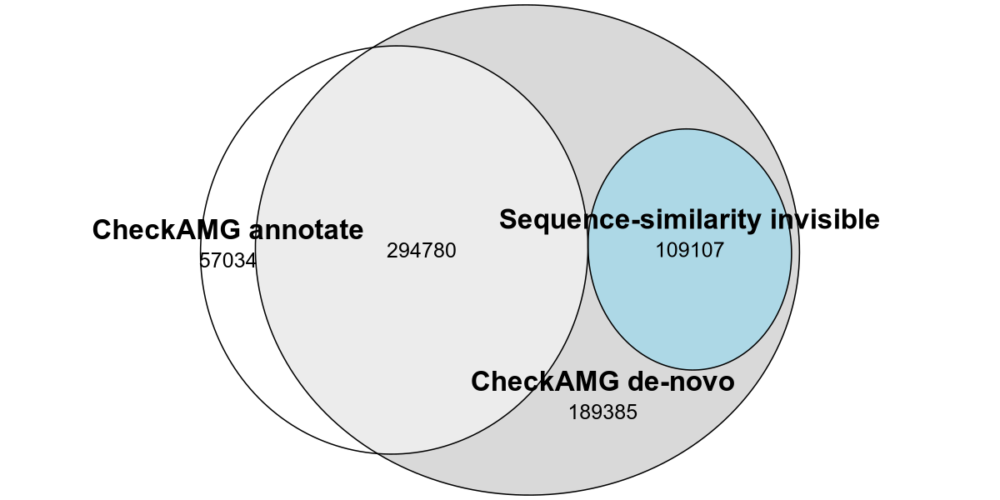<!-- -->

``` r
ggsave(file.path(PLOT_DIR, "q1_annotation_status_euler.svg"), p_q1_euler.plot,
       width = 8, height = 4, units = "in", bg = NULL, device = svglite::svglite)
```

# Auxiliary functions recovered that homology misses

``` r
q3 <- q3_hi %>%
  mutate(avg_category = factor(avg_category, levels = c("metabolic", "physiological", "regulatory")),
         lab = paste(top_train_function, avg_category, sep = "___"),
         lab = fct_reorder(lab, n_avgs))

p_q3 <- ggplot(q3, aes(x = n_avgs, y = lab, fill = avg_category)) +
  geom_col(color = "black", width = 0.75) +
  geom_text(aes(label = comma(n_avgs)), hjust = -0.12, size = 4) +
  # Title-case strips match Panel A
  facet_wrap(~ avg_category, scales = "free", nrow = 1, labeller = as_labeller(str_to_title)) +
  scale_y_discrete(labels = function(x) nice(str_remove(x, "___.*$"), 52)) +
  scale_fill_manual(values = category_pal, guide = "none") +
  scale_x_continuous(labels = label_number(scale = 1e-3, suffix = "K"), expand = expansion(mult = c(0, 0.4))) +
  labs(x = "AVGs (number of proteins)", y = NULL) +
  # strip.text size matches Panel A/B; axis.text/axis.title already match via base_theme
  theme(strip.text = element_text(size = 14), plot.margin = margin(t = 5, b = 5, l = 10, r = 15))
print(p_q3)
```

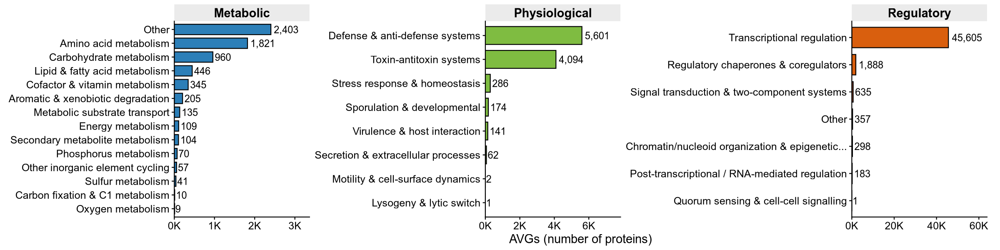<!-- -->

# AVG inventory by category and L1 function

``` r
# trim a few over-long L1 category names so labels leave room for the bars
short_lab <- function(x) x %>%
  str_replace(" & epigenetic regulation", "") %>%
  str_replace(" / RNA-mediated regulation", " regulation") %>%
  str_replace(" & two-component systems", "") %>%
  str_replace(" & cell-cell signalling", "") %>%
  str_replace(" & coregulators", "") %>%
  str_replace(" & host interaction", "") %>%
  str_replace(" & anti-defense systems", " / anti-defense") %>%
  str_replace(" / glucosinolate / mycotoxin", "") %>%
  str_squish()

binv <- inventory_L1 %>%
  mutate(category = factor(category, levels = c("metabolic", "physiological", "regulatory")),
         source = factor(source, levels = c("annotate", "de-novo (propagated)")),
         ecosystem = factor(ecosystem, levels = c("soil", "gut"), labels = c("Soil", "Gut")))
# Top-12 L1 categories are picked on the combined total, so both source rows show the same set
keep <- binv %>% group_by(category, category_L1) %>% summarise(t = sum(n_avgs), .groups = "drop") %>%
  group_by(category) %>% slice_max(t, n = 12) %>% ungroup()
binv <- binv %>% semi_join(keep, by = c("category", "category_L1")) %>%
  mutate(lab = paste(short_lab(category_L1), category, sep = "___"))

## "Other" and "Unresolved" are pinned to the last two positions in each category
lab_order <- binv %>% group_by(category, lab) %>% summarise(tot = sum(n_avgs), .groups = "drop") %>%
  mutate(l1 = str_remove(lab, "___.*$"),
         tier = case_when(str_starts(l1, "Unresolved ") ~ 2L, l1 == "Other" ~ 1L, TRUE ~ 0L)) %>%
  arrange(category, tier, tot) %>%
  pull(lab)

## complete() adds zero rows for every (category, L1) in both ecosystems, so each panel shows only its own L1 categories
## category is re-derived from lab because complete() blanks it on the added rows
binv <- binv %>%
  complete(lab, source, ecosystem, fill = list(n_avgs = 0, n_genomes = 0)) %>%
  mutate(category = factor(str_remove(lab, "^.*___"), levels = c("metabolic", "physiological", "regulatory")),
         lab = factor(lab, levels = lab_order))

biome_pal_cap <- c("Soil" = unname(biome_pal[["soil"]]), "Gut" = unname(biome_pal[["gut"]]))
DODGE <- position_dodge(width = 0.78)

## Two facet_wrap rows stacked with patchwork, because facet_grid cannot free y per category while sharing x across sources
# The top row needs more headroom for its rotated count labels
# Subtitles are hand-written so plotmath can italicize only the module name
subtitle_lab <- list(
  "annotate" = expression(paste("CheckAMG ", italic("annotate"), " (HMM-derived functions)")),
  "de-novo (propagated)" = expression(paste("CheckAMG ", italic("de-novo"), " (propagated functions)")))

bio_row <- function(src, show_x, y_expand) {
  ggplot(filter(binv, source == src), aes(x = lab, y = n_avgs, fill = ecosystem)) +
    geom_col(color = "black", width = 0.78, position = DODGE) +
    geom_text(data = ~ filter(.x, n_avgs > 0), aes(label = comma(n_avgs)), position = DODGE,
              angle = 90, hjust = -0.15, vjust = 0.5, size = 3.2) +
    scale_fill_manual(values = biome_pal_cap, name = "Ecosystem") +
    facet_wrap(~ category, scales = "free", nrow = 1, labeller = as_labeller(str_to_title)) +
    scale_x_discrete(labels = function(x) str_remove(x, "___.*$")) +
    scale_y_continuous(labels = label_number(scale_cut = cut_short_scale()),
                        expand = expansion(mult = c(0, y_expand))) +
    labs(y = "AVGs (number of proteins)", x = NULL, subtitle = subtitle_lab[[src]]) +
    theme(axis.text.x = if (show_x) element_text(angle = 45, hjust = 1, margin = margin(t = 5)) else element_blank(),
          axis.ticks.x = if (show_x) element_line() else element_blank(),
          strip.text = element_text(size = 14),
          plot.subtitle = element_text(size = 16),
          legend.text = element_text(size = 13),
          legend.title = element_text(size = 14))
}

p_bio_top <- bio_row("annotate", show_x = FALSE, y_expand = 0.33) +
  theme(legend.position = "none")
p_bio_bottom <- bio_row("de-novo (propagated)", show_x = TRUE, y_expand = 0.33) +
  theme(legend.position = "bottom", legend.justification = "center",
        strip.background = element_blank(), strip.text = element_blank(),
        # Pulls the Ecosystem legend up toward the rotated axis text
        legend.box.spacing = unit(0, "pt"))

# Extra left margin on both rows keeps the leftmost rotated tick label inside the panel
p_bio <- (p_bio_top / p_bio_bottom) &
  theme(plot.margin = margin(t = 4, r = 4, b = 4, l = 40))
print(p_bio)
```

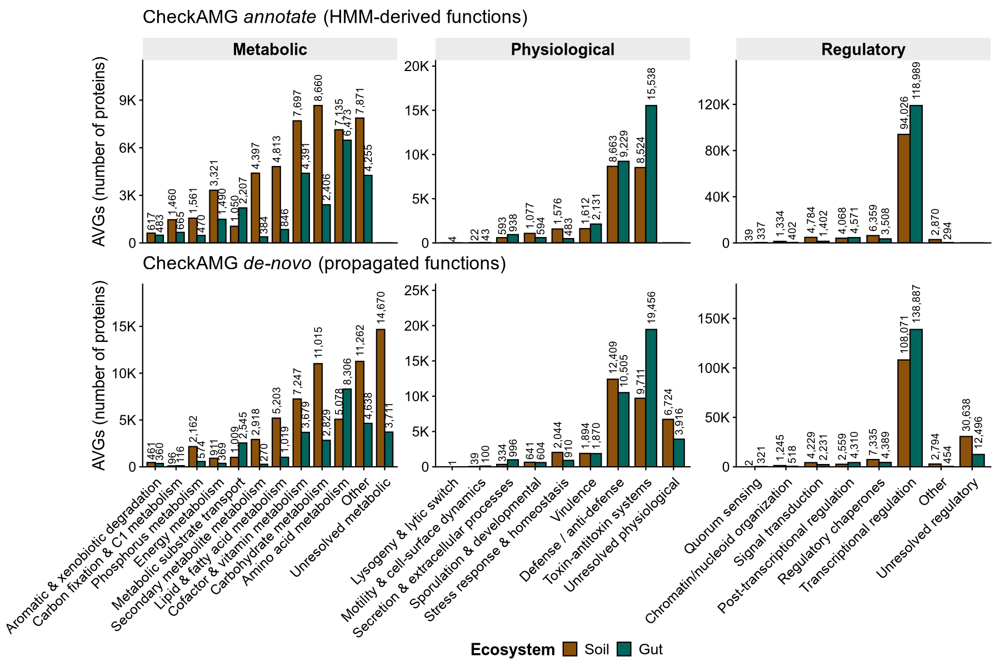<!-- -->

# Where propagated labels come from, and how deep they go

``` r
# Both bars share the hmm_shared floor, and the rest of the De-novo bar above its known-function segments is the sequence-similarity invisible set
mod_depth <- bind_rows(
    mast %>% filter(annotate_avg) %>%
      mutate(function_level = if_else(denovo_avg, "hmm_shared", "hmm_annotate_only")) %>%
      count(function_level, name = "n") %>% mutate(module = "Annotate"),
    mast %>% filter(denovo_avg) %>%
      mutate(function_level = case_when(
        function_level == "annotate" & annotate_avg  ~ "hmm_shared",
        function_level == "annotate" & !annotate_avg ~ "hmm_denovo_only",
        TRUE ~ as.character(function_level))) %>%
      count(function_level, name = "n") %>% mutate(module = "De-novo")) %>%
  mutate(function_level = factor(function_level, levels = names(depth_pal)),
         module = factor(module, levels = c("Annotate", "De-novo"))) %>%
  group_by(module) %>% mutate(pct = 100 * n / sum(n)) %>% ungroup() %>%
  mutate(lab = sprintf("%s\n%.1f%%", comma(n), pct))

# Stack boundaries computed explicitly so labels and brackets line up with the plotted segments
an_stack <- mod_depth %>% filter(module == "Annotate") %>%
  arrange(match(function_level, names(depth_pal))) %>%
  mutate(top = cumsum(n), bottom = top - n, mid = (top + bottom) / 2)

dn_stack <- mod_depth %>% filter(module == "De-novo") %>%
  arrange(match(function_level, names(depth_pal))) %>%
  mutate(top = cumsum(n), bottom = top - n, mid = (top + bottom) / 2)

# Single definition of known function shared by the cutoff and the label filter
known_levels <- c("hmm_shared", "hmm_annotate_only", "hmm_denovo_only")
hi_start <- dn_stack %>% filter(function_level %in% known_levels) %>% pull(top) %>% max()
hi_end   <- max(dn_stack$top)
hi_n     <- hi_end - hi_start
hi_pct   <- 100 * hi_n / hi_end
hi_mid   <- (hi_start + hi_end) / 2

# Callouts are evenly spaced and joined to their segment by a leader line
hi_seg <- dn_stack %>% filter(!function_level %in% known_levels) %>%
  arrange(mid) %>%
  mutate(label_y = hi_start + (row_number() - 0.5) * (hi_end - hi_start) / n(),
         lab2 = sprintf("%s\n%.1f%%", comma(n), pct))

# In-bar labels placed at computed midpoints, because position_stack() does not reproduce the stacking order on a filtered layer
label_pts <- bind_rows(an_stack, dn_stack %>% filter(function_level %in% known_levels)) %>%
  mutate(lab_color = if_else(function_level == "hmm_shared", "white", "black"))

p_ad <- ggplot(mod_depth, aes(x = module, y = n, fill = function_level)) +
  geom_col(color = "black", linewidth = 0.3, width = 0.6, position = position_stack(reverse = TRUE)) +
  # hmm_shared is dark enough to need white text; the other two purples stay black
  geom_text(data = label_pts, aes(x = module, y = mid, label = lab, color = lab_color),
            size = 3.2, lineheight = 0.95, show.legend = FALSE) +
  scale_color_identity() +
  # The bracket sits in the gap between the two bars
  annotate("segment", x = c(1.7, 1.6, 1.7), xend = c(1.6, 1.6, 1.6),
           y = c(hi_start, hi_start, hi_end), yend = c(hi_start, hi_end, hi_end), linewidth = 0.4) +
  # leader lines from each segment's true midpoint on the bar out to its evenly spaced callout label
  annotate("segment", x = 2.32, xend = 2.52, y = hi_seg$mid, yend = hi_seg$label_y, linewidth = 0.3) +
  annotate("text", x = 2.55, y = hi_seg$label_y, label = hi_seg$lab2,
           hjust = 0, size = 3.8, lineheight = 0.95) +
  # The sequence-similarity invisible callout sits over the Annotate bar's empty headroom
  annotate("text", x = 0.8, y = hi_mid,
           label = sprintf("Seq. similarity invisible\n(n = %s, %.1f%%)", comma(hi_n), hi_pct),
           hjust = 0.5, size = 3.8, lineheight = 1.0) +
  scale_fill_manual(values = depth_pal, labels = depth_lab, name = NULL) +
  scale_y_continuous(labels = label_number(scale_cut = cut_short_scale()),
                      expand = expansion(mult = c(0, 0.02))) +
  # Bars shifted right with total padding held constant
  scale_x_discrete(expand = expansion(add = c(1.0, 0.65)),
                    labels = c("Annotate" = expression(italic("annotate")),
                               "De-novo" = expression(italic("de-novo")))) +
  coord_cartesian(clip = "off") +
  guides(fill = guide_legend(ncol = 1, byrow = TRUE)) +
  labs(y = "AVGs (number of proteins)", x = "CheckAMG module") +
  theme(legend.position = c(-0.3, -0.2),
        axis.title = element_text(size = 14),
        axis.text = element_text(size = 12),
        legend.text = element_text(size = 13),
        legend.location = "plot",
        plot.margin = margin(t = 10, r = 40, b = 110, l = 5))
print(p_ad)
```

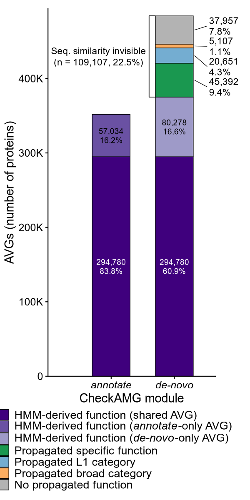<!-- -->

``` r
# The combined summary refers to the depth panel as p_depth
p_depth <- p_ad
```

# UpSet of sequence-similarity invisible AVGs

``` r
ups <- nvm %>%
  transmute(`CheckAMG: at least a category` = prop_category,
            `CheckAMG: at least L1`         = prop_L1,
            `CheckAMG: specific function`   = prop_specific,
            DefenseFinder = DefenseFinder,
            `Structure: known function`   = struct_tier == "Structure: known function",
            `Structure: unknown function` = struct_tier == "Structure: unknown function",
            ecosystem, theme_ext, func_category)

set_cols_raw <- c("CheckAMG: at least a category", "CheckAMG: at least L1",
                  "CheckAMG: specific function", "DefenseFinder",
                  "Structure: known function", "Structure: unknown function")
ups[set_cols_raw] <- lapply(ups[set_cols_raw], as.logical)
# Wrapped set names narrow the label gutter and widen the UpSet
set_cols <- c("CheckAMG: at least a category", "CheckAMG: at least L1",
              "CheckAMG: specific function", "DefenseFinder",
              "Structure: known function", "Structure: unknown function")
names(ups)[match(set_cols_raw, names(ups))] <- set_cols
ups <- ups %>% mutate(theme_ext = factor(theme_ext, levels = theme_lvl),
                      ecosystem = factor(ecosystem, levels = names(biome_pal))) %>% as.data.frame()
upset_invisible <- ComplexUpset::upset(
  ups, set_cols, name = NULL, sort_sets = FALSE, sort_intersections_by = "cardinality",
  n_intersections = Inf,
  height_ratio = 0.5, width_ratio = 0.33, guides = "over",
  base_annotations = list(
    "AVGs" = ComplexUpset::intersection_size(mapping = aes(fill = theme_ext), bar_number_threshold = 1,
                                   text = list(size = PT_MIN * 1.25, vjust = 0, hjust = 0, angle = 45),
                                   text_colors = c(on_background = "black", on_bar = "black")) +
      scale_fill_manual(values = theme_pal, name = "Auxiliary\ncategory", drop = TRUE,
                        labels = function(x) str_wrap(x, 18)) +
      guides(fill = guide_legend(ncol = 1, title.position = "top", order = 1, keywidth = unit(0.3, "cm"))) +
      scale_y_continuous(expand = expansion(mult = c(0, 0.15))) +
      labs(y = "AVGs (proteins)") +
      coord_cartesian(clip = "off") +
      theme(panel.grid = element_blank(),
            axis.title.y = element_text(size = 16, margin = margin(r = 1, l = 4)),
            axis.text.y = element_text(size = 14))),
  matrix = ComplexUpset::intersection_matrix(geom = geom_point(size = 2.4)),
  themes = ComplexUpset::upset_modify_themes(list(
    "intersections_matrix" = theme(axis.text.y = element_text(size = 14, lineheight = 0.85),
                                   axis.title.x = element_blank()))),
  set_sizes = ComplexUpset::upset_set_size(
      geom = geom_bar(aes(fill = ecosystem, x = group), width = 0.6), position = "right") +
    scale_fill_manual(values = biome_pal, labels = c(soil = "Soil", gut = "Human gut"), name = "Ecosystem") +
    guides(fill = guide_legend(ncol = 1, title.position = "top", order = 2, keywidth = unit(0.34, "cm"))) +
    scale_y_continuous(expand = expansion(mult = c(0, 0.1))) +
    labs(x = "Set size") +
    theme(axis.text.x = element_text(size = 14), axis.title.x = element_text(size = 16))
) & theme(text = element_text(size = 14), legend.title = element_text(size = 16, face = "bold"),
          legend.text = element_text(size = 14))
# both legends sit one above the other in the empty block over the set-size bars, so panel A gains no height
upset_invisible <- upset_invisible & theme(legend.justification = c(0, 1), legend.box = "vertical", legend.box.just = "left",
                 legend.text = element_text(size = 14), legend.title = element_text(size = 16, face = "bold"),
                 legend.spacing.y = unit(0.45, "cm"), legend.margin = margin(t = 2, b = 2, l = 2),
                 legend.key.size = unit(0.38, "cm"), legend.key.spacing.y = unit(0.12, "cm"))
upset_invisible <- ggdraw(upset_invisible) + theme(plot.margin = margin(0, 2, 0, 0))
print(upset_invisible)
```

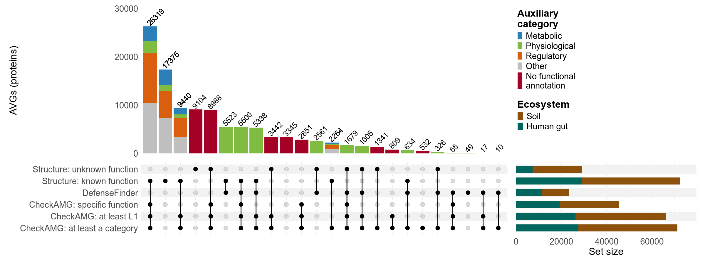<!-- -->

# Biome-pure regions, labeled by dominant function

``` r
set.seed(20260611)
pp  <- umap_pts
lab <- clusters
skew_pal <- c("soil-specific" = "#8c510a", "soil-leaning" = "#dfc27d", "mixed" = "grey80",
              "gut-leaning" = "#80cdc1", "gut-specific" = "#01665e")
skew_lv <- names(skew_pal)

# Only near-pure clusters are labeled, with the dominant function's share in their own biome
lab_sel <- lab %>% filter(skew %in% c("soil-specific", "gut-specific")) %>% group_by(skew) %>% slice_max(n, n = 9) %>% ungroup() %>%
  mutate(fn = ifelse(is.na(top_function) | top_function == "", "unknown function", nice(top_function, 40)),
         fn = ifelse(function_purity < 0.3 & fn != "unknown function", paste0(fn, " (mixed)"), fn),
         pct = ifelse(skew == "soil-specific", paste0(round(100 * soil_frac), "% soil"), paste0(round(100 * (1 - soil_frac)), "% gut")),
         label = paste0(fn, "\n", pct))

pp_bg <- pp %>% filter(skew %in% c("mixed", "unclustered")) %>% slice_sample(n = min(120000, sum(pp$skew %in% c("mixed", "unclustered"))))
pp_fg <- pp %>% filter(!skew %in% c("mixed", "unclustered"))

p_pure <- ggplot() +
  geom_point(data = pp_bg, aes(umap1, umap2, color = skew), size = 0.5, alpha = 0.3) +
  geom_point(data = pp_fg, aes(umap1, umap2, color = skew), size = 0.8, alpha = 0.78) +
  geom_label_repel(data = lab_sel, aes(cx, cy, label = label), size = 3, label.size = 0.15,
                   fill = alpha("white", 0.72), box.padding = 0.5, max.overlaps = 40,
                   min.segment.length = 0, seed = 20260611) +
  scale_color_manual(values = skew_pal, name = "Cluster biome skew", breaks = skew_lv, limits = skew_lv,
                     labels = function(x) sub("^(.)", "\\U\\1", x, perl = TRUE), na.value = "grey92") +
  labs(x = "UMAP-1", y = "UMAP-2") + umap_theme +
  theme(legend.position = "bottom", legend.title.position = "top") +
  guides(color = guide_legend(nrow = 5, override.aes = list(size = 5, alpha = 1)))
print(p_pure)
```

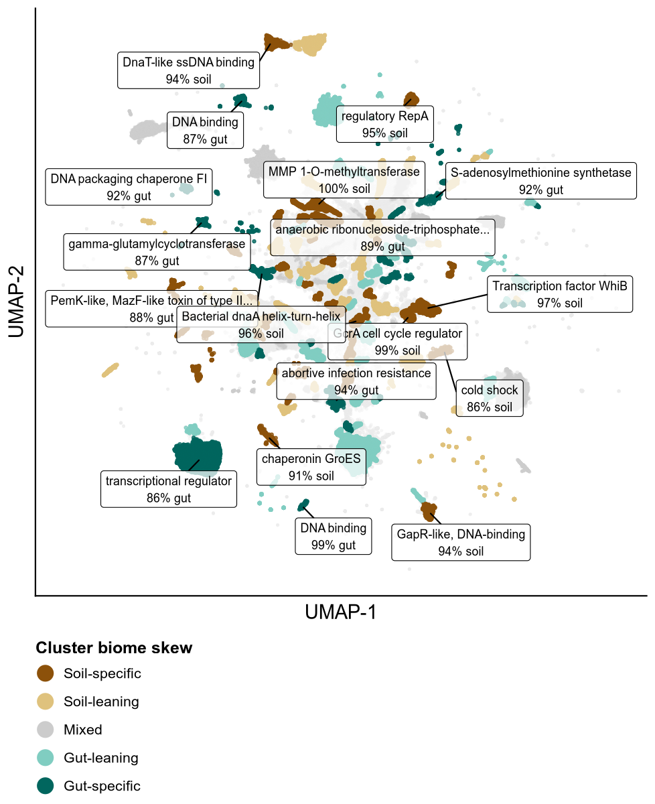<!-- -->

# AMG functions partition by ecosystem

``` r
g2 <- part_L2 %>% filter(tot >= 20) %>%
  mutate(neglog10q = -log10(pmax(fdr_q_cmh_genecount, .Machine$double.xmin)),
         sig = enrichment_cmh_genecount != "not different")
# The 16 most significant calls in each direction are labeled, a display cap and not a second significance criterion
g2_lab <- g2 %>% filter(sig) %>% group_by(enrichment_cmh_genecount) %>%
  slice_min(fdr_q_cmh_genecount, n = 16) %>% ungroup() %>%
  mutate(label = category_L2)
l1_levels <- sort(unique(g2$L1_group))
l1_pal <- setNames(colorRampPalette(brewer.pal(12, "Paired"))(length(l1_levels)), l1_levels)

p_part <- ggplot(mapping = aes(log2_OR_cmh_genecount, neglog10q)) +
  geom_vline(xintercept = 0, linetype = 2, color = "grey60") +
  geom_vline(xintercept = c(-log2(1.5), log2(1.5)), linetype = 3, color = "grey75") +
  geom_hline(yintercept = -log10(0.05), linetype = 3, color = "grey75") +
  # Categories that clear neither threshold stay gray, as in a conventional volcano, so color marks a call
  geom_point(data = filter(g2, !sig), aes(size = tot), shape = 21,
             fill = "grey85", color = "grey65", stroke = 0.25, alpha = 0.8) +
  geom_point(data = filter(g2, sig), aes(size = tot, fill = L1_group), shape = 21,
             color = "grey25", stroke = 0.3, alpha = 0.9) +
  # Inf keeps ggrepel from silently dropping labels, and the raised force and iterations resolve the crowding
  geom_text_repel(data = g2_lab, aes(label = label), size = 3, max.overlaps = Inf,
                  min.segment.length = 0, box.padding = 0.35, point.padding = 0.25,
                  force = 10, force_pull = 0, max.iter = 10000, max.time = 3,
                  segment.size = 0.25, segment.color = "grey40", seed = 20260611) +
  scale_size_continuous(range = c(1, 6), trans = "sqrt", name = "Genomes", labels = comma) +
  scale_fill_manual(values = l1_pal, name = "Biogeochemical function",
                    breaks = sort(unique(filter(g2, sig)$L1_group))) +
  # Square-root axis because q values span more than 300 orders of magnitude
  scale_y_continuous(trans = "sqrt", breaks = c(0, 2, 10, 25, 50, 100, 200, 300),
                     expand = expansion(mult = c(0.02, 0.06)), limits = c(0, NA)) +
  scale_x_continuous(limits = c(-8, 8)) +
  labs(x = expression("gut enriched"%<-%"    "~log[2]~"odds ratio    "%->%"soil enriched"),
       y = expression(-log[10]~"FDR q")) +
  theme(legend.position = "bottom", legend.justification = "center",
                   legend.location = "plot", legend.box = "horizontal", legend.title.position = "top") +
  guides(fill = guide_legend(nrow = 5, override.aes = list(size = 3.5)),
         size = guide_legend(ncol = 1))
print(p_part)
```

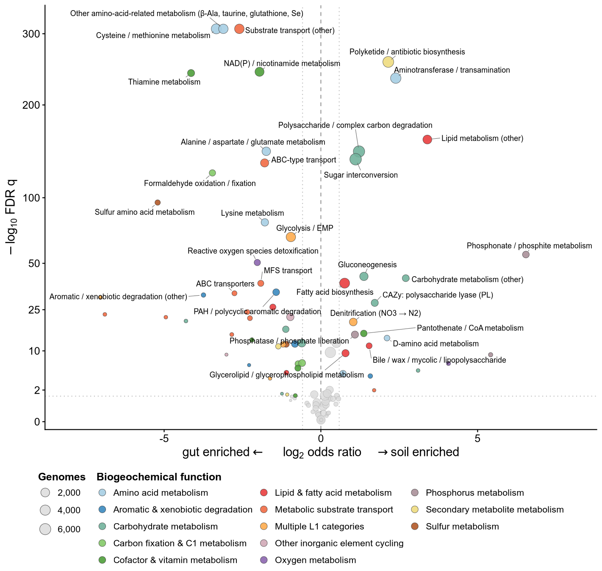<!-- -->

# Within each biome: AMG functions by ecosystem subtype and host phylum

``` r
p_eco_combined <-
  (bubble_biome(within_eco, "soil", "Soil", topn = 20, compact = TRUE) |
   bubble_biome(within_eco, "gut", "Gut", topn = 20, compact = TRUE)) +
  plot_layout(guides = "collect", widths = c(1.45, 1)) &
  theme(legend.position = "bottom", legend.box = "vertical",
        legend.key.size = unit(0.35, "cm"), legend.margin = margin(1, 1, 1, 1),
        plot.margin = margin(t = 4, r = 10, b = 4, l = 4))
save_plot_both(p_eco_combined, "within_biome_amg_by_ecosystem", w = 12, h = 9)
print(p_eco_combined)
```

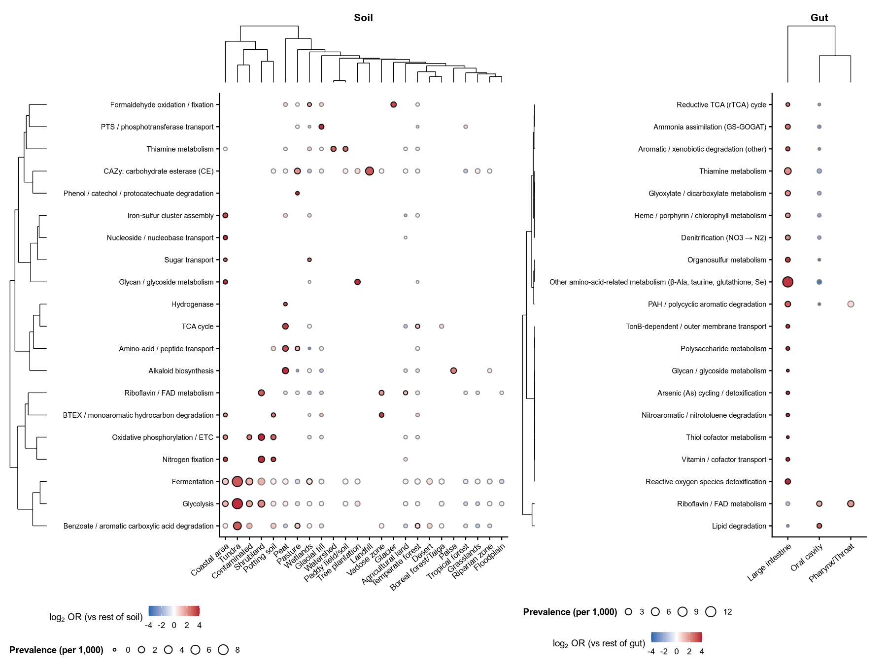<!-- -->

``` r
p_host_combined <-
  (bubble_biome(within_host, "soil", "Soil", topn = 20, compact = TRUE) |
   bubble_biome(within_host, "gut", "Gut", topn = 20, compact = TRUE)) +
  plot_layout(guides = "collect", widths = c(1.3, 1)) &
  theme(legend.position = "bottom", legend.box = "vertical",
        legend.key.size = unit(0.35, "cm"), legend.margin = margin(1, 1, 1, 1),
        plot.margin = margin(t = 4, r = 10, b = 4, l = 4))
save_plot_both(p_host_combined, "within_biome_amg_by_host", w = 12, h = 9)
print(p_host_combined)
```

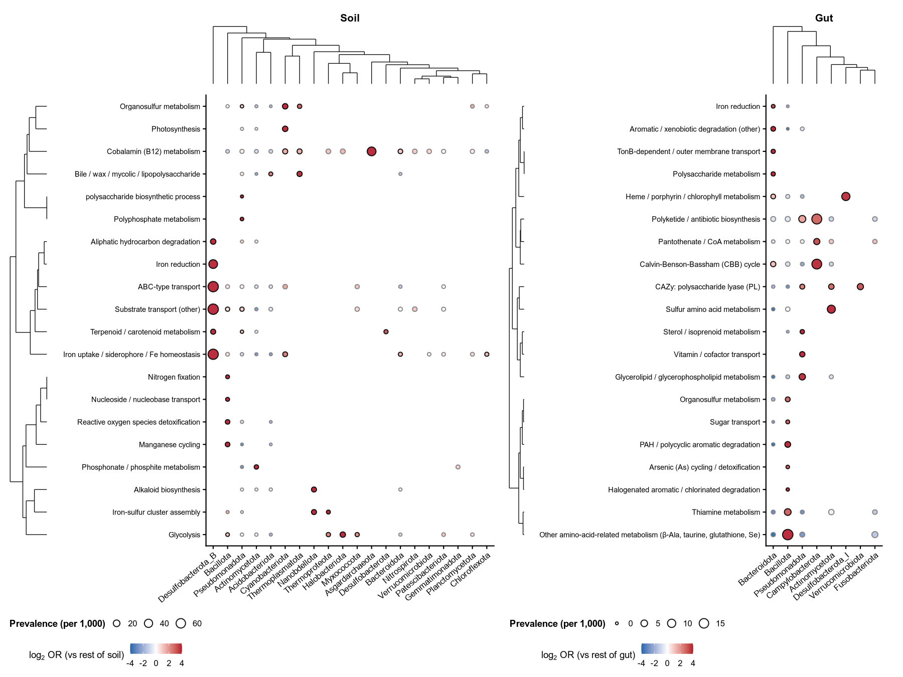<!-- -->

# Combined summary figures

``` r
combined <- cowplot::plot_grid(
  cowplot::plot_grid(
    p_bio + theme(legend.position = "bottom"),
    p_depth,
    ncol = 2,
    rel_widths = c(12, 4),
    labels = c("A", "B"),
    label_size = 20
  ),
  p_q3,
  upset_invisible,
  nrow = 3,
  rel_heights = c(8, 4, 6),
  labels = c("", "C", "D"),
  label_size = 20
)
save_plot_both(combined, "soil_gut_avgs_summary", w = 16, h = 18)
print(combined)
```

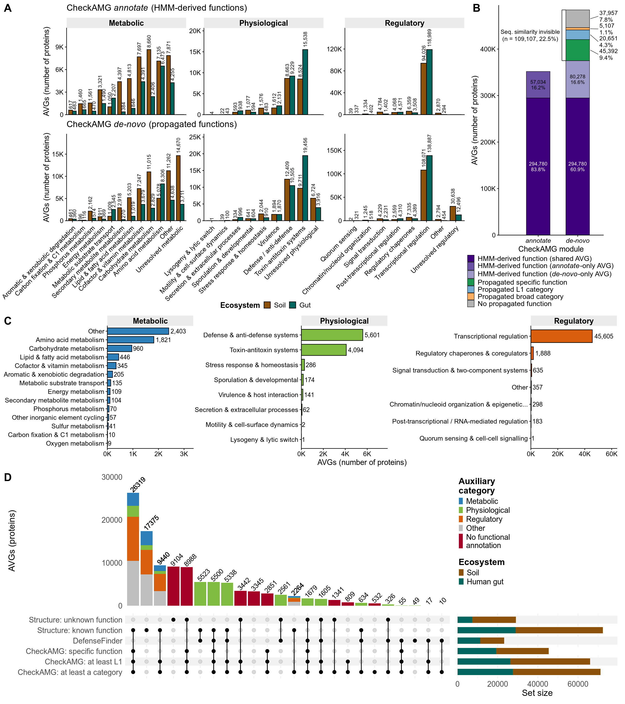<!-- -->

``` r
combined_ecol <- cowplot::plot_grid(
    p_pure + theme(legend.position = "bottom") +
      guides(color = guide_legend(nrow = 5, override.aes = list(size = 5, alpha = 1))),
    # Stacked legends keep the size key from being clipped at this panel width
    p_part + theme(legend.position = "bottom", legend.justification = "center",
                   legend.location = "plot", legend.box = "horizontal") +
      guides(fill = guide_legend(nrow = 5, override.aes = list(size = 3.5)),
             size = guide_legend(ncol = 1)),
    ncol = 2,
    rel_widths = c(0.9, 1),
    labels = c("A", "B"),
    label_size = 24,
    align = "h", axis = "tb"
)

save_plot_both(combined_ecol, "soil_gut_avgs_ecology", w = 16, h = 9)
print(combined_ecol)
```

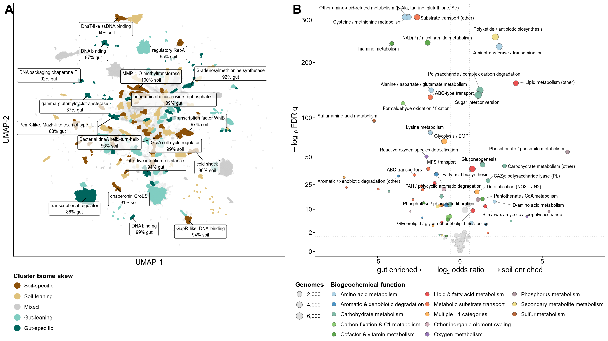<!-- -->

# Source data

``` r
SRC_DIR <- file.path(TABLES_DIR, "source_data")
dir.create(SRC_DIR, showWarnings = FALSE, recursive = TRUE)

readr::write_csv(binv,      file.path(SRC_DIR, "fig5A_inventory_by_category_L1.csv"))
readr::write_csv(mod_depth, file.path(SRC_DIR, "fig5B_assignment_depth_by_module.csv"))
readr::write_csv(q3,        file.path(SRC_DIR, "fig5C_invisible_L1_functions.csv"))
readr::write_csv(ups,       file.path(SRC_DIR, "fig5D_invisible_upset_membership.csv"))

# Written in parts so each file stays under GitHub's 100 MB limit
fig6a_parts <- split(pp_fg, ceiling(seq_len(nrow(pp_fg)) / ceiling(nrow(pp_fg) / 4)))
for (k in seq_along(fig6a_parts)) {
  readr::write_csv(fig6a_parts[[k]], file.path(SRC_DIR, sprintf("fig6A_umap_biome_skew_points_part%d.csv", k)))
}
readr::write_csv(lab_sel,   file.path(SRC_DIR, "fig6A_umap_region_labels.csv"))
readr::write_csv(g2,        file.path(SRC_DIR, "fig6B_biome_partition_plotted.csv"))

readr::write_csv(bind_rows(vol_concord,
                           tibble(metric = c("tested_propagated_inclusive", "tested_annotate_only", "added_by_propagation"),
                                  value = c(nrow(ecotype_incl), nrow(ecotype_ann), nrow(ecotype_incl) - nrow(ecotype_ann)))),
                 file.path(SRC_DIR, "supp_volcano_concordance.csv"))

cat(sprintf("source data written to %s\n", SRC_DIR))
```

    ## source data written to ./tables/soil_gut_avgs/source_data

``` r
print(tibble::tibble(
  file = list.files(SRC_DIR, pattern = "^fig[56]"),
  rows = vapply(list.files(SRC_DIR, pattern = "^fig[56]", full.names = TRUE),
                function(p) nrow(readr::read_csv(p, show_col_types = FALSE)), integer(1))))
```

    ## # A tibble: 11 x 2
    ##    file                                     rows
    ##    <chr>                                   <int>
    ##  1 fig5A_inventory_by_category_L1.csv        116
    ##  2 fig5B_assignment_depth_by_module.csv        8
    ##  3 fig5C_invisible_L1_functions.csv           29
    ##  4 fig5D_invisible_upset_membership.csv   109107
    ##  5 fig6A_umap_biome_skew_points_part1.csv  73397
    ##  6 fig6A_umap_biome_skew_points_part2.csv  73397
    ##  7 fig6A_umap_biome_skew_points_part3.csv  73397
    ##  8 fig6A_umap_biome_skew_points_part4.csv  73395
    ##  9 fig6A_umap_biome_skew_points.csv       293586
    ## 10 fig6A_umap_region_labels.csv               18
    ## 11 fig6B_biome_partition_plotted.csv          98

# Supplemental: Euler diagram

``` r
library(eulerr)
avg_div_base <- read_parquet(file.path("./tables/soil_gut_avgs", "avg_master_per_protein.parquet"))
avg_div_struc <- avg_div_base %>%
  left_join(
    nvm %>%
      select(Protein, struct_tier, known_function, DefenseFinder),
    by="Protein"
 )
func_euler <- c(
  "CheckAMG annotate" = length(unique(subset(avg_div_struc, (annotate_avg == TRUE & denovo_avg == FALSE))$Protein)),
  "CheckAMG de-novo" = length(unique(subset(avg_div_struc, (annotate_avg == FALSE & denovo_avg == TRUE))$Protein)),
  "CheckAMG annotate&CheckAMG de-novo" = length(unique(subset(avg_div_struc, (denovo_avg == TRUE & annotate_avg == TRUE & sequence_similarity_invisible == FALSE))$Protein)),
    "CheckAMG de-novo&Sequence-similarity invisible" = length(unique(subset(avg_div_struc, (denovo_avg == TRUE & sequence_similarity_invisible == TRUE))$Protein)),
  "CheckAMG de-novo&Sequence-similarity invisible&Structure: unknown function" = length(unique(subset(avg_div_struc, (denovo_avg == TRUE & sequence_similarity_invisible == TRUE & struct_tier == "Structure: unknown function"))$Protein))
  )

p_euler <- euler(
  func_euler,
  shape = "ellipse"
)
euler.plot <- plot(
  p_euler, quantities = TRUE,
  labels = list(fontsize = 16)
  )
euler.plot
```

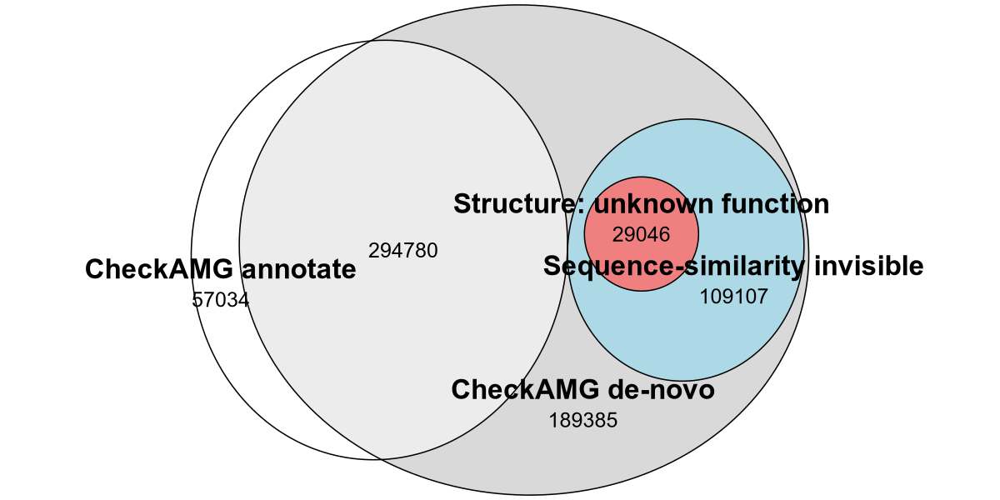<!-- -->

``` r
ggsave(file.path(PLOT_DIR, "annotation_status_structure_euler.svg"), euler.plot,
       width = 8, height = 4, units = "in", bg = NULL, device = svglite::svglite)
```

# Session info

``` r
sessionInfo()
```

    ## R version 4.3.3 (2024-02-29)
    ## Platform: x86_64-conda-linux-gnu (64-bit)
    ## Running under: Ubuntu 20.04.6 LTS
    ## 
    ## Matrix products: default
    ## BLAS/LAPACK: /storage2/scratch/kosmopoulos/miniconda3/envs/peatlands_env/lib/libopenblasp-r0.3.21.so;  LAPACK version 3.9.0
    ## 
    ## locale:
    ##  [1] LC_CTYPE=en_US       LC_NUMERIC=C         LC_TIME=en_US       
    ##  [4] LC_COLLATE=en_US     LC_MONETARY=en_US    LC_MESSAGES=en_US   
    ##  [7] LC_PAPER=en_US       LC_NAME=C            LC_ADDRESS=C        
    ## [10] LC_TELEPHONE=C       LC_MEASUREMENT=en_US LC_IDENTIFICATION=C 
    ## 
    ## time zone: America/Chicago
    ## tzcode source: system (glibc)
    ## 
    ## attached base packages:
    ## [1] stats     graphics  grDevices utils     datasets  methods   base     
    ## 
    ## other attached packages:
    ##  [1] eulerr_7.0.0       colorspace_2.1-1   jsonlite_2.0.0     ggrepel_0.9.8     
    ##  [5] svglite_2.1.2      RColorBrewer_1.1-3 scales_1.4.0       patchwork_1.3.2   
    ##  [9] cowplot_1.1.3      lubridate_1.9.4    forcats_1.0.0      stringr_1.5.1     
    ## [13] dplyr_1.1.4        purrr_1.0.4        readr_2.1.5        tidyr_1.3.1       
    ## [17] tibble_3.2.1       ggplot2_3.5.2      tidyverse_2.0.0    arrow_13.0.0      
    ## 
    ## loaded via a namespace (and not attached):
    ##  [1] utf8_1.2.4         generics_0.1.3     polylabelr_0.2.0   stringi_1.8.7     
    ##  [5] hms_1.1.3          digest_0.6.37      magrittr_2.0.3     evaluate_1.0.3    
    ##  [9] grid_4.3.3         timechange_0.3.0   fastmap_1.2.0      textshaping_0.3.7 
    ## [13] cli_3.6.4          crayon_1.5.3       rlang_1.2.0        polyclip_1.10-7   
    ## [17] bit64_4.6.0-1      withr_3.0.2        yaml_2.3.10        parallel_4.3.3    
    ## [21] tools_4.3.3        tzdb_0.5.0         ComplexUpset_1.3.3 assertthat_0.2.1  
    ## [25] vctrs_0.6.5        R6_2.6.1           lifecycle_1.0.4    bit_4.6.0         
    ## [29] vroom_1.6.5        ragg_1.3.3         pkgconfig_2.0.3    pillar_1.10.2     
    ## [33] gtable_0.3.6       glue_1.8.0         Rcpp_1.0.14        systemfonts_1.2.1 
    ## [37] xfun_0.52          tidyselect_1.2.1   knitr_1.50         farver_2.1.2      
    ## [41] htmltools_0.5.8.1  labeling_0.4.3     rmarkdown_2.29     compiler_4.3.3    
    ## [45] S7_0.2.2
